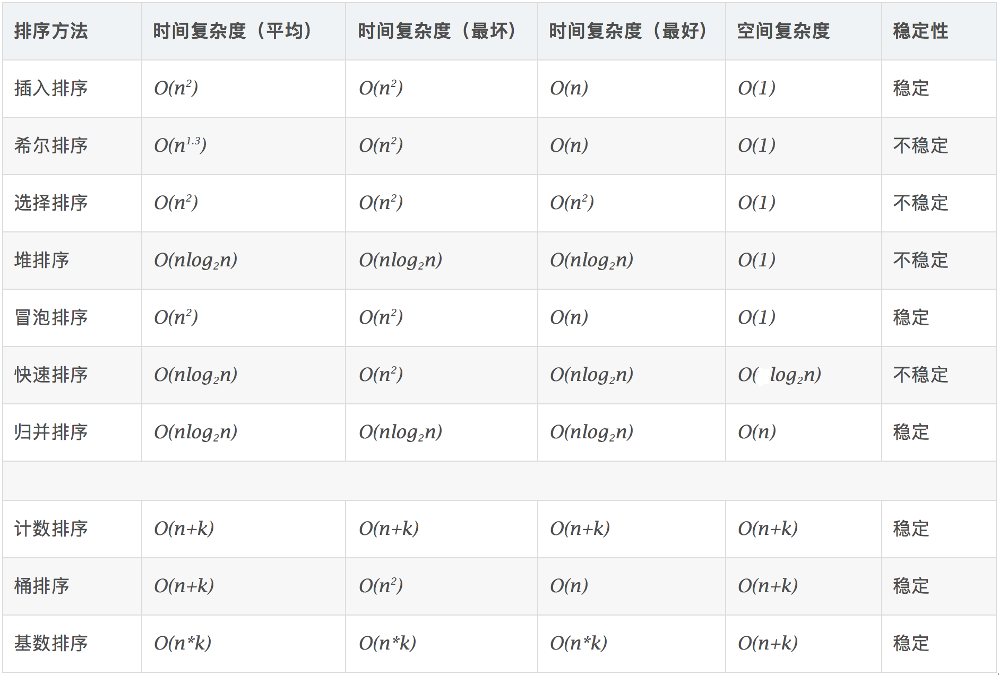
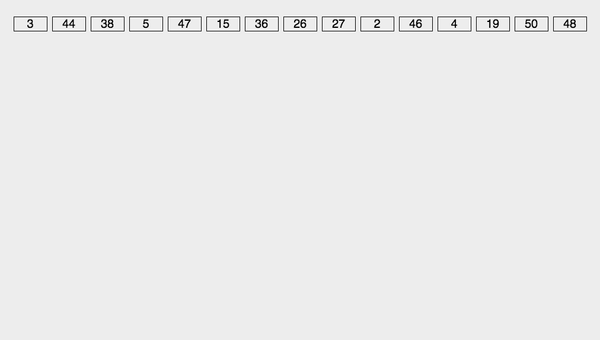

> 该文转自[一像素](https://www.cnblogs.com/onepixel/p/7674659.html),实在无法拒绝动图的诱惑~

## 0. 整体



★ **比较排序** ：需要数据之间的对比。

​	● **最基本**：选择、冒泡、插入。O(n^2)。

​	● **稍提升：** 希尔。利用基本有序的序列，插入排序会更加高效的特点。O(n^1.3)

​	● **大提升**： 快排、归并、堆。都使用了二分的概念。O(nlogn)

★ **非比较排序**： 利用空间换时间。

​	计数、桶、基数。O(n)

★ **稳定性**： 相同大小的数排序后位子不变。

​	**插入、冒泡、归并是稳定的。非比较的也是稳定的。**实际上，所有的排序都能修改成稳定的。

★ **注意点：**

​	● 冒泡排序可以通过提前停止提高性能。

​	● 插入、冒泡在数据比较有序情况下O(n)。

​	● 选择排序最死板正真最慢，怎么都是O(n^2)。

​	● 归并排序利用有序数组合并方便的特点，将数据无限二分再合并。因为一定会二分，所以好坏为O(nlogn)

​	● 堆排序利用了大顶堆获得最大值只需要logn的特点。因为不管怎么样都要构建二叉树，所以好坏O(nlogn)

​	● 快排，最常用算法，因为其**内循环中的指令很少而且能够利用缓存（因为总是顺序访问数据）使得快排成为一种实际跑起来最快的排序。**也是利用二分，减少小数和大数的重复比较，但是如果数据比较有序会造成二分的效果不好、不平衡，极端情况下等于没有二分。不像归并和堆排必定生成完全二叉树。所以O(nlogn)->O(n^2)

​    ● 快排的空间复杂度并不是O(1)，因为使用了递归需要函数栈，所以平均空间复杂度为O(logn)，最最差为O(n)。

​    ● 归并的空间复杂度为O(n)，因为不是原地排序需要有一个n长度的全局数组来辅助交换数据，如果用自上而下的方式实现需要递归空间复杂度会提升O(n+logn)，而如果用自下而上的实现只需要循环则不需要额外的空间。

​	● 计数排序需要知道数据范围。只能用于小范围的数据。

​	● 桶排序，对计数排序稍加改进，减少浪费的空间。

​	● 基数排序，更节约空间，但O(kn)并不一定快于O(nlogn)，所以适用于数据量很大的排序。

​    ● java中sort函数对原始数据类型使用（三向切分）快速排序，对于引用类型使用归并排序（维持对象的顺序）。


## 1. 冒泡排序（Bubble Sort）

- 比较相邻的元素。如果第一个比第二个大，就交换它们两个；

- 对每一对相邻元素作同样的工作，从开始第一对到结尾的最后一对，这样在最后的元素应该会是最大的数；

- 针对所有的元素重复以上的步骤，除了最后一个；

- 重复步骤1~3，直到排序完成。

  

```JAVA
// 优化
// 设置标志位flag，如果发生了交换flag设置为true；如果没有交换就设置为false。
// 这样当一轮比较结束后如果flag仍为false，即：这一轮没有发生交换，说明数据的顺序已经排好，没有必要继续进行下去。
public static void BubbleSort1(int [] arr){

   int temp;//临时变量
   boolean flag;//是否交换的标志
   for(int i=0; i<arr.length-1; i++){   //表示趟数，一共arr.length-1次。

       flag = false;
       for(int j=arr.length-1; j>i; j--){

           if(arr[j] < arr[j-1]){
               temp = arr[j];
               arr[j] = arr[j-1];
               arr[j-1] = temp;
               flag = true;
           }
       }
       if(!flag) break;
   }
}
```


## 2. 选择排序（Selection Sort）

- 在长度为N的无序数组中，第一次遍历n-1个数，找到最小的数值与第一个元素交换；
- 第二次遍历n-2个数，找到最小的数值与第二个元素交换；
- 。。。
- 第n-1次遍历，找到最小的数值与第n-1个元素交换，排序完成。


```java
public static void select_sort(int array[],int lenth){

   for(int i=0;i<lenth-1;i++){

       int minIndex = i;
       for(int j=i+1;j<lenth;j++){
          if(array[j]<array[minIndex]){
              minIndex = j;
          }
       }
       if(minIndex != i){
           int temp = array[i];
           array[i] = array[minIndex];
           array[minIndex] = temp;
       }
   }
}
```


## 3. 插入排序（Insertion Sort）

- 从第一个元素开始，该元素可以认为已经被排序；
- 取出下一个元素，在已经排序的元素序列中从后向前扫描；
- 如果该元素（已排序）大于新元素，将该元素移到下一位置；
- 重复步骤3，直到找到已排序的元素小于或者等于新元素的位置；
- 将新元素插入到该位置后；
- 重复步骤2~5。


```java
public static void  insert_sort(int array[],int lenth){
   int temp;
   for(int i=0;i<lenth-1;i++){
       for(int j=i+1;j>0;j--){
           if(array[j] < array[j-1]){
               temp = array[j-1];
               array[j-1] = array[j];
               array[j] = temp;
           }else{         //不需要交换
               break;
           }
       }
   }
}
```


## 4. 希尔排序（Shell Sort）

如果数据序列基本有序，使用插入排序会更加高效

先将整个待排序的记录序列分割成为若干子序列分别进行直接插入排序，具体算法描述：

- 选择一个增量序列t1，t2，…，tk，其中ti>tj，tk=1；
- 按增量序列个数k，对序列进行k 趟排序；
- 每趟排序，根据对应的增量ti，将待排序列分割成若干长度为m 的子序列，分别对各子表进行直接插入排序。仅增量因子为1 时，整个序列作为一个表来处理，表长度即为整个序列的长度。


```java
public static void shell_sort(int array[],int lenth){

   int temp = 0;
   int incre = lenth;

   while(true){
       incre = incre/2;

       for(int k = 0;k<incre;k++){    //根据增量分为若干子序列

           for(int i=k+incre;i<lenth;i+=incre){

               for(int j=i;j>k;j-=incre){
                   if(array[j]<array[j-incre]){
                       temp = array[j-incre];
                       array[j-incre] = array[j];
                       array[j] = temp;
                   }else{
                       break;
                   }
               }
           }
       }

       if(incre == 1){
           break;
       }
   }
}
```

## 5. 归并排序（Merge Sort）

归并排序是建立在归并操作上的一种有效的排序算法。该算法是采用分治法的一个非常典型的应用。
首先考虑下如何将2个有序数列合并。这个非常简单，只要从比较2个数列的第一个数，谁小就先取谁，取了后就在对应数列中删除这个数。然后再进行比较，如果有数列为空，那直接将另一个数列的数据依次取出即可。

自上而下的归并排序：

- 把长度为n的输入序列分成两个长度为n/2的子序列；
- 对这两个子序列分别采用归并排序；
- 将两个排序好的子序列合并成一个最终的排序序列。

自下而上的归并排序：

- 直接按2,4,8...顺序进行归并。
- 能够节约递归的栈内存。


```java
public static void merge_sort(int a[],int first,int last,int temp[]){
  if(first < last){
      int middle = (first + last)/2;
      merge_sort(a,first,middle,temp);//左半部分排好序
      merge_sort(a,middle+1,last,temp);//右半部分排好序
      mergeArray(a,first,middle,last,temp); //合并左右部分
  }
}
//合并 ：将两个序列a[first-middle],a[middle+1-end]合并
public static void mergeArray(int a[],int first,int middle,int end,int temp[]){     
  int i = first;
  int m = middle;
  int j = middle+1;
  int n = end;
  int k = 0; 
  while(i<=m && j<=n){
      if(a[i] <= a[j]){
          temp[k] = a[i];
          k++;
          i++;
      }else{
          temp[k] = a[j];
          k++;
          j++;
      }
  }     
  while(i<=m){
      temp[k] = a[i];
      k++;
      i++;
  }     
  while(j<=n){
      temp[k] = a[j];
      k++;
      j++; 
  }

  for(int ii=0;ii<k;ii++){
      a[first + ii] = temp[ii];
  }
}
```


## 6. 快速排序（Quick Sort）

通过一趟排序将待排记录分隔成独立的两部分，其中一部分记录的关键字均比另一部分的关键字小，则可分别对这两部分记录继续进行排序，以达到整个序列有序。

- 从数列中挑出一个元素，称为 “基准”（pivot）；
- 重新排序数列，所有元素比基准值小的摆放在基准前面，所有元素比基准值大的摆在基准的后面（相同的数可以到任一边）。在这个分区退出之后，该基准就处于数列的中间位置。这个称为分区（partition）操作；
- 递归地（recursive）把小于基准值元素的子数列和大于基准值元素的子数列排序。


```java
public static void quickSort(int a[],int l,int r){
     if(l>=r)
       return;

     int i = l; int j = r; int key = a[l];//选择第一个数为key

     while(i<j){

         while(i<j && a[j]>=key)//从右向左找第一个小于key的值
             j--;
         if(i<j){
             a[i] = a[j];
             i++;
         }

         while(i<j && a[i]<key)//从左向右找第一个大于key的值
             i++;

         if(i<j){
             a[j] = a[i];
             j--;
         }
     }
     //i == j
     a[i] = key;
     quickSort(a, l, i-1);//递归调用
     quickSort(a, i+1, r);//递归调用
 }
```


## 7. 堆排序（Heap Sort）

堆排序（Heapsort）是指利用堆这种数据结构所设计的一种排序算法。堆积是一个近似完全二叉树的结构，并同时满足堆积的性质：即子结点的键值或索引总是小于（或者大于）它的父节点。

- 将初始待排序关键字序列(R1,R2….Rn)构建成大顶堆，此堆为初始的无序区；
- 将堆顶元素R[1]与最后一个元素R[n]交换，此时得到新的无序区(R1,R2,……Rn-1)和新的有序区(Rn),且满足R[1,2…n-1]<=R[n]；
- 由于交换后新的堆顶R[1]可能违反堆的性质，因此需要对当前无序区(R1,R2,……Rn-1)调整为新堆，然后再次将R[1]与无序区最后一个元素交换，得到新的无序区(R1,R2….Rn-2)和新的有序区(Rn-1,Rn)。不断重复此过程直到有序区的元素个数为n-1，则整个排序过程完成。


```java
// 代码以构建小顶堆为例，相似
// 都是从非叶节点开始，从下往上得到最大/小数据
// 构建最小堆
public static void MakeMinHeap(int a[], int n){
 for(int i=(n-1)/2 ; i>=0 ; i--){
     MinHeapFixdown(a,i,n);
 }
}
//从i节点开始调整,n为节点总数 从0开始计算 i节点的子节点为 2*i+1, 2*i+2  
public static void MinHeapFixdown(int a[],int i,int n){

   int j = 2*i+1; //子节点
   int temp = 0;

   while(j<n){
       //在左右子节点中寻找最小的
       if(j+1<n && a[j+1]<a[j]){   
           j++;
       }

       if(a[i] <= a[j])
           break;

       //较大节点下移
       temp = a[i];
       a[i] = a[j];
       a[j] = temp;

       i = j;
       j = 2*i+1;
   }
}
public static void MinHeap_Sort(int a[],int n){
  int temp = 0;
  MakeMinHeap(a,n);

  for(int i=n-1;i>0;i--){
      temp = a[0];
      a[0] = a[i];
      a[i] = temp; 
      MinHeapFixdown(a,0,i);
  }     
}
```


## 8. 计数排序（Counting Sort）

计数排序不是基于比较的排序算法，其核心在于将输入的数据值转化为键存储在额外开辟的数组空间中。 作为一种线性时间复杂度的排序，计数排序要求输入的数据**必须是有确定范围的整数**。

- 找出待排序的数组中最大和最小的元素；
- 统计数组中每个值为i的元素出现的次数，存入数组C的第i项；
- 对所有的计数累加（从C中的第一个元素开始，每一项和前一项相加）；
- 反向填充目标数组：将每个元素i放在新数组的第C(i)项，每放一个元素就将C(i)减去1。


## 9. 桶排序（Bucket Sort） 

桶排序是**计数排序的升级版**。它利用了函数的映射关系，高效与否的关键就在于这个映射函数的确定。桶排序 (Bucket sort)的工作的原理：假设输入数据服从均匀分布，将数据分到有限数量的桶里，每个桶再分别排序（有可能再使用别的排序算法或是以递归方式继续使用桶排序进行排）。

- 设置一个定量的数组当作空桶；
- 遍历输入数据，并且把数据一个一个放到对应的桶里去；
- 对每个不是空的桶进行排序；
- 从不是空的桶里把排好序的数据拼接起来。


## 10. 基数排序（Radix Sort）

基数排序是按照低位先排序，然后收集；再按照高位排序，然后再收集；依次类推，直到最高位。有时候有些属性是有优先级顺序的，先按低优先级排序，再按高优先级排序。最后的次序就是**高优先级高的在前，高优先级相同的低优先级高的在前。**

- 取得数组中的最大数，并取得位数；

- arr为原始数组，从最低位开始取每个位组成radix数组；

- 对radix进行计数排序（利用计数排序适用于小范围数的特点）；

  

```java
public static void RadixSort(int A[],int temp[],int n,int k,int r,int cnt[]){

   //A:原数组
   //temp:临时数组
   //n:序列的数字个数
   //k:最大的位数2
   //r:基数10
   //cnt:存储bin[i]的个数

   for(int i=0 , rtok=1; i<k ; i++ ,rtok = rtok*r){

       //初始化
       for(int j=0;j<r;j++){
           cnt[j] = 0;
       }
       //计算每个箱子的数字个数
       for(int j=0;j<n;j++){
           cnt[(A[j]/rtok)%r]++;
       }
       //cnt[j]的个数修改为前j个箱子一共有几个数字
       for(int j=1;j<r;j++){
           cnt[j] = cnt[j-1] + cnt[j];
       }
       for(int j = n-1;j>=0;j--){      //重点理解
           cnt[(A[j]/rtok)%r]--;
           temp[cnt[(A[j]/rtok)%r]] = A[j];
       }
       for(int j=0;j<n;j++){
           A[j] = temp[j];
       }
   }
}
```

