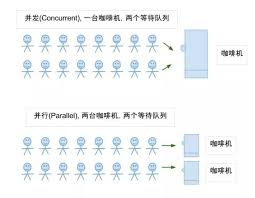

完全想到哪写到哪，做个重要知识的回顾，总结。

# ◇ 并行，并发

## ◆ 并发

并发指的是两个或以上的任务，可以在一个重叠时间内启动、执行和结束。它并不意味着多个任务在同一时间由同一实例去运行，比如在一台单核上执行多任务，同一时间仍然只有同一个任务，但是任务之间并非顺序执行，而是在整个生命周期内有重叠。所以并发是个单独的概念，不单指协程、进程或者线程。它是对时间的切片，是一种虚拟的并行。

## ◆ 并行

并行特指多个任务在同一时间运行，无论是进程、线程还是协程。前提必须多核。

