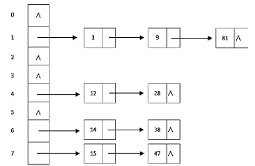
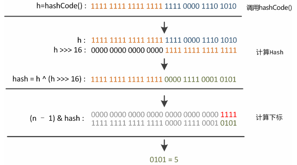
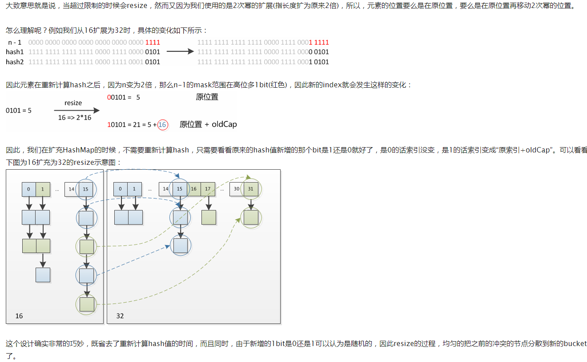

# 散列表

　　**散列表/哈希表（Hash Table）一种用空间换时间**的储存结构，能够快速的进行查找。不论是顺序存储结构还是树存储结构在查找时都需要不断的进行比较，而比较这个操作非常的耗时。而散列表能够**直接通过给定的关键字直接访问具体对应的值，基本免去比较的步骤。** 所以速度非常的快。

 　　散列表存储的是键值对形式的数据（key,value）。通过key映射得到value的地址。散列表利用了**数组寻址方便的特点 **,将得到的地址作为数组的索引，从而快速得到value。也就是说**散列表将一个大范围取值的key映射到了一个有限范围的连续内存地址中。** 那么有两个主要问题需要解决：**怎么映射？映射冲突怎么办？**


# 散列函数/Hash函数

散列函数/Hash函数将键转化为数组的索引，完成映射。

 

一个优秀的散列函数的三个条件：

- **一致性**，等价的键必然产生相等的散列值。

- **高效性**，计算简便。

- **均匀性**，均匀的散列所有的键。越不均匀越容易产生冲突，性能越差。均匀性需要散列函数能够有效的利用键的所有信息。

所以，严格的说，对于每种类型的键都需要一个与之对应的散列函数.


**例子：**

- 正整数：**除留余数法。** k%M，将键散布到0~M-1的范围内。需要注意的是**M最好取素数**。因为如果不是素数，会导致无法利用键的所有信息导致分布不均匀（比如M=10时，个位数的信息就没有被用到）。
- 浮点数：表示为二进制数再用除留余数法。
- 字符串：按位做处理 $hash = (R*hash+s.charAt(i))\% M$ 如果没有R则相当于直接所有字符相加取余。
-  Java：所有数据类型都继承一个能够**返回一个32位bit整数的 hashCode() 方法。**（注意：如果a.equals(b)==true，那么一定a.hashCode()==b.hashCode()。但是如果a.hashCode()==b.hashCode()，a.equals(b)不一定为true）。 
  得到32位整数后需要转化为一个数组索引=> $(x.hashCode() \& 0x7fffffff)\%M$ 。**注意将符号位屏蔽**，否则Java取余会得到负数，然后寻址崩溃。


# 碰撞、冲突解决

哈希碰撞是无法避免的，毕竟是将无限范围映射到有限范围。

最常见的冲突解决方法：

- **拉链法**。使用数组+链表的组合，冲突的值放在一个链表中。
- **开放地址法**。冲突的值放在后面的空位置中，需要根据情况控制数组大小。
- 公共溢出区法。建立一个公共溢出区，冲突时，将新地址放在公共溢出区中。


## 拉链法

利用数组+链表的方式解决冲突问题。

假设有数组大小为M，总数据量为N。那么查询时间为N/M。

拉链法的一大优势在于：**散列表的大小不是非常关键。** 毕竟查询时间稳定在N/M，只要M足够大，就能很好的提升性能。



java中，用Capacity设置数组大小，Load factor（0.75）设置数组填满程度最大比例。其认为当数组使用率达到75%时，哈希冲突已经比较严重了，需要成倍扩容数组。

java中put实现：

1. 获得key的hashCode()计算index;
2. 如果没碰撞直接放到bucket里；
3. 如果碰撞了，以链表的形式存在buckets后；
4. 如果碰撞导致链表过长(大于等于TREEIFY_THRESHOLD)，就把链表转换成红黑树；
5. 如果节点已经存在就替换old value(保证key的唯一性)
6. 如果bucket满了(超过load factor*current capacity)，就要resize。

java中get实现：

1. bucket里的第一个节点，直接命中；
2. 如果有冲突，则通过key.equals(k)去查找对应的entry
   若为树，则在树中通过key.equals(k)查找，O(logn)；
   若为链表，则在链表中通过key.equals(k)查找，O(n)。

java中index实现：

- hash(key) = (key == null) ? 0 : (h = key.hashCode()) ^ (h >>> 16); 

- tab[(n - 1) & hash] 因为n是2的幂次，所以等价于 %，但更快。



java中resize实现：




```java
// 拉链法简单实现。
// 节点类,默认key为int类型,value为String
class Entry{
    int key;
    String value;
    Entry next;
    public Entry(int key,String value){
        this.key=key;
        this.value=value;
        this.next=null;
    }
}

//链表类
class EntryList{
    Entry head = null;

    // 添加数据
    public int put(Entry entry){
        if(head==null) {
            head=entry;
            return 1;
        }
        Entry curEnt = head;
        while(true){
            //已存在值,替换
            if(curEnt.key==entry.key){
                curEnt.value = entry.value;
                return 0;
            }
            if(curEnt.next==null){
                break;
            }
            curEnt = curEnt.next;
        }
        // 存入新值
        curEnt.next = entry;
        return 1;
    }

    public String get(Entry entry){
        Entry curEnt=head;
        while(curEnt!=null){
            if(entry.key==curEnt.key)
                return curEnt.value;
            curEnt = curEnt.next;
        }
        return null;
    }

    // 移除数据
    public int remove(Entry entry){
        if(head==null) return 0;
        if(head.key==entry.key){
            head=null;
            return -1;
        }
        Entry curEnt = head;
        Entry preEnt = null;
        while(true){
            if (curEnt.key==entry.key){
                preEnt.next=curEnt.next;
                return -1;
            }
            if(curEnt.next==null)
                return 0;
            preEnt = curEnt;
            curEnt = curEnt.next;
        }
    }

    // 遍历链表
    public void list(){
        if(head==null){
            return;
        }
        Entry curEnt = head;
        while(true){
            System.out.println("key:"+curEnt.key+"value:"+curEnt.value);
            if(curEnt.next==null)
                break;
            curEnt = curEnt.next;
        }
    }
}

// 默认key为int类型，不用指定
public class HashTable {

    private int N=0;//键值对总数
    private int M=10;//散列表大小
    private double alpha=2;// N/M的上限
    private EntryList[] table;//链表数组

    public HashTable(){
        table = new EntryList[M];
        for(int i=0;i<M;i++)
            table[i]=new EntryList();
    }

    // 简单的求余hash函数
    private int hash(int key){
        return key % M;
    }

    private void put(int key,String value){
        int index=hash(key);
        Entry entry = new Entry(key,value);
        N+=table[index].put(entry);
        if((N+0.0)/M>alpha) resize(M*2);
    }

    private String get(int key){
        int index=hash(key);
        Entry entry = new Entry(key,"");
        return table[index].get(entry);
    }

    private void remove(int key){
        int index=hash(key);
        Entry entry = new Entry(key,"");
        N+=table[index].remove(entry);
        if((N+0.0)/M<1.0/(alpha*2) && M>10) resize(M/2);
    }

    private void list(){
        for(int i=0;i<table.length;i++)
            table[i].list();
    }


    // 重置散列表大小，重填
    private void resize(int M){
        this.M = M;
        EntryList[] oldTable = table;
        table = new EntryList[M];
        for(int i=0;i<M;i++)
            table[i]=new EntryList();

        for(int i=0;i<oldTable.length;i++){
            Entry curEnt = oldTable[i].head;
            while(curEnt!=null){
                int index = hash(curEnt.key);
                table[index].put(curEnt);
                curEnt=curEnt.next;
            }
        }

    }
```


## 开放地址法

其策略是：当目标地址已经有值时，向后进行探索，寻找空位进行存放。最简单的方式是**线性探测法**，及发生冲突时直接检查下一个位置，直到找到空位或目标键。

线性探测法的实现十分简单，只需要实现一个并行数组，一个保存键，一个保存值。

线性探测法的查询时间与**键簇长度**有关，键簇指一组连续非空的数组段。已证明：**在均匀分布的前提下，当数组使用率小于1/2时，探测预期次数只有1.5到2.5之间。** 所以线性探测法需要维持**数组使用率在1/4到1/2之间。** 这样既保证不会过多浪费空间，也保证了查询速度。


```java
// 线性探测法
// 默认key为int>0,value为String
public class HashTable_linesr {

    int[] keys;
    String[] values;
    int N=0;//键值对总数
    int M=16;//散列表大小

    public HashTable_linesr(){
        keys = new int[M];
        values = new String[M];
    }
    public int hash(int key){
        return key % M;
    }

    public void put(int key,String value){
        int index=hash(key);
        // 为了方便假设key都大于0
        while(keys[index]!=0){
            if(keys[index]==key){
                values[index]=value;
                return;
            }
            index = (index+1)%M;
        }
        keys[index]=key;
        values[index]=value;
        N++;
        if(N>=M/2) resize(M*2);//方法散列表
    }

    public String get(int key){
        int index=hash(key);
        while(keys[index]!=0){
            if(keys[index]==key){
                return values[index];
            }
            index = (1+index)%M;
        }
        return null;
    }

    // 注意需要将整个键簇的值都重插一遍！
    public void remove(int key){
        int index = hash(key);
        while(keys[index]!=0 && keys[index]!=key)
            index = (index+1)%M;
        if(keys[index]!=key) return;
        keys[index]=0;
        values[index]=null;
        index = (index+1)%M;
        while(keys[index]!=0){
            int curKey = keys[index];
            String curValue = values[index];
            keys[index]=0;
            values[index]=null;
            N--;
            put(curKey,curValue);
            index = (index+1)%M;
        }
        N--;
        if(N<=M/8) resize(M/2);
    }

    // 重新装填
    public void resize(int M){
        this.M = M;
        int[] old_keys = keys;
        String[] old_values = values;
        keys = new int[M];
        values = new String[M];
        for(int i=0;i<old_keys.length;i++){
            if(old_keys[i]!=0)
                put(old_keys[i],old_values[i]);
        }
    }
    
}
```


## 数组大小调整

- 对于开放地址法，数组的大小调整是必须的（不然查询时间会变长还会出现数组被填满的情况），需要维持N/M（数组使用率）在1/4到1/2之间。
- 对于拉链法，大小的调整不是必须的，但最好维持N/M（链表平均长度）在2到8之间。java的策略则是保证数组填充率小于75%。

## 内存使用

- 拉链法，需要为每个键值对额外创建节点内存。
- 对于开放地址法，直接创建了两个很大的数组。


# 使用场景

- 缓存，减少和数据库的交互。
- 快速查找。


# HashMap、Hashtable 、TreeMap、LinkedHashMap、set

- HashMap和Hashtable基本相同，除了Hashtable不允许使用null和支持线程同步。
- HashMap是HashTable的轻量级实现。
- HashMap继承AbstractMap，HashTable继承Dictionary类。


- LinkedHashMap保存了记录的插入顺序。
- set都是用Map实现的，是键和值相同的map。
- HashMap使用哈希结构，TreeMap使用红黑树结构。
- HashMap适用于插入、删除和定位元素。
- TreeMap适用于自然顺序（按键升序）或自定义顺序遍历键。
- HashMap使用hashcode()和equal()寻值。TreeMap则使用Comparator()寻值。


