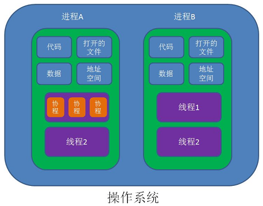
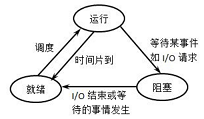

完全想到哪写到哪，做个重要知识的回顾，总结。

# ◇ 进程，线程，协程

## ◆ 进程

**系统分配资源的最小单位！**进程的创建和销毁都是相对于系统资源,所以是一种比较昂贵的操作。

资源：

- 代码段：保存应用的执行代码。
- 数据段：全局变量，常量，静态变量。
- 堆栈段：
  - 堆：存放各种变量数据（new的对象），大小动态调整。
  - 栈：子任务（线程、协程）独立存放数据的地方（函数调用、参数、局部变量等）。

三个状态：

- 阻塞态：等待某个事件的完成（比如等待IO数据）。

- 就绪态：等待系统分配处理器运行（随时可以运行）。

- 运行态：占有处理器运行。

- 一般不太讨论创建态和结束态。

  

通信：

- 进程间是隔离的,各自拥有自己的资源, *因此相对于线程比较安全*, 所以不同进程之间的数据只能通过 *IPC(Inter-Process Communication)* 进行通信共享。

安全性：

- 进程间隔离，资源安全，一个进程崩溃不会影响其他进程。

上下文切换：

- 切换页目录以使用新的地址空间（进程拥有独立的地址空间）
- 切换内核栈
- 切换硬件上下文

## ◆ 线程

**CPU调度的最小单位。** 因此几乎不占系统资源，轻量级。

资源：

- 只需分配独立的栈空间，大小固定，提前设置好。

状态：

- 派生（New）：线程在进程内派生出来，它即可由进程派生，也可由线程派生。
- 阻塞（Block）：如果一个线程在执行过程中需要等待某个事件发生，则被阻塞。
- 激活（Unblock）：如果阻塞线程的事件发生，则该线程被激活并进入就绪队列。
- 调度（Schedule）：选择一个就绪线程进入执行状态。
- 结束（Finish）：如果一个线程执行结束，它的寄存器上下文以及堆栈内容等将被释放。

 通信：

- 同个进程中的线程共享资源（全局变量），可以直接进行通信。

安全性：

- 由于资源共享，使用时需要引入各种锁。
- 一个线程的崩溃会导致整个进程的崩溃，继而导致所有线程的崩溃。

上下文切换：

- 切换内核栈（不用切换地址空间，共享进程的地址空间）
- 切换硬件上下文

## ◆ 协程

**由程序员手动切换。** 属于线程，是在线程里面跑的，因此协程又称微线程和纤程等。

资源：

- 拥有自己的栈空间，大小动态调整。

安全性：

- 拥有自己的寄存器上下文和栈。

上下文切换：

- 无消耗，直接操作栈。调度切换是用户(程序员)手动切换,可控的切换时机，很小的切换代价,因此又叫用户态的轻量级的线程。

实现：

- 迭代器： 实现了迭代接口的类,接口函数例如:current,key,next,rewind,valid。迭代器最基本的规定了对象可以通过next返回下一个值，而不是像数组，列表一样一次性返回。语言实现：在Java的foreach遍历迭代器对(数组)，Python的for遍历迭代器对象(tuple，list，dist)。
- 生成器： 使用 yield 关键字的函数,可以多次返回值，生成器实际上也算是实现了迭代器接口(协议)。即生成器也可通过next返回下一个值。

## ◆ 小结

- **多核CPU，CPU密集型应用** 此时多线程的效率是最高的，多线程可以使到全部CPU核心满载，又避免了协程间切换造成性能损失。当CPU密集型任务时，CPU一直在利用着，切换反而会造成性能损失，即便协程上下文切换消耗最小，但也还是有消耗的。
- **多核CPU，IO密集型应用**此时采用多线程多协程效率最高，多线程可以使到全部CPU核心满载，而一个线程多协程，则更好的提高了CPU的利用率。
- **单核CPU，CPU密集型应用**单进程效率是最高，此时单个进程已经使到CPU满载了。
- **单核CPU，IO密集型应用**多协程，效率最高。

