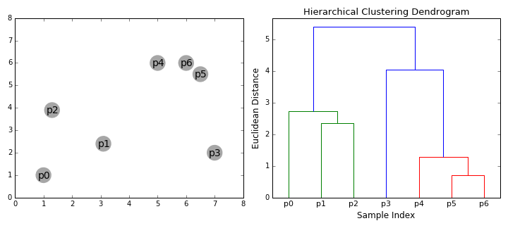

​									

​	**聚类(clustering)**算法是一种十分常用，方便的方法。

​	首先它是**非监督学习**，其训练样本**没有标记信息**。在日常任务中，我们往往会遇到手上有了数据但不知道具体该怎么做的情况，比如一些商业应用中需要对用户的类型进行判别，但具体怎么定义“用户类型”却十分困难。这个时候就需要用到聚类算法，对数据进行聚类之后再根据每一类的特点定义“用户类型”就会简单很多。

​	聚类算法既能作为一个单独的过程，用于**寻找数据内在的分布结构**，也可以作为分类等**其他学习任务的前驱过程**。

​	那么，现在让我们简单的来了解一下聚类算法。

## 1. 度量

​	在具体讲聚类的算法之前，先让我们来了解一下聚类算法的基础知识，其中最为重要的就是如何进行**度量**。

​	在聚类算法中度量可以分为两种——**性能度量**和**距离度量**。

### 1.1 距离度量

​	距离度量是聚类算法的基础。两个点是否为同一个类，就要看这两个点离的是否“足够近”。

​	最为常用的距离度量是**闵可夫斯基距离（Minkowski distance）:**

​		$dist_{mk}(x_i,x_j)=(\sum_{u=1}^{n}|x_{iu}-x_{ju}|^p)^{1/p}$

​	当P=2时，即为**欧式距离（Euclidean distance）:**

​		$dist_{ed}(x_i,x_j)=\sqrt{\sum_{u=1}^n|x_{iu}-x_{ju}|^2}$

​	当P=1时，即为**曼哈顿距离（Manhattan distance）:**

​		$dist_{man}(x_i,x_j)=\sum_{u=1}^n|x_{iu}-x_{ju}|$

​	……是不是觉得很熟悉~

​	另外还有一种针对**离散变量**的常用距离计算**VDM(Value Difference Metric)：**

​		$VDM_P(a,b)=\sum_{i=1}^k|\frac{m_{u,a,i}}{m_u,a}-\frac{m_{u,b,i}}{m_u,b}|^P$

​		其中m_{u,a}表示属性u上取值为a的样本数，_
​		_m_{u,a,i}表示在第i个样本簇中在属性u上取值为a的样本数，
​		k为样本簇数。


> 这里说一下关于**变量类型**的问题，这个问题在进行属性数值运算时经常遇到。

​	● 对于**连续变量**,一般我们会做一下**标准化**或者**归一化**,或者不做特别处理也行。

​	● 对于**离散变量**中的**有序变量**，如{大一，大二，大三}、{满意，一般，不满意}等，我们可以用类似{1,2,3}这样的值去替代，因为这样可以保留更多的信息。可借助sklearn.preprocessing.OrdinalEncoder()来帮助替换。

​	● 对于**离散变量**中的**无序变量**，如{飞机，火车，轮船}，{医生，记者，学生}等，我们以往使用**onehot编码**来替换，但是在计算距离时onehot编码会损失信息，因为各个编码之间的距离是一样的。这时候我们需要使用VDM这类计算方式，来尽量多的保留变量信息。但是有一个问题：**大部分的算法库并没有考虑无序变量**，这样一来如果我们要实现VDM这类度量，只能自己手动撸了。这使得在要求不高的情况下onehot凑合着用就行了，反正聚类本来就是个大概。（当然如**K-prototypes**可以处理混合变量，十分周到~） 

​	

### 1.2 性能度量

​	对数据进行聚类，我们的目标很简单：**“簇内相似度（intra-cluster similarity）”高且“簇间相似度（inter-cluster similarity）低”**。对一个聚类的结果一般从这两个方面去度量。

​	而性能度量根据有没有“参考模型”可以分为两种**外部指标**和**内部指标**。

#### 1.2.1 内部指标

​	内部指标就是单纯靠聚类后类内和类间的距离来评估。

​	常见的有：

##### ● **Silhouette Coefficient**

​	Silhouette Coefficient 对每个样本都进行了评估：	

​		$S=\frac{b-a}{max(a,b)} $

​		a：在同一个类中，一个样本与其他所有点的平均距离。

​		b：一个样本与下一个最近的类中的所有其他点的平均距离。

​	最后对数据集的整体评估为每个样本评估的平均值。

[sklearn](https://scikit-learn.org/stable/modules/clustering.html#silhouette-coefficient)

```python
## 优点：取值[-1,1]。负数表示错误分类，正数表示正确分类，0表示重叠分类。
##　		分值越高表示簇越稠密，分类效果越好。
## 缺点：对于凸簇分类的算法往往评分会比较高，比如基于密度分类的DBSCAN
>>> from sklearn import metrics
>>> from sklearn.metrics import pairwise_distances
>>> from sklearn import datasets
>>> from sklearn.cluster import KMeans
>>> import numpy as np

>>> dataset = datasets.load_iris()
>>> X = dataset.data
>>> y = dataset.target
>>> kmeans_model = KMeans(n_clusters=3, random_state=1).fit(X)
>>> labels = kmeans_model.labels_
>>> metrics.silhouette_score(X, labels, metric='euclidean')
...                                                      
0.55...
```


##### ● **Calinski-Harabaz Index**

​	也被称为**Variance Ratio Criterion**。

​	$s(k)=\frac{Tr(B_k)}{Tr(W_k)}*\frac{N-k}{k-1}$

​	$W_k=\sum_{q=1}^k\sum_{x\in C_q}(x-c_q)(x-c_q)^T$

​	$B_k=\sum_qn_q(c_q-c)(c_q-c)^T$

​	其中N为数据的样本数，k为簇数，$C_q$为簇q的样本集，$c_q$为簇q的中心点，c为整个数据的中心点，$n_q$为簇q的样本数。

[sklearn](https://scikit-learn.org/stable/modules/clustering.html#calinski-harabaz-index)

```python
## 优点：得分越高表示簇越稠密，分类效果越好
##     	 计算速度快
## 缺点：对于凸簇分类的算法往往评分会比较高，比如基于密度分类的DBSCAN
>>> from sklearn import metrics
>>> from sklearn.metrics import pairwise_distances
>>> from sklearn import datasets
>>> dataset = datasets.load_iris()
>>> X = dataset.data
>>> y = dataset.target

>>> import numpy as np
>>> from sklearn.cluster import KMeans
>>> kmeans_model = KMeans(n_clusters=3, random_state=1).fit(X)
>>> labels = kmeans_model.labels_
>>> metrics.calinski_harabaz_score(X, labels)  
561.62...
```


##### ● **Davies-Bouldin Index**

​	这个指标根据各个簇内距离和簇之间的距离远近来评估。

​	$R_{i,j}=\frac{s_i+s_j}{d_{i,j}}$

​	$DB=\frac{1}{k}\sum_{i=1}^kmax_{i\ne j}R_{i,j}$

​	$s_i$表示簇i中所有的点到簇中心点的平均距离。

​	$d_{i,j}$表示簇i和簇j的中心点距离。

[sklearn](https://scikit-learn.org/stable/modules/clustering.html#davies-bouldin-index)

```python
## 优势：得分越低越好，最低为0
## 		计算简单，迅速
## 缺点：对于凸簇分类的算法往往评分会比较高，比如基于密度分类的DBSCAN
>>> from sklearn import datasets
>>> iris = datasets.load_iris()
>>> X = iris.data
>>> from sklearn.cluster import KMeans
>>> from sklearn.metrics import davies_bouldin_score
>>> kmeans = KMeans(n_clusters=3, random_state=1).fit(X)
>>> labels = kmeans.labels_
>>> davies_bouldin_score(X, labels)  
0.6619...
```


#### 1.2.2 外部指标

​	外部指标的计算需要**依靠“参考模型”**，比如领域专家给出的划分结果，所以并不是很常用。

​	一般这种指标也就看看自己的聚类和别人的聚类是否相似，比如某个领域已经有专家人工对数据进行了分类，现在你用机器学习方法也聚了一下类，然后想看看两者是否相似。

​	常见的有：

##### ● Adjusted Rand index

​	该指标计算了预测标签和标记标签的相似度。

​	首先是一般的Rand index	

​		$RI=\frac{a+b}{C_n^2}$

​	a：表示在预测中**属于**同一簇且在参考标记中也**属于**同一簇的样本对的数量。

​	b：表示在预测中**不属于**同一簇且在参考标记中也**不属于**同一簇的样本对的数量。

​	$C_n^2$： 表示样本对总数。

​	但是**RI**系数有个缺点：当标签是随机分配时，指标并不接近零，这是反直觉的。

​	因此**ARI**：

​		$ARI=\frac{RI-E[RI]}{max(RI)-E[RI]}$

​	其中，E[RI]为随机标签时，RI的期望。

[sklearn](https://scikit-learn.org/stable/modules/clustering.html#adjusted-rand-index)

```python
##　优势：得分［-1,1］。随机标签得分接近0，负数则效果差，正数则效果好。
##  缺点：需要已标注的分类。
>>> from sklearn import metrics
>>> labels_true = [0, 0, 0, 1, 1, 1]
>>> labels_pred = [0, 0, 1, 1, 2, 2]

>>> metrics.adjusted_rand_score(labels_true, labels_pred)  
0.24...
# 具体标签值不影响
>>> labels_pred = [1, 1, 0, 0, 3, 3]
>>> metrics.adjusted_rand_score(labels_true, labels_pred)  
0.24...
# 对称性
>>> metrics.adjusted_rand_score(labels_pred, labels_true)  
0.24...
```


##### ● Mutual Information 

​	基于互信息，也就是利用信息熵来评估两者的相似程度。

​	主要分为两种：**Normalized Mutual Information(NMI)** 和 **Adjusted Mutual Information(AMI)**
​	一般AMI比NMI稍好一点。	

​	数学公式有点多，这里就不展开了，实际上本质并没有区别，无非就是用信息熵代替了原来的比值。

[sklearn](https://scikit-learn.org/stable/modules/clustering.html#mutual-information-based-scores)

```python
## 优势：得分接近０表示是随机标签。最高为１。正好负坏。
>>> from sklearn import metrics
>>> labels_true = [0, 0, 0, 1, 1, 1]
>>> labels_pred = [0, 0, 1, 1, 2, 2]

>>> metrics.adjusted_mutual_info_score(labels_true, labels_pred)  
0.22504...
# 具体标签值不影响
>>> labels_pred = [1, 1, 0, 0, 3, 3]
>>> metrics.adjusted_mutual_info_score(labels_true, labels_pred)  
0.22504...
# 对称性
>>> metrics.adjusted_mutual_info_score(labels_pred, labels_true)  
0.22504...
```


##### ● V-measure

​	使用条件熵分析。

​	分为三个指标：

​	**homogeneity_score**：同质性指标，指每个簇中的样本都来源于一个类。（可以理解为标记分类含括了预测分类）。

​	**completeness_score**：完整性指标，指每个类中的样本都来源于一个簇。（可以理解为预测分类含括了标记分类）。

​	**V-measure**： 为两者的调和平均数。和上面的NMI基本一个东西~

​	具体可以看论文：[V-Measure: A conditional entropy-based external cluster evaluation measure](http://aclweb.org/anthology/D/D07/D07-1043.pdf) 

``` python
## 优势：[0,1]。0最坏，1最好
## 		当homogeneity_score比较大时，可以认为预测得到的分类是标记分类的“子类”，更加精细且两者相似。
## 		当completeness_score比较大时，可以认为预测的到的分类是标记分类的“父类”，比较泛但两者相似。	
## 缺点：随机标签的得分并不为0。这个问题当样本数量比较大，且分类数小于10时可以忽略。否则则需要使用
## 		adjusted指标，如ARI。
>>> from sklearn import metrics
>>> labels_true = [0, 0, 0, 1, 1, 1]
>>> labels_pred = [0, 0, 1, 1, 2, 2]

>>> metrics.homogeneity_score(labels_true, labels_pred)  
0.66...

>>> metrics.completeness_score(labels_true, labels_pred) 
0.42...

>>> metrics.v_measure_score(labels_true, labels_pred)    
0.51...

>>> metrics.homogeneity_completeness_v_measure(labels_true, labels_pred)
...(0.66..., 0.42..., 0.51...)

>>> homogeneity_score(a, b) == completeness_score(b, a)
```


##### ● Fowlkes-Mallows index

​	既然是分类问题，为什么不用混淆矩阵来评估呢，都有了标注那和监督型分类的评估也没什么不一样了。

​	$FMI=\frac{TP}{\sqrt{(TP+FP)(TP+FN)}}$

​	TP：真阳性。FP：假阳性。FN：假阴性。

```python
## 优势：随机标签得分接近0.优秀分类得分趋于1.
## 缺点：需要标注数据。
>>> from sklearn import metrics
>>> labels_true = [0, 0, 0, 1, 1, 1]
>>> labels_pred = [0, 0, 1, 1, 2, 2]
>>> metrics.fowlkes_mallows_score(labels_true, labels_pred)  
0.47140...
```


## 2. 算法

​	聚类算法是一类十分“灵活”，“活跃”的算法。不同的距离度量，不同的评估标准等都会诞生新的聚类算法，现在已知的聚类算法都有100多种了。

​	当然我们只要最常用，效果最好的几种方法就够了。


### 2.1 K-means

​	**k均值**可以说是最为流行的聚类算法了。因为他简单、高效、易实现。

​	k-means算法的思想很简单：将数据分为k类，并使簇内样本相似度最高，即最小化平方误差。

​		$E=\sum_{i=1}^k\sum_{x\in C_i}||x-u_i||_2^2$

​		$u_i$为簇i的中心、均值向量。

​	k-means的目标很明确，但最小化E却是一个**NP难问题**。 只能通过启发式的，贪心策略来获得近似解。

> 接下来让我们看一下它是怎么执行的：


1. 首先我们要确定将数据分为几个类，即确定K值。然后随机选取K个点作为簇的中心点。
2. 通过计算每个样本与中心点的距离对数据进行分类。
3. 根据分类后的数据，可以重新计算每个簇的中心点。
4. 不断重复2、3步骤，获得优秀的分类结果。

> K-means 的优点

​	K-means的优点很明显：简单，快速。
​	K-means的时间复杂度为O(n)

> K-means 的缺点

​	● 需要事先确定分几个类。一般只能选取足够大的分类数，导致一些自然的聚类被多个聚类表示。

​	● 对噪声点比较敏感。可以用LOF算法提前去除离群点，也可以改用k-Mediods算法，用中位数代替均值。

​	● 需要随机初始化中心点。原始中心点的选取对最终结果的影响十分大。我们需要进行多次不同的初始化来逼近最优解(n_init参数)。sklearn实现了一种称为K-means++的初始化方法，其可以一定程度上解决初始化的问题，它的策略是使初始化的中心点尽量互相远离。

​	● 相比于其他算法，K-means的结果可复现性差。

​	● 由于K-means使用欧几里得距离作为距离度量并用均值法来求取中心点，直观的理解，可以认为其在用“圆”来划分数据。也就意味着K-means对于“长条”型的数据分类效果会比较差。

​	● 由于K-means使用欧几里得距离作为距离度量，这会导致当数据比较高维时度量会膨胀也就是“维度诅咒”。可以在数据预处理时使用PCA技术进行降维，来减轻高维度带来的问题且能提升算法速度。

[KMeans](https://scikit-learn.org/stable/modules/generated/sklearn.cluster.KMeans.html#sklearn.cluster.KMeans)   &   [MiniBatchKMeans](https://scikit-learn.org/stable/modules/generated/sklearn.cluster.MiniBatchKMeans.html#sklearn.cluster.MiniBatchKMeans)

```python
## 在sklearn中还实现了MiniBatchKMwans算法，这个算法在一般K-means算法基础上使用了批处理方式，从而不需要## 每次都处理所有数据，这能够大大提升算法的速度，以牺牲一点点分类质量为代价。

from sklearn.cluster import MiniBatchKMeans, KMeans
k_means = KMeans(init='k-means++', n_clusters=3, n_init=10)
k_means.fit(X)
mbk = MiniBatchKMeans(init='k-means++', n_clusters=3, batch_size=40,
                      n_init=10, max_no_improvement=10, verbose=0)
mbk.fit(X)
```


### 2.2 Mean-Shift

​	**均值漂移**算法是基于**滑动窗口**的算法。这个算法的目标在于**寻找数据的密集区域**， 其认为**在一个簇的中心点数据一定是最密集的**！

> 让我们看一下它具体是怎么运行的：


​	

1. 首先初始化许多窗口中心点，并设置一个合适的窗口大小。
2. 将一个窗口中所有点的均值作为这个窗口新的中心点，这样一来窗口就会向着高密度区域滑动。
3. 不断的重复2，直到窗口不再移动为止。
4. 将距离相近的中心点进行合并，得到最终分类结果。

> mean-shift优点：

​	● 对噪声有很强的鲁棒性

​	● 只有一个参数调参方便	

> mean-shift缺点：

​	● 窗口宽度大小的选取对最终结果有比较大影响。

​	● 速度慢,O(n^2)

​	● 可能会产生一些不确定的小聚类点。

> mean-shift的窗口：

​	有窗口那么就一定会有**核函数**选择的问题。实际上就是一种**花哨的权重分配方法~**。而在核函数选择问题中，往往都是Gaussian kernel获胜。但在sklearn中却只实现了Flat kernel，很难受。。


```python
>>> from sklearn.cluster import MeanShift
>>> import numpy as np
>>> X = np.array([[1, 1], [2, 1], [1, 0],
...               [4, 7], [3, 5], [3, 6]])
>>> clustering = MeanShift(bandwidth=2).fit(X)
>>> clustering.labels_
array([1, 1, 1, 0, 0, 0])
>>> clustering.predict([[0, 0], [5, 5]])
array([1, 0])

## 当不知道bandwidth取什么的时候可以借助estimate_bandwidth
from sklearn.cluster import estimate_bandwidth
bandwidth = estimate_bandwidth(X, quantile=0.2)
```


### 2.3 DBSCAN

​	**Density-Based Spatial Clustering of Applications with Noise（DBSCAN）**是一种著名的**基于密度聚类**的算法。

​	DBSCAN和Mean-Shift比较相似。**Mean-Shift认为在一个簇的中心点数据一定是最密集的**， 而**DBSCAN则认为在两个簇之间数据一定是稀疏的！** 

​	那么DBSCAN的重点在于**怎么判断一个区域数据是否稀疏。**

​		$minPts:一个区域中最少的数据点数。$

​		$\epsilon:区域半径。$

​	可以认为一个点如果在其半径为ε的区域内，数据点的总数少于minPts，那么这个点就是孤立点。

> 为了更直观的理解，让我们看一下其具体流程：


1. 遍历所有点，判断其是否为**核心对象** 。核心对象指的是该点满足：以该点为圆心，ε为半径的区域内数据点数不小于minPts。
2. 以任一“未用”核心对象为起点建立一个新簇，其ε半径内的点都为该簇内点。
3. 选取该簇内一个“未扩展”的核心对象，其ε半径内的点都为该簇内点。
4. 不断重复3，使得簇不断生长，直到簇内的核心对象都已经“扩展”过，即生成一个完整的簇。在执行步骤2。
5. 对于那些不在任何簇内的点标记为**噪声点**。 


> 参数的选择

​	**minPts:**

​		● 一般大于3，大于（维度+1），且一般大一点好。

​		● 数据集越大，minPts越大。

​	**ε**

​		● 可以通过K-distance graph 来辅助选择。

​		● 取值太小会导致大量数据无法分类；太大则会导致类别数太少。

​		● 一般来说，取值小一点较好。

> DBSCAN优点：

​	● 不需要指定簇数。

​	● 可以对任意形状的稠密数据集进行聚类。

​	● 能够标记噪声点，对异常点不敏感。

​	● 只要参数不变，能够重现分类结果。

> DBSCAN缺点：

​	● 当样本集的密度不均匀、聚类间距差相差很大时，聚类质量较差。

​	● 对于高维数据处理效果较差。

​	● 速度慢，O(N^2)，可以对搜索最近邻时建立的KD树或者球树进行规模限制来改进。

​	● 两个参数调参很麻烦，不同的参数对最终结果影响很大。

```python
>>> from sklearn.cluster import DBSCAN
>>> import numpy as np
>>> X = np.array([[1, 2], [2, 2], [2, 3],
...               [8, 7], [8, 8], [25, 80]])
>>> clustering = DBSCAN(eps=3, min_samples=2).fit(X)
>>> clustering.labels_
array([ 0,  0,  0,  1,  1, -1])
>>> clustering 
DBSCAN(algorithm='auto', eps=3, leaf_size=30, metric='euclidean',
    metric_params=None, min_samples=2, n_jobs=None, p=None)
```


### 2.4 GMM

​	**Gaussian Mixture Model，GMM，** 高斯混合模型 。其认为**数据分布符合高斯分布**，于是算法就**用多个高斯模型去表示、拟合数据的分布！**

​	GMM和K-means十分的像。实际上**K-means可以看作是GMM的一种特殊情况。**
​	直观的来看：

​	● 在K-means中，我们用欧几里得求距离用均值求中心点，实际上就是在用“圆”去分割数据。而GMM则更一般化，其用高斯函数去拟合，高斯函数拥有均值和方差两个变量，可以看成是在用“椭圆”去分割数据。很明显GMM的拟合能力强于K-means。

​	● 在K-means中，我们将界限划分的很强硬，一个点一定且只能属于一个簇。而GMM则更一般化，因为高斯函数有个好处，其可以用**概率大小来表示距离的远近**，所以我们可以得到一个点对于各个簇的概率。这对于那些“中间点”的分析友好了太多。

​	● 求解时，在K-means中，我们使用贪心的策略启发式的去寻找中心点。在GMM也一样，不过因为用的是概率所以称为**EM（最大期望）算法**，本质上并没有什么区别。


>  GMM算法主要的变量有4个：

​	$K$：和K-means算法一样，需要预先确定有几个簇。在GMM也就是component的数量。

​	$\mu_i$： 第i个高斯函数的均值。

​	$\Sigma_i$： 第i个高斯函数的协方差。

​	$\pi_i$： 第i个高斯函数的权重，可估计为$N_k/N$。

 其中只有K值需要人为确定，另外的值则通过学习自动获取。

> 具体流程：


1. 首先确定簇的个数K，并初始化高斯分布的参数和权重。
2. 根据现有参数计算每个样本属于每个component的后验概率。**E步**
3. 根据极大似然估计（即使得数据整体的概率最大化），更新参数和权重。**M步**
4. 不断重复23步，得到近似最优解。

这里实际上跟着公式来看更加清晰易懂，但是实在懒得打公式了~~


> GMM优势：

​	● 数据点的分类用概率的方式进行描述，对“中间点”更友好。

​	● 相比于K-means，更灵活，分类效果更好。

​	● 速度快，O(n)

> GMM劣势：

​	● 需要预先确定K值。

​	● 需要初始化高斯参数，不同的初始化会对结果产生很大的影响。


[sklearn](https://scikit-learn.org/stable/modules/generated/sklearn.mixture.GaussianMixture.html#sklearn.mixture.GaussianMixture)

```python
from sklearn import mixture
gmm = mixture.GaussianMixture(n_components=3, covariance_type='full',n_init=10,)
gmm.fit(X)
y=gmm.predict(X)
```


### 2.5 Hierarchical 

​	**Hierarchical clustering层次聚类算法**，也是一种十分常用的算法。

​	Hierarchical Clustering主要分为两大类：**bottom-up、agglomerative、自下而上**和 **top-down、divisive、自上而下**。其中主要使用自下而上的算法，因为自上而下算法执行起来太麻烦。。

​	自下而上的算法又被称为**Hierarchical Agglomerative Clustering，HAC，凝聚式层次聚类**。其首先将每个数据点视为一个单一的簇，然后连续地合并（或聚合）两个簇，直到所有的簇都合并成一个包含所有数据点的簇。

​	

那么整个算法的主要问题就是：**怎么计算两个点的距离**和**怎么选择簇进行合并**。

> 如何计算两个点的距离

​	在前面距离度量中已经提过这个问题，一般选用**欧式距离（“euclidean”，“l2”）**。

​	也可以选用其他度量方式，如：manhattan("Cityblock","l1")，cosine，precomputed。

> 怎么选择簇进行合并

​	可以将距离最近的两个类进行合并：	

​		● **Single linkage**： 两个类中距离最近的点的距离。

​		● **Maximum** or **complete linkage**： 两个类中距离最远的点的距离。

​		● **Average linkage**： 将两个类中所有点的距离进行平均。

​	也可以选择合并后指标最小的情况：

​		● **ward**： 和K-means的思想相似，最小化簇内的平方误差。

​	 sklearn中对这些合并策略、指标进行了分析：

​		● ward的效果最好，但是其距离度量无法改变，只能用欧氏距离。

​		● 在非欧式距离情况下，Average linkage表现最好。

​		● 在非欧式距离度量中：“l1“距离对稀疏特征和噪声往往有比较好的效果。

​		● 可以进行连通性约束，即只有“相邻”的簇可以合并。

> Agglomerative Hierarchical的优点：

​	● 不需要指定簇的数量，甚至可以选择看起来较好的分类。

​	● 对于距离度量标准的选择并不敏感，效果都比较好。

> 缺点：

​	● 其优秀的聚类能力以效率为代价，O(n^3)。

​	

```python
>>> from sklearn.cluster import AgglomerativeClustering
>>> import numpy as np
>>> X = np.array([[1, 2], [1, 4], [1, 0],
...               [4, 2], [4, 4], [4, 0]])
>>> clustering = AgglomerativeClustering().fit(X)
>>> clustering 
AgglomerativeClustering(affinity='euclidean', compute_full_tree='auto',
            connectivity=None, linkage='ward', memory=None, n_clusters=2,
            pooling_func='deprecated')
>>> clustering.labels_
array([1, 1, 1, 0, 0, 0])
```


### 2.6 Spectral Clustering

​	因为谱聚类属于用起来很简单，但证明起来有点麻烦的算法，涉及的东西有点多，所以这里不讲具体的证明，只讲一些简单的概念和使用。具体的证明可以看[刘建平的博客](https://www.cnblogs.com/pinard/p/6221564.html)或者[谱聚类的论文](https://www.cs.cmu.edu/~aarti/Class/10701/readings/Luxburg06_TR.pdf) 。实际上整体看下来并不难，只是会感觉真的精彩。

​	**谱聚类（spectral clustering）**是广泛使用的聚类算法，相比于K-means，其**速度更快，效果更好！**

​	谱聚类，名字很高大上，但其实思想并不难。其**重点在于对数据无向图的切割**，这点和DBSCAN有点像。我们可以将数据用无向图的形式表现出来，顶点表示样本点，边表示数据之间的权重。当我们要将数据分成K份时，实际上就是将该图切割为K个不相连的字图，我们的策略就是尽可能的使**被切断的边的权重最小**。 而图往往用矩阵来表示，然后经过一系列十分神奇的转换后，这个问题可以用很简单的矩阵运算求得近似最优解！


接下来，简单讲一下一些基本概念：

> 怎么得到权重？

​	权重的获得分为两部分：**哪些点之间的权重需要表示？权重怎么用具体数值表示？**

​	边的选取：
​		● ε-临近法：对距离为ε内的点进行权重计算。
​		● K-临近法：对距离最近的K个点进行权重计算。
​		● 全连接：对所有的点进行权重计算。
​	其中，无疑全连接的效果是最好的，用的也最普遍。

​	权重表示：
​		● 多项式核函数
​		● 高斯核函数
​		● Sigmoid核函数
​	就是将距离进行变换来表示权重，其中**高斯核RBF最常使用**。

> 怎么用矩阵表示图

​	**权重矩阵、邻接矩阵W：** 矩阵中的每个值$\omega_{i,j}=\omega_{j,i}$表示点i和j的权重。 
​	**度矩阵D：**对角矩阵，只有主对角线有值。值为该点到其他所有点的权重的和。
​	**拉普拉斯矩阵L：** L=D-W。其特性有助于推导证明。

> 如何切割无向图

​	切割的关键点在于**使得被切割的权重最小**。
​		● 直接将被切割的权重相加。但是容易切割出孤立点。
​		● RatioCut：在权重相加的基础上除以该子集的点个数，即考虑最大化每个字图的点数。
​		● Ncut：在权重相加的基础上除以该子集的权重和。
​	RatioCut和Ncut实际上都考虑了对字图“大小”的度量，防止孤立点的出现。其中**Ncut更常用一些**。

> 如何获得最优切割方案	

​	已经有了最小化的目标：RatioCut或Ncut。但很不幸这是个NP难问题，无法直接求解。于是在这里谱聚类用了一个十分巧妙的转换，利用拉普拉斯矩阵的特性将这个问题变为**求解k个最小特征值的问题！**

> 流程

1. 根据数据构造一个 Graph ，Graph 的每一个节点对应一个数据点，将相似的点连接起来，并且边的权重用于表示数据之间的相似度。把这个 Graph 用邻接矩阵的形式表示出来，记为 W。
2. 把W的每一列元素加起来得到  个数，把它们放在对角线上（其他地方都是零），组成一个N*N的矩阵，记为 D。并令 L=D-W 。
3. 求出L最小的K个特征值以及对应的特征向量 。
4. 把这k个特征（列）向量排列在一起组成一个N*K的矩阵，将其中每一行看作K维空间中的一个向量，并使用 K-means算法进行聚类。聚类的结果中每一行所属的类别就是原来数据点的分类结果。

> 整体

​	想要更好的理解整个算法必须跟着公式一步步证明下来。但如果换个角度，结合降维算法可以将其看成**对数据进行Laplacian Eigenmap降维之后再做一个传统聚类，而这个传统聚类一般选择K-means！** 我们知道，传统的聚类算法对于高维数据的处理结果往往不好，而谱聚类简单来说就是先进行了降维再处理，于是性能得到了情理之中的提升！

```python
>>> from sklearn.cluster import SpectralClustering
>>> import numpy as np
>>> X = np.array([[1, 1], [2, 1], [1, 0],
...               [4, 7], [3, 5], [3, 6]])
>>> clustering = SpectralClustering(n_clusters=2,
...         assign_labels="discretize",
...         random_state=0).fit(X)
>>> clustering.labels_
array([1, 1, 1, 0, 0, 0])
>>> clustering 
SpectralClustering(affinity='rbf', assign_labels='discretize', coef0=1,
          degree=3, eigen_solver=None, eigen_tol=0.0, gamma=1.0,
          kernel_params=None, n_clusters=2, n_init=10, n_jobs=None,
          n_neighbors=10, random_state=0)
```


## 3. 后记

​	在这里记录一些陆续看到的、感觉挺有启发的tips。

### 3.1 K-means + Mean-shift

​	我们知道K-means有个很大的问题就是K值难以确定，而Mean-shift的问题就是速度慢，会产生一些小的不确定聚类点。那么将两者进行结合就能克服这些问题。

​	首先用K-means进行聚类，结果可能出现一个自然类被分成了好几个小类的情况，这时将聚类点作为Mean-shift的窗口中心点，这样就会将一些合适的聚类点进行合并，**解决了K值难以确定的问题**； 另外由于由K-means确定了mean-shift的初始窗口中心，使得**计算量可以大大的下降**；另外由于K-means得到的聚类点一般位于高密度空间，**解决了出现小的不确定聚类点的问题**;另外两者的结合还能**解决非凸聚类的寻找问题**。 


## 4. 参考资料

● https://towardsdatascience.com/the-5-clustering-algorithms-data-scientists-need-to-know-a36d136ef68

● https://scikit-learn.org/stable/modules/clustering.html

● https://www.slideshare.net/MahbuburShimul/dbscan-algorithom

● http://blog.pluskid.org/?page_id=78

● https://www.cnblogs.com/pinard/p/6221564.html

● https://www.cs.cmu.edu/~aarti/Class/10701/readings/Luxburg06_TR.pdf

● Li, James (2012). “Visualizing High Dimensional Data”


