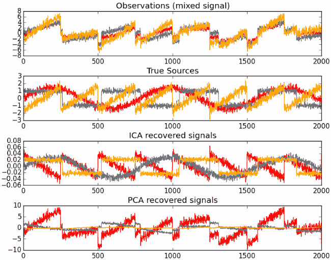

​	当我们尝试自己使用机器学习去解决实际问题时，遇到的最大问题往往不是算法上的问题，而是数据上的问题。有时候我们会苦恼于没有数据，而有时候却会因为数据太多而陷入“幸福”的困扰。
​	在之前学习算法时可以看到许多算法都涉及距离计算，而高维空间会给距离计算带来很大的麻烦。实际上，在高维情形下出现的数据样本稀疏、距离计算困难等问题是所有机器学习方法共同面临的严重障碍，被称为**“维度灾难、维度诅咒、维度危机等”** 。

> 降维能带来什么好处？

​	● 降维可以大幅的减少数据存储空间。
​	● 降维可以减少数据计算、训练的时间。
​	● 有些算法对于高维数据处理效果很差。
​	● 有些数据之间存在很强的联系，降维可以减少数据冗余。
​	● 有助于数据的可视化。

> 怎么降维？

​	在机器学习和统计学领域，降维是指在某些限定条件下，降低随机变量个数，得到一组“不相关”主变量的过程。 降维可进一步细分为**变量选择**和**特征提取**两大方法。

接下来，我将从这两个分类出发，简单了解降维的原理和学习基础的算法使用。


## 1. 变量选择

​	变量选择假定数据中包含大量冗余或无关变量（或称特征、属性、指标等），旨在从原有变量中找出主要变量。
​	变量选择一般只能简单的处理一些不是很大的数据集，而且往往需要一些经验支撑。

### 1.1 丢失值比例

​	**Missing Value Ratio**,顾名思义按照变量丢失的情况来选择变量。

​	实际中，我们获得的数据往往是含有损失值的，一般情况下我们会用平均值或者中位数什么的去填补这些缺失值，但是当这个属性的缺失比例过大时，比如大于20%，那么往往没有必要再使用这个属性了。

​	**所以在数据预处理时，可以直接将丢失值比例超出阈值的属性之间抛弃。**


### 1.2 低方差过滤

​	属性值的**方差能够表示一个属性蕴含信息量的多少。**方差小，意味着属性值都很接近，互相之间没有什么区别，也就没法带来有用的信息。

​	**所以在数据预处理时，可以直接将方差很小的属性之间抛弃。**

``` Python
>>> from sklearn.feature_selection import VarianceThreshold
>>> X = [[0, 0, 1], [0, 1, 0], [1, 0, 0], [0, 1, 1], [0, 1, 0], [0, 1, 1]]
>>> sel = VarianceThreshold(threshold=(.8 * (1 - .8)))
>>> sel.fit_transform(X)
array([[0, 1],
       [1, 0],
       [0, 0],
       [1, 1],
       [1, 0],
       [1, 1]])
```


### 1.3 高相关过滤

​	两个变量之间的高度相关意味着它们具有相似的趋势并且可能携带相似的信息。相似的变量对于提高模型的准确率一般没有帮助，只会降低模型的学习速度。 我们可以计算出变量之间的相关性，如果相关系数超过某个阈值，我们可以删除其中一个变量。

​	可以借助pandas中的.corr获得属性之间的相似度值。
MySQL Notifier

[Main Instruction]
MySQL Notifier 已停止工作

[Content]
Windows 正在查找该问题的解决方案...

[取消]


​	一般当相似度值大于0.5~0.6时，可以考虑抛弃其中一个变量。

### 1.4 随机森林 

​	我们之前已经比较详细的学习过Random Forest了。知道他是一种集成算法，其每次随机选取一些样本和属性来训练出一个决策树，再根据其准确率为每个决策树分配权重，实际上可以看做一种很巧妙的决策树降低过拟合的方法。因为其随机选择了属性并为之分配了权重，所以我们可以通过它获得属性各自的权重分配情况！

```python
>>> from sklearn.ensemble import RandomForestClassifier

>>> model= RandomForestClassifier(random_state=1)
>>> model.fit(x_train, y_train)
>>> for i, j in sorted(zip(x_train.columns, model.feature_importances_)):
>>>    print(i, j)
ApplicantIncome 0.180924483743
CoapplicantIncome 0.135979758733
Credit_History 0.186436670523
.
.
.
Property_Area_Urban 0.0167025290557
Self_Employed_No 0.0165385567137
Self_Employed_Yes 0.0134763695267
```

​	然后将权重特别小的一些数据进行舍弃。


### 1.5 向后属性消去

​	**Backward Feature Elimination，向后属性消去**，简单来说就是以递归的方式消去属性。

​		● 首先用所有的特征，n个，训练出一个模型，并评估其性能。 
​		● 分别移除一个特征后，再训练出n个模型，评估这些模型的性能，将变化最小的也足够小的模型所对应的特征移除。
​		● 重复这个过程，知道没有特征能够移除。

​	很明显，这个方法十分耗时，毕竟要多次训练评估模型，因此**一般使用线性拟合或逻辑回归作为基础模型。** 

```python 
## 这里使用了SVM
>>> from sklearn.datasets import make_friedman1
>>> from sklearn.feature_selection import RFE
>>> from sklearn.svm import SVR
>>> X, y = make_friedman1(n_samples=50, n_features=10, random_state=0)
>>> estimator = SVR(kernel="linear")
>>> selector = RFE(estimator, n_features_to_select=5, step=1)
>>> selector = selector.fit(X, y)
>>> selector.support_ 
array([ True,  True,  True,  True,  True, False, False, False, False,
       False])
## 还能获得各个属性的排名
>>> selector.ranking_
array([1, 1, 1, 1, 1, 6, 4, 3, 2, 5])
```


### 1.6 向前属性消去

​	**Forward Feature Selection，向前属性消去，**看名字就知道和向后属性消去类似。不过就是变成每次挑一个对模型优化最大的特征增加。

​	同样这个方法十分耗时，只能用于属性比较少的情况。

```python
>>> from sklearn.datasets import load_iris
>>> from sklearn.feature_selection import SelectKBest ## 只保留最好的k个属性
>>> from sklearn.feature_selection import f_regression 
>>> iris = load_iris()
>>> X, y = iris.data, iris.target
>>> X.shape
(150, 4)
>>> X_new = SelectKBest(f_regression, k=2).fit_transform(X, y) 
>>> X_new.shape
(150, 2)
```


## 2. 特征提取

​	特征提取可以看作变量选择方法的一般化：变量选择假设在原始数据中，变量数目浩繁，但只有少数几个真正起作用；而特征提取则认为在所有变量可能的函数(比如这些变量各种可能的线性组合)中，只有少数几个真正起作用。

​	这部分内容，每个算法都涉及到很麻烦的数学推导、证明，要完全啃下来需要花费很多的时间，所以我只是预习性的对这些算法有个大概整体上的了解，不做深入。到时候真要用了再说~~。

### 2.1 ★主成分分析,PCA

​	**Principal Component Analysis,PCA,主成分分析**。 说到降维毫无疑问，最常用也是最出名就是这货。


★ 首先让我们顺着推导大概了解一下，PCA是怎么来的。

​	PCA实际上做的就是**寻找一个低维空间，这个空间能使得原高维数据进行投影之后仍保留大量信息。**

> 那么怎么体现投影之后仍保留大量信息？

​	PCA认为这样的空间、超平面大概应具有类似的性质：

​	● 最近重构性：样本点到超平面的距离都足够近，也就意味着样本点尽量少移动。
​	● 最大可分性：样本点在超平面上的投影尽可能分开，因为分的越开方差越大信息包含越多。

​	PCA就是基于这两点出发进行推导、求取低维空间。神奇的是，不论选哪个性质开始推导，结果都一样。

> 推导结果是什么？

​	在推导前当然要进行一些假设：

​	● 假定数据进行了中心化（即所有坐标都减去了均值）$X$，这一步的目的只是为了后续推导方便。
​	● 假定新的空间坐标系为 $W:\{\omega_1,\omega_2,…,\omega_d\}$ ，且$\omega$都为标准正交基向量。也就是说降维到d维。
​	● 从上面任意一个性质出发推导，…跳过具体推导…,最后可以求得$XX^T\omega_i=\lambda_i\omega_i$ 

​	定睛一看，我的天，这不就说 $\omega$ 是$XX^T$的特征向量！ 而且为了保留尽量多的信息，我们选择那些特征值大的特征向量。

> 具体步骤

​	● 设有m条n维数据。
​	● 将原始数据按列组成n行m列矩阵$X$。
​	● 将$X$的每一行（代表一个属性字段）进行零均值化，即减去这一行的均值。
​	● 求出协方差矩阵$XX^T$。
​	● 对矩阵进行特征值分解，特征值及对应的特征向量。
​	● 将特征向量按对应特征值大小从上到下按行排列成矩阵，取前k行组成矩阵$P$
​	● $Y=PX$即为降维到k维后的数据。	


★ 好吧，顺着推导有点难，让我们试着根据结果，来尝试想象PCA到底在干什么。

> 理解一：

​	我们知道一个属性的信息量多少可以用方差、标准差来表示。

​		$var(X)=\frac{\sum_{i=1}^n(X_i-\bar X)(X_i-\bar X)}{n-1}$

​	而两个属性之间的相似度则可以用协方差来表示。正则正相关，负则负相关，0则无关。

​		$cov(X,Y)=\frac{\sum_{i=1}^{n}(X_i-\bar X)(Y_i-\bar Y)}{n-1}$

​	而我们在PCA中，先行对数据进行了中心化，这就使得矩阵$XX^T$实际上就是协方差矩阵！

​		$C=\Bigg(\begin{array}\ cov(X,X)\ cov(X,Y) \ cov(X,Z)\\ cov(Y,X)\ cov(Y,Y) \ cov(Y,Z)\\ cov(Z,X)\ cov(Z,Y) \ cov(Z,Z)\\\end{array} \Bigg)$

​	协方差矩阵代表了各个属性之间的关系，而协方差矩阵又是实对称矩阵，意味着一定有n个正交特征向量来表示这个“关系空间”。又因为特征值大的特征向量意味着在这个方向信息量就大，也就是说能获得更多的属性关系。所以我们就对协方差矩阵进行了特征分解，然后选取最大的k个特征值的特征向量来构建新的低维空间。
​	所以可以这么理解：**PCA通过协方差矩阵学得了属性之间的特征，然后保留信息量多的特征，舍弃信息量少的特征(向此方向进行压缩)。** 虽然不严谨~

> 理解二：

​	我们知道最后我们通过$Y=PX$将数据降到k维。而P是一个k*n的矩阵。这个降维可以看成一个**线性变换**！ 细节到每一条数据，从原来的1\*n变为1\*k，实则进行了k次线性变换，每次变换都是原数据乘以各个属性的权重。所以也可以这么理解：**PCA学得了属性之间的线性关系，原空间用单一属性做基，现在则用属性的线性组合做基，这样一来可以将原本比较接近的属性进行合并！**


★ 拓展，KPCA

​	PCA虽然效果往往不错，但是他有一个很大的缺陷：**是线性降维，对非线性数据往往就效果很差了。**为了克服这个问题提出了一种叫**核主成分分析(Kernel Principal Component Analysis, KPCA)**的算法，用以解决非线性问题。其使用了kernel tricks，基本思想是：将数据隐式映射到高维线性可分空间，利用核函数进行处理，无需知道映射函数的具体形式。

```python
##
# kernel : "linear" | "poly" | "rbf" | "sigmoid" | "cosine" | "precomputed"
# 默认"linear"。一般"rbf"最常用。
>>> from sklearn.datasets import load_digits
>>> from sklearn.decomposition import KernelPCA
>>> X, _ = load_digits(return_X_y=True)
>>> transformer = KernelPCA(n_components=7, kernel='linear')
>>> X_transformed = transformer.fit_transform(X)
>>> X_transformed.shape
(1797, 7)
```


★  杂记

​	● 我们常常会看到PCA使用了**Singular Value Decomposition（SVD，奇异值分解）**， 这个SVD是什么？在上面我们求矩阵特征向量用的是特征分解，需要求$XX^T$ ,但是在这一步中，一些非常小的数容易在平方中丢失！而SVD也是一种矩阵分解方法且也能得到特征向量，但不用求$XX^T$，所以**SVD更稳定，对于稀疏矩阵效果更好！**

  	● PCA不要随便使用，他相当于提前进行了归纳，因而也有可能带来过拟合问题，一般只有到算法效果不好时再考虑PCA等提前优化。

​	● PCA不只是能用来提前优化，一些时候还能帮助可视化数据。

```python
from sklearn import datasets
from sklearn.decomposition import PCA,TruncatedSVD

iris = datasets.load_iris() # 150*4
pca = PCA(n_components=3).fit_transform(iris.data) # 150*3
# 注意当0<n_components<1时，则会考虑信息保留量。0.1意味着至少保留原信息的90%
pca = PCA(n_components=0.1).fit_transform(iris.data) # 150*3
# SVD能够用于稀疏矩阵
svd = TruncatedSVD(n_components=3).fit_transform(iris.data)
```

​	

### 2.2 因子分析,FA

​	**Factor Analysis**，也是一种比较常用的降维方法。因子分析是指研究从变量群中提取共性因子的统计技术，最早由英国心理学家C.E.斯皮尔曼提出。他发现学生的各科成绩之间存在着一定的相关性，一科成绩好的学生，往往其他各科成绩也比较好，从而推想是否存在某些潜在的共性因子，或称某些一般智力条件影响着学生的学习成绩。因子分析可在许多变量中找出隐藏的具有代表性的因子，将相同本质的变量归入一个因子，可减少变量的数目，还可检验变量间关系的假设。

​	因子分析与主成分分析十分的像，不论是推导过程还是结果表示，当然他们还是有本质差别的。我们知道在PCA中，得到的主成分实际上就是变量的线性组合；而在FA中，**得到的因子则可以通过高斯分布、线性变换、误差扰动生成原始数据！**简单来说，比如现在有收入、教育两个变量，用PCA降到一维则会用{0.5\*收入+0.5\*教育}这样的形式来表示整体；而FA则可能得到“智商”这么一个因子，收入=0/5\*智商+0.1、教育=0.5\*智商+0.2。

​	● PCA是提取观测变量的线性组合。
​	● FA是用潜在的理论上的因子构成一个模型去预测观测变量。
​	● FA基于一种概率模型，使用EM算法来估计参数。
​	● FA的优势在于其**解释性更好**，比如抽象出“智商”这个因子就能拥有很好的解释。
​	● **如果你只是想单纯的降维，那么还是使用PCA。如果你是想构造一个因子模型去解释数据，那么使用FA。**

```python
>>> from sklearn.datasets import load_digits
>>> from sklearn.decomposition import FactorAnalysis
>>> X, _ = load_digits(return_X_y=True)
>>> transformer = FactorAnalysis(n_components=7, random_state=0)
>>> X_transformed = transformer.fit_transform(X)
>>> X_transformed.shape
(1797, 7)
```


### 2.3 独立成分分析,ICA

​	一般的降维方法，如**PCA、LDA、FA都是以观测数据点呈高斯分布模型为基本假设前提的，在已经先验经验知道观测数据集为非高斯分布模型的前提下，PCA和LDA的降维效果并不好**；而**ICA适用于非高斯分析数据集** ，是主成分分析（PCA）和因子分析（Factor Analysis）的一种有效扩展。

​	独立成分分析（Independent component analysis，简称ICA）是一种**利用统计原理进行计算**的方法，它是一个线性变换，这个变换把数据或信号分离成**统计独立的非高斯的信号源的线性组合**。

​	独立成分分析的最重要的假设就是信号源统计独立，并且这个假设在大多数盲信号分离（blind signal separation）的情况中符合实际情况；但即使当该假设不满足时，仍然可以用独立成分分析来把观察信号统计独立化，从而进一步分析数据的特性。

> 经典问题

​	**鸡尾酒会问题（cocktail party problem）**，这个问题假设在鸡尾酒会中有n个人，我们利用房间里面的n个麦克风或录音机对同时说话的这些人进行录音，由此得到一个混合信号源或声音源，现在要做的就是从这个信号源中分离出不同人的说话声音。

> 使用前提：

​	● 数据信号源是独立的且数据非高斯分布（或者信号源中最多只有一个成分是高斯分布）
​	● 观测信号源的数目不能少于源信号数目。

> PCA VS ICA

```python
class sklearn.decomposition.FastICA(n_components=None, 
                                    algorithm='parallel', 
                                    whiten=True, 
                                    fun='logcosh', 
                                    fun_args=None, 
                                    max_iter=200, 
                                    tol=0.0001, 
                                    w_init=None, 
                                    random_state=None)
```



可以看出，对于这类非高斯分布的数据，使用ICA的效果远远好于PCA。（但是现实中数据一般都是高斯分布的~）


### 2.4 多维缩放 DMS

​	**Multi-dimensional Scaling(DMS,多维缩放)**，是一种非常经典的线性降维方法。

​	DMS起源于心理学,它被用来了解受访者的意见对象之间的相似性或相异。MDS还用于营销、管理、金融、社会学、信息科学、政治科学、物理、生物学、生态学等等。

​	DMS的目标很简单：**寻找一个低维空间，使得点之间的距离与其在原高维空间中的距离相似。**

​	**Metric MDS**：度量型，使得在不同空间中，点之间的距离保持相似。比如欧式距离。

​	**non-metric MDS**： 非度量型，使得在不同空间中，点之间的距离关系顺序保持不变，也就是说原来靠的近的仍然靠的近，原来距离远的任然远，不再追求距离的度量也要保持不变。

​	毫无疑问，metric MDS的效果会好一些，但是会以速度作为代价。

```python
## 参数
# metric : boolean default: True。 当为True时，使用metric MDS。否则使用nonmetric MDS
# n_init : int default: 4 。因为不同的初始化结果不同，所以多次运行取最优值。
>>> from sklearn.datasets import load_digits
>>> from sklearn.manifold import MDS
>>> X, _ = load_digits(return_X_y=True)
>>> X.shape
(1797, 64)
>>> embedding = MDS(n_components=2)
>>> X_transformed = embedding.fit_transform(X[:100])
>>> X_transformed.shape
(100, 2)
```


### 2.5 流形学习

​	**manifold learning,流形学习**需要复杂的微分几何，拓扑等数学理论作为基础，而且在实际应用中很少被使用，所以我只是进行了**最最最基础的了解~** 

​	流形学习的主要思想是**将高维的数据映射到低维，使该低维的数据能够反映原高维数据的某些本质结构特征**。流形学习的前提是有一种假设，即**某些高维数据，实际是一种低维的流形结构嵌入在高维空间中**。

> 为什么要研究流形？


​	在前面我们已经了解了PCA,FA,ICA算法，但是这些算法有一个问题：**最终结果是线性变换。** 这意味着会损失一些非线性的信息。比如上图数据用PCA降维效果就很差。而流形学习则认为数据可以用**流形结构来表示**，就像上图的大大卷一样，然后将这个流形结果展开来就能起到降维的效果。于是流形学习的**目标就是：保留数据之间的拓扑结构。**

#### 2.5.1 ISOMAP

​	**Isometric Mapping,等距映射**,最早的流形学习算法。使用了微分几何中测地线的思想，它希望数据在向低维空间映射之后能够保持流形上的测地线距离。**直观来看，就是将数据投影到低维空间之后，保持数据点之间的相对远近关系。** ISOMAP可以看做是**MDS或kernel PCA的延伸。**

​	

​	如上图所示，**测地线距离**指的是在流形上两点之间的距离，其可以用两点之间最短路径来近似。算法的目标：映射坐标下的欧氏距离（蓝线）与原来的测地线距离（红线）尽量相等！

#### 2.5.2 LLE

​	**Locally linear embedding，局部线性嵌入**。 核心思想是**每个样本点都可以由与它相邻的多个点的线性组合（体现了局部线性）来近似重构**，这相当于用分段的线性面片近似代替复杂的几何形状，样本投影到低维空间之后要保持这种线性重构关系，即有相同的重构系数。

​                                                	

#### 2.5.3 LE & LPP 

​	**Laplacian eigenmaps（LP，拉普拉斯特征映射）和  Locality preserving projections（LPP,局部保持投影）**都是**基于图论**的方法。它从样本点构造带权重的图，然后计算图的拉普拉斯矩，对该矩阵进行特征值分解得到投影变换矩阵。他们的目的在于：**希望保持流形的近邻关系，将原始空间中相近的点映射成目标空间中相近的点。** LP和LPP只是限制函数不同而已。


#### 2.5.4 ★ t-SNE

​	**T 分布随机近邻嵌入（T-Distribution Stochastic Neighbour Embedding）**可以说是目前效果**最好的高维数据可视化方法之一**。t-SNE 主要的优势就是**保持局部结构的能力**。也就是说高维数据空间中距离相近的点投影到低维中仍然相近。

> 怎么表示数据点之间的关系

​	t-SNE将数据点之间的**欧氏距离转换为表示相似度的概率。** 认为原高维空间中数据呈高斯分布，嵌入空间中的数据呈t-分布。我们的目标是**变换前后两个相似度接近。**

> 怎么将距离转换为概率来表示相似度？

​	算法假设点$x_i$和其周围的点呈高斯分布，则$x_j$是$x_i$周围点的概率是$p(j|i)$。若数据点相距较近，则$p(j|i)$较大，相反若数据点相距非常远，$p(j|i)$则可以接近无穷小。

​									 $p(j|i)= {exp({-\Vert x_i-x_j\Vert^2 \over 2\sigma_i^2}) \over \sum_{k\neq i}exp({-\Vert x_i-x_k\Vert^2 \over 2\sigma_i^2})}$

​	上面这个公式的方差σ选取是个问题，由于数据点的稠密程度不同，因此这个方差选用单个固定值是不合理的，例如在密度高的区域适合选用较小的方差值。算法引入了一个固定值，**困惑度（perplexity）**,困惑度大致等价于在匹配每个点的原始和嵌入分布时考虑的最近邻数，较低的困惑度意味着我们在匹配原分布并拟合每一个数据点到目标分布时只考虑最近的几个点，而较高的困惑度意味着拥有较大的全局结构，论文建议值位5-50。

​	同理t-分布的相似度概率为：

​									$q(j|i)=\frac{ (1 + \left \| y_i-y_j \right \|^2)^{-1}}{\sum_{k \neq i} (1 + \left \| y_i-y_k \right \|^2)^{-1}}$

> 怎么度量两个相似度接近？

​	用**KL散度（Kullback-Leibler divergence）来衡量。**

​									$C = \sum_iKL(P_i\Vert Q_i)=\sum_i \sum_j p(j|i)log{p(j|i)\over q(j|i)}$

于是可以将KL散度作为损失函数，通过最小化(求导)损失函数就能得到每个点对应的嵌入坐标。

**注意，上面的公式只是意思一下，完整的证明可以参考[一灯@qiancy](http://qiancy.com/2016/11/12/sne-tsne/)的文章，里面讲解的十分的详细。**


> 如何更好的使用T-SNE

​	关于使用，理解T-SNE，[distill的文章](https://distill.pub/2016/misread-tsne/#perplexity=100&epsilon=20&demo=10&demoParams=200)讲解的非常牛逼，可以好好看一下。

​		★ **perplexity，困惑度**用来平衡对数据局部和全局的关注度，某种意义上可以理解为具体考虑几个临近点。这个值对结果影响有着很复杂的影响。一般建议取5-50,而且要小于数据点数。

​		★ **分析时最好多画图，因为不同的困惑值，会有不同的表现形状！**

​		★ **在使用T-SNE前，将数据归一化。**因为需要计算距离。

​		★ **可以在使用T-SNE之前，先使用PCA。** 因为PCA强在保留全局信息而T-SEN强在保留局部信息，所以可以两者结合提高效果。参数：init='pca'。

​		★ **在sklearn中默认使用Barnes-Hut t-SNE实现**，其对速度进行了优化，不过仅在目标维度为3或更小时才起作用，以2D可视化为主。

​		● **iterations,迭代次数 **对结果也有神奇的影响，如果次数不足数据还未收敛，数据可能会出现“被压扁”的形状。所以迭代次数尽量大，保证收敛

​		● **结果簇的大小并不能代表什么！**因为算法会扩张稠密的数据、收缩稀疏的数据。所以最后结果展示的簇大小并没有什么用！

​		● **结果簇之间的距离并不能代表什么！** 

​		● **随机噪声看起来并不总是随机的！** 也就是说有可能你觉得是一个类，而他可能只是随机噪声！

​		● **有时候能够看出结果呈现一些有趣的形状，虽然没什么用~**

```python
from time import time
import matplotlib.pyplot as plt
from mpl_toolkits.mplot3d import Axes3D
from matplotlib.ticker import NullFormatter
from sklearn import manifold, datasets

# # Next line to silence pyflakes. This import is needed.
# Axes3D
n_points = 1000
# X是一个(1000, 3)的2维数据，color是一个(1000,)的1维数据
X, color = datasets.samples_generator.make_s_curve(n_points, random_state=0)
n_neighbors = 10
n_components = 2

fig = plt.figure(figsize=(8, 8))
# 创建了一个figure，标题为"Manifold Learning with 1000 points, 10 neighbors"
plt.suptitle("Manifold Learning with %i points, %i neighbors"
             % (1000, n_neighbors), fontsize=14)


'''绘制S曲线的3D图像'''
ax = fig.add_subplot(211, projection='3d')
ax.scatter(X[:, 0], X[:, 1], X[:, 2], c=color, cmap=plt.cm.Spectral)
ax.view_init(4, -72)  # 初始化视角

'''t-SNE'''
t0 = time()
tsne = manifold.TSNE(n_components=n_components, init='pca', random_state=0)
Y = tsne.fit_transform(X)  # 转换后的输出
t1 = time()
print("t-SNE: %.2g sec" % (t1 - t0))  # 算法用时
ax = fig.add_subplot(2, 1, 2)
plt.scatter(Y[:, 0], Y[:, 1], c=color, cmap=plt.cm.Spectral)
plt.title("t-SNE (%.2g sec)" % (t1 - t0))
ax.xaxis.set_major_formatter(NullFormatter())  # 设置标签显示格式为空
ax.yaxis.set_major_formatter(NullFormatter())
# plt.axis('tight')

plt.show()
```


> t-SNE的缺点

​	● 计算复杂度很高，在数百万个样本数据集中可能需要几个小时，而PCA可以在几秒钟或几分钟内完成。

​	● 算法是随机的，具有不同种子的多次实验可以产生不同的结果。

​	● 全局结构未明确保留。这个问题可以通过PCA初始化点（使用 init ='pca'）来缓解。


#### 2.5.5 ★ UMAP

​	**Uniform Manifold Approximation and Projection (UMAP)**， 是一种十分强大的降维算法。其使用了黎曼流形。

​	为了体现他的强大经常拿他与t-SNE比较：

​		● 数据可视化能力与t-SNE相近，甚至可以说更优！

​		● 运算速度远远大于t-SNE（例子：784*70000的数据，UMAP需要2.5分钟，而t-SNE则需要45分钟）。

​		● UMAP不但能做可视化，还能做一般的数据降维工作，作为数据预处理。

​		● UMAP能够保留更多的数据全局结构信息。

​		● UMAP支持多种距离函数，比如余弦距离等。

​		● UMAP能够已有的embedding添加新的点。

​		● UMAP还支持监督和半监督降维。这意味着可以提供标签，使其更好的学习。

​		● 在流形学习领域，UMAP拥有十分坚固的理论基础。

可以看到功能十分的强大！

[github](https://github.com/lmcinnes/umap) 和 [官网文档](https://umap-learn.readthedocs.io/en/latest/)

```python
import umap
from sklearn.datasets import load_digits

digits = load_digits()
## 主要参数
# n_components:降维维度。和t-SNE不同，不只能取2,3，还能取更大的维度。default:2
# n_neighbors:考虑临近点的数量，一般取5-50，默认10-15.
# min_dist:控制点的压缩程度。大则会使得分布更均匀，小则会考虑更多局部结构。一般取0.001-0.5,默认0.1
# metric:选择距离度量函数。default:'euclidean'
embedding = umap.UMAP(n_components=3， 
                      n_neighbors=5,
                      min_dist=0.3,
                      metric='correlation').fit_transform(digits.data)
```


#### 2.5.6 杂项

> [sklearn](https://scikit-learn.org/stable/modules/manifold.html#manifold) 算法速度比较


> ISOMAP VS LLE

​	● Isomap 和 LLE 从不同的出发点来实现同一个目标，它们都能从某种程度上发现并在映射的过程中保持流形
的几何性质。

​	● Isomap 希望保持任意两点之间的测地线距离；LLE 希望保持局部线性关系。

​	● 从保持几何的角度来看，Isomap保持了更多的信息量。

​	● 然而 Isomap 的全局方法有一个很大的问题就是要考虑任意两点之间的关系，这个数量将随着数据点数量的增多而爆炸性增长，从而使得计算难以负荷。


> 流形学习的挑战：

​	● 现有算法对于数据的要求比较高，**对噪音的情况处理能力不够**。

​	● 需要在流形上发展相应的统计概念以及学习理论。

​	● 流形学习算法往往是要求一个整体的矩阵分解，**很难处理大规模数据**。可以看sklearn中各个算法的复杂度都很高。


## 3.总结 


​	这篇文章对于降维只是进行了基础的学习，对于算法的理论实现没有深入。原本是想好好看一下证明的，然后发现算法实在太多了，而且涉及的数学证明都不简单，于是只好转念一想：”我又不研究降维算法，我只是需要这个工具而已，会用就行，管他乱七八糟的实现干什么？“于是就心安理得的只了解了一下各个算法的特点~~

​	各算法主要特点：

​		★ **丢失值比例，低方差过滤，高相关过滤**：对数据进行统计，抛弃一些明显的垃圾属性。

​		★ **随机森林**：利用随机森林算法的特点获得属相的排名。

​		● 向前/后属性消去：通过遍历的方式，对属性进行逐个判断。**速度太慢**。

​		★ **PCA**：线性降维，**速度快，数据预处理**。

​		● **DMS**：线性降维，虽然效果也不错但感觉并不怎么用。

​		● **FA**： 线性降维，与PCA相似，生成因子模型，**利于解释数据**。

​		● **ICA**：线性降维，**适用于非高斯分布**，但实际中大部分数据是高斯分布的。。

​		★**KPCA**：非线性降维，对PCA添加了一个核，**常用高斯核rbf**。

​		★ **t-SNE**：非线性降维，**用于数据可视化，速度慢。**

​		★ **UMAP**：非线性降维，**数据可视化 ，数据预处理，速度快。**

​		● **ISOMAP**：非线性降维，**速度慢。**

​		● **LLE**：非线性降维。

​		● **LE,LPP**：非线性降维，基于图论。

​	关于使用的一些个人看法（有问题请指正）：

  		1. 在数据使用之前可以使用“变量选择”，将明显无用的数据去除。
		2. 拿到数据时可以先用**t-SNE或UMAP**进行可视化，看看是否能分类，如果能那恭喜你这数据大概率好用。当然如果可视化的图不好看也不要放弃，可能只是无法在这么低的维度看出而已。
		3. 不要随便对数据进行特征提取做预处理，因为特征提取会丢失一些信息，而且特征提取可以看成一个学习器，会对后续的学习器产生影响。一般当不进行特征提取最终结果不好时再使用特征提取，或者分两组进行训练，一组进行特征提取，一组不进行，最后看看效果怎么样。
		4. 特征提取的算法往往会有多个参数，所以调参是个重要工作，特别是维度的选择。但是也不要执着于获得最优的特征提取结果，毕竟这只是个预处理。所以我们可以获得几个特征提取后的数据集(50维？100维？……)，然后分别进行学习，取效果最好的那个。
		5. 因为特征提取的效果并不是十分十分的重要，所以在效果相差不大的情况下反而先考虑速度问题，毕竟调参很花时间。所以我觉的这是为什么PCA这么流行的关键。
		6. 所以感觉一般用用**t-SNE,UMAP,PCA,KPCA**就差不多了，毕竟流形学习速度是真的慢~


## 参考

● https://www.analyticsvidhya.com/blog/2018/08/dimensionality-reduction-techniques-python/

● https://stats.stackexchange.com/questions/1576/what-are-the-differences-between-factor-analysis-and-principal-component-analysi

● 数据常青藤：https://www.dataivy.cn/blog/%E7%8B%AC%E7%AB%8B%E6%88%90%E5%88%86%E5%88%86%E6%9E%90independent-component-analysis_ica/

● https://zhuanlan.zhihu.com/p/40214106

● http://www.cad.zju.edu.cn/reports/%C1%F7%D0%CE%D1%A7%CF%B0.pdf

● https://www.jiqizhixin.com/articles/2017-11-13-7

● http://qiancy.com/2016/11/12/sne-tsne/

● https://link.springer.com/referenceworkentry/10.1007%2F978-3-642-04898-2_386