> 本文主要参考自[AISHWARYA SINGH的博客](https://www.analyticsvidhya.com/blog/author/aishwaryasingh/) 和西瓜书。
> 2019/7/29：再推荐一个大佬博客[细语呢喃](https://www.hrwhisper.me/)，理解的非常透彻。跟着大佬的思路又完善了一下这篇博客。

## 1. 什么是集成学习

　　**集成学习（ensemble learning）**通过构建并结合多个学习器来完成学习任务，有时也被称为多分类系统（multi-classifier system）、基于委员会的学习（committee-based learning）等。   

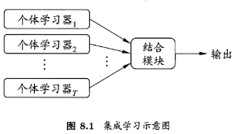

　　如果硬要把集成学习进一步分类，可以分为两类，一种是把强分类器进行强强联合，使得融合后的模型效果更强，称为**模型融合**。另一种是将弱分类器通过学习算法集成起来变为很强的分类器，称为**机器学习元算法**。（注意这里的强弱指的是学习效果的好坏，并不是分类器本身的分类能力，性能强的分类器能够通过数据给予的不完整变成弱分类器。嗯，毕竟强行分类~）

- 模型融合的代表有：投票法(Voting)、线性混合(Linear Blending)、Stacking。

- 而机器学习元算法又可以根据个体学习器之间是否存在依赖关系分为两类，称为Bagging和Boosting。

> 集成学习为什么能提高模型准确率？

　　学习器的结合可能会从三个方面带来好处[Dietterich,2000]：
　　　● **从统计方面来看** ，由于学习任务的假设空间往往很大，可能有多个假设在训练集上达到同等性能，此时若使用单学习器可能因误选而导致泛化性能不佳，结合多个学习器则会减少这一风险；
　　　● **从计算方面来看**，学习算法往往会陷入局部极小，有的局部极小点所对应的泛化性能可能很糟糕，而通过多次运算之后进行结合，可降低陷入糟糕局部极小点的风险；
　　　● **从表示的方面来看**，某些学习任务的真实假设可能不在当前学习算法所考虑的假设空间中，此时若使用单学习器则肯定无效，而通过结合多个学习器，由于相应的假设空间有所扩大，有可能学得更好的近似。

​							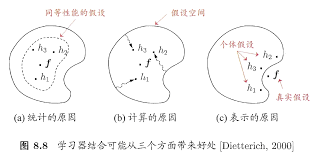                                                        

## 2. 结合策略

　　结合策略旨在将多个个体学习器的结果结合成一个可用的最终结果。

### 2.1 平均法

　　对于数值类的**回归预测问题**，通常使用的结合策略是平均法，也就是说，对于若干个弱学习器的输出进行平均得到最终的预测输出。

　　● 算术平均

　　● 加权平均

```python
model1 = tree.DecisionTreeClassifier()
model2 = KNeighborsClassifier()
model3= LogisticRegression()

model1.fit(x_train,y_train)
model2.fit(x_train,y_train)
model3.fit(x_train,y_train)

pred1=model1.predict_proba(x_test)
pred2=model2.predict_proba(x_test)
pred3=model3.predict_proba(x_test)

# 算术平均 
finalpred=(pred1+pred2+pred3)/3
# 加权平均
finalpred=(pred1*0.3+pred2*0.3+pred3*0.4)
```


### 2.2 投票法

　　对于**分类问题的预测**，我们通常使用的是投票法。

　　　● 相对多数投票法：少数服从多数，如果不止一个类别获得最高票，则随机选择一个做最终类别。

　　　● 绝对多数投票法：不光要求获得最高票，还要求票过半数。否则会拒绝预测。

　　　● 加权投票法：为每个学习器分配一个权重值，进行加权投票。

```python
# 可以直接调用sklearn实现的VotingClassifier
from sklearn.ensemble import VotingClassifier
model1 = LogisticRegression(random_state=1)
model2 = tree.DecisionTreeClassifier(random_state=1)
model = VotingClassifier(estimators=[('lr', model1), ('dt', model2)], voting='hard')
model.fit(x_train,y_train)
model.score(x_test,y_test)
```
### 2.3 学习法

　　对弱学习器的结果做平均或者投票，相对比较简单，但是可能学习误差较大，于是就有了学习法。对于学习法，代表方法是stacking，当使用stacking的结合策略时， 先从初始数据集训练出初级学习器，然后生成一个新数据集用于训练次级学习器，在这个新数据集中，初级学习器的输出被当做样例输入特征，而初始样本的标记仍被当做样例标记。
　　实际上Stacking不仅可以看做是一种特殊的集合策略，其本身就是一种著名的集成学习方法。将在下面对其进行详细的讲解。


## 3. 高级集成技术

　　最为常见的集成技术有以下4种：

　　　● Stacking
　　　● Blending
　　　● Bagging
　　　● Boosting

　　其中最为常用的就是**Bagging**和**Boosting** 。

### 3.1 ★Stacking 

　　Stacking方法是指训练一个模型用于组合其他各个模型。首先我们先训练多个不同的模型，然后把之前训练的各个模型的输出作为输入来训练一个模型，以得到一个最终的输出。


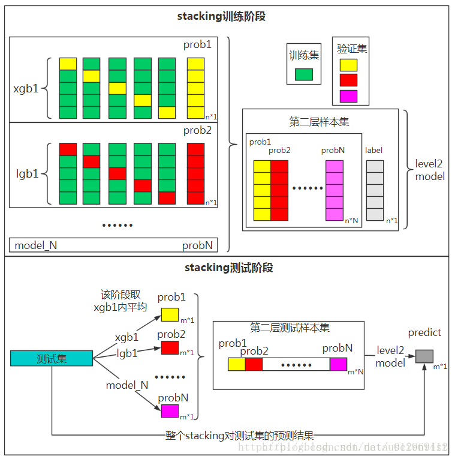

让我们一步步的过一遍Stacking：

训练时：

1. 将训练集分为5份，准备5-折交叉验证。

2. 在训练集上，基础模型(如决策树)通过交叉验证进行训练，每次训练获得一折训练数据的预测值。

3. 经过5次训练之后，能够获得整个训练集的预测值。

4. 同样的，用其他基础模型（如KNN）进行训练，也能获得训练数据的预测值。

5. 将这些预测值作为新的特征来训练第二层模型（一般为逻辑回归）。

测试时：

1. 由于5-折交叉，所以每个基础模型有5个训练模型。将这5个训练模型的预测值做平均作为第二层模型的输入。

   

> **重点：** 
>
> 1. 初级学习器为**并行**关系。
> 2. Stacking的着**重点在于怎么结合多个初级学习器**，即**结合策略。**
> 3. **进行交叉验证是为了减少过拟合风险。** 若直接用初始学习器的训练集来产生次级训练集，过拟合风险会比较大。（直接对训练的数据进行预测，过拟合有点高~）
> 4. Stacking可以**同时减小方差和偏差。**
> 5. 在Stacking中，初级学习器**一般为异质学习器。**
> 6. 次级学习器一般为逻辑回归。


**简单代码实现：**

```Python
###　sklearn & numpy & pandas
## 通过n-折交叉验证法训练模型，并得到训练集和测试集的预测值
def Stacking(model,train,y,test,n_fold):
   folds=StratifiedKFold(n_splits=n_fold,random_state=1)
   test_pred=np.empty((test.shape[0],1),float)
   train_pred=np.empty((0,1),float)
   for train_indices,val_indices in folds.split(train,y.values):
      x_train,x_val=train.iloc[train_indices],train.iloc[val_indices]
      y_train,y_val=y.iloc[train_indices],y.iloc[val_indices]

      model.fit(X=x_train,y=y_train)
      train_pred=np.append(train_pred,model.predict(x_val))
      test_pred=np.append(test_pred,model.predict(test))
    return test_pred.reshape(-1,1),train_pred

## 训练一个decision tree
model1 = tree.DecisionTreeClassifier(random_state=1)
test_pred1 ,train_pred1=Stacking(model=model1,n_fold=10, train=x_train,test=x_test,y=y_train)
train_pred1=pd.DataFrame(train_pred1)
test_pred1=pd.DataFrame(test_pred1)
## 训练一个KNN
model2 = KNeighborsClassifier()
test_pred2 ,train_pred2=Stacking(model=model2,n_fold=10,train=x_train,test=x_test,y=y_train)
train_pred2=pd.DataFrame(train_pred2)
test_pred2=pd.DataFrame(test_pred2)
## 将之前的预测值作为新的特征训练逻辑回归
df = pd.concat([train_pred1, train_pred2], axis=1)
df_test = pd.concat([test_pred1, test_pred2], axis=1)
model = LogisticRegression(random_state=1)
model.fit(df,y_train)
model.score(df_test, y_test)
```


### 3.2 Blending

　　　Blending和Stacking基本一致，区别在于Blending在训练集中特地分出了验证集来训练新模型，而Stacking则是用整个训练集来训练新模型。

让我们一步步的实现一下Blending：

1. 将train set 分为 training set 和  validation(HoldOut) set。

   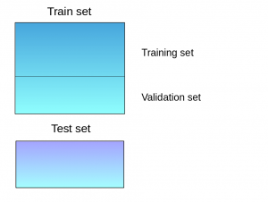

2. 在 Training set 上训练基础模型组。

3. 基础模型对Validation set 和 Test set 进行预测。

   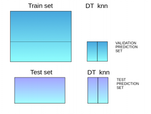

   

4. 将预测值作为新的特征，训练新的模型（如逻辑回归）。

> Blending 相比于Stacking更加简单，因为不用做K-折交叉验证，而是直接留出一部分数据（留出法）用作第二阶段模型的特征。但是由于使用的数据较少**过拟合的风险较大**。**一般来说，Stacking优于Blending。Blending可以看做是Stacking的一个简化模式。** 

**简单代码实现：**

```python 
### sklearn & numpy & pandas
# 训练决策树，并预测validation set 和 test set
model1 = tree.DecisionTreeClassifier()
model1.fit(x_train, y_train)
val_pred1=model1.predict(x_val)
test_pred1=model1.predict(x_test)
val_pred1=pd.DataFrame(val_pred1)
test_pred1=pd.DataFrame(test_pred1)
# 训练KNN，并预测validation set 和 test set
model2 = KNeighborsClassifier()
model2.fit(x_train,y_train)
val_pred2=model2.predict(x_val)
test_pred2=model2.predict(x_test)
val_pred2=pd.DataFrame(val_pred2)
test_pred2=pd.DataFrame(test_pred2)
# 将预测值作为特征训练逻辑回归
df_val=pd.concat([x_val, val_pred1,val_pred2],axis=1)
df_test=pd.concat([x_test, test_pred1,test_pred2],axis=1)
model = LogisticRegression()
model.fit(df_val,y_val)
model.score(df_test,y_test)
```


### 3.3 ★Bagging

　　**Bagging(or Bootstrap Aggregating)** 是并行式集成学习方法最著名的代表。其主要思想是：**通过自助采样法(bootstrap sampling) **获得一组互不相同的采样集，这些采样集与原始训练集大小相同且原始训练集中约有63.2%的样本出现在采样集中。这样一来可以通过这些采样集训练出一组基学习器，最后将这些基学习器进行结合。

　　Bootstrap为有放回的抽样，每次从m个样本的数据集D中抽取一个，重复m次，最终得到包含m个样本的采样集D‘。$\lim_{m\rightarrow\infty} \ (1 – \frac{1}{m})^m \rightarrow \frac{1}{e} \approx 0.368$


> **重点：**
>
> 1. 学习器为**并行关系**。
> 2. Bagging的着重点在于**如何生成存在差异的学习器**。 其通过对数据集的抽样产生不同的随机子集，从而训练出不同的存在差异的基学习器。
>    ● 对样本进行随机采样，称为Pasting。
>    ● 对样本进行有放回的随机采样，称为Bagging。
>    ● 对特征进行随机采样，称为Random Subspaces。
>    ● 对特征和样本都进行随机采样，称为Random Patches。
> 3. 从偏差-方差分解角度看，Bagging主要**降低方差，减少过拟合**。因此它在**不减枝决策树、神经网络等易受样本扰动的学习器上效用明显。**
> 4. Bagging的学习器**一般为同质学习器。**
> 5. 在最后对预测进行结合时，通常使用简单投票法（分类任务）或简单平均法（回归任务）。


**实现：**

#### 3.3.1 meta-estimator

　　[sklearn](https://scikit-learn.org/stable/modules/ensemble.html#bagging-meta-estimator) 对其进行了实现，其会通过Bootstrapping生成随机子集，然后用这些随机子集训练指定的基础模型，然后对这些基础模型的预测进行结合。

````python
##　具体参数见官网
from sklearn.ensemble import BaggingClassifier
from sklearn.neighbors import KNeighborsClassifier
bagging = BaggingClassifier(KNeighborsClassifier(),
                            max_samples=0.5, max_features=0.5)
bagging.fit(x_train, y_train)
````

#### 3.3.2 Random Forest 

　　随机森林是Bagging的一种拓展，其对**样本和特征都进行了采样，样本自助采样，特征随机采样。** 因为其使用的基础学习器为CART决策树所以称为Random Forest。

　　在随机森林中，虽然**每一棵树的偏差变大了，但是平均之后整体的方差变小了**，因为决策树本身就是一种极易过拟合的模型，所以整体来说能够获得一个效益更佳的模型。

　　随机森林的**自我验证**。由于每个决策树的样本都是通过自助采样得到的，所以会自动生成一个36.8%的验证集。验证时，每个样本的预测值可以用“没有使用这个样本的决策树进行预测取均值”表示，进而求出每个样本的误差，最后所有样本误差取均值即为整个模型的误差（之所以能这样做是因为使用了样本的决策树可以认为预测一定是准确的，且每个样本被使用的概率是一样的，从而能够表示整体的误差）。这样一来**随机森林不需要额外划分验证集和训练集就能知道模型效果。**

　　随机森林有一个很有用的功能：**提供特征的权重**。基本原理是：如果特征 j 比较重要，如果往这个特征上塞入一些噪声，模型的表现肯定会变差。而这个噪声不能乱加，否则会破坏原始分布，所以为了不破坏原始分布，使用将该特征数据打乱的方式添加噪声。**通过比较打乱前后模型性能差异来确定特征的重要性。** 因为随机森林能够自我验证，所以可以通过将各个验证集的特征数据进行打乱的方式来模拟数据打乱后的模型性能（简单来说就是验证时每次放弃一个特征，看看这个特征对模型的影响如何）。

　　在[sklearn](https://scikit-learn.org/stable/modules/ensemble.html#extremely-randomized-trees)中还实现了一种称为Extremely Randomized Trees（ExtRa Trees）的模型，其更为过分，其在决策树分枝时并不沿着纯度最大的方向分，而是**随机的分裂值。** 这样一来，**偏差进一步增大，方差进一步变小。**

**代码实现：**

````python
##  其中最为重要的参数为 n_estimators 和 max_features
# n_estimators 为决策树的个数，当然越大越好，但是会花更多的时间训练
# max_features 为使用的特征数，越小则方差越小但偏差增大。一般按经验，对于回归问题
# max_features=n_features,对于分类问题 max_features=sqrt(n_features)
# 另外，较好的结果一般 使用 max_depth=None 和 min_samples_split=2
>>> from sklearn.model_selection import cross_val_score
>>> from sklearn.datasets import make_blobs
>>> from sklearn.ensemble import RandomForestClassifier
>>> from sklearn.ensemble import ExtraTreesClassifier
>>> from sklearn.tree import DecisionTreeClassifier

>>> X, y = make_blobs(n_samples=10000, n_features=10, centers=100,
...     random_state=0)

>>> clf = DecisionTreeClassifier(max_depth=None, min_samples_split=2,
...     random_state=0)
>>> scores = cross_val_score(clf, X, y, cv=5)
>>> scores.mean()                               
0.98...

>>> clf = RandomForestClassifier(n_estimators=10, max_depth=None,
...     min_samples_split=2, random_state=0)
>>> scores = cross_val_score(clf, X, y, cv=5)
>>> scores.mean()                               
0.999...

>>> clf = ExtraTreesClassifier(n_estimators=10, max_depth=None,
...     min_samples_split=2, random_state=0)
>>> scores = cross_val_score(clf, X, y, cv=5)
>>> scores.mean() > 0.999
True

## 另外，随机森林还能获得特征的重要程度 model.feature_importances_
>>> model= RandomForestClassifier(random_state=1)
>>> model.fit(x_train, y_train)
>>> for i, j in sorted(zip(x_train.columns, model.feature_importances_)):
>>>    print(i, j)
ApplicantIncome 0.180924483743
CoapplicantIncome 0.135979758733
Credit_History 0.186436670523
.
.
.
Property_Area_Urban 0.0167025290557
Self_Employed_No 0.0165385567137
Self_Employed_Yes 0.0134763695267
````


### 3.4 ★Boosting

　　和前面几种集成方法不同，Boosting是**串行的。** Boosting是一族可将弱学习器提升为强学习器的算法。这族算法的工作机制类似：先从初始训练集训练出一个基学习器，再根据基学习器的表现对训练样本进行调整，使得先前基学习器**做错的训练样本在后续受到更多关注**，然后基于调整后的样本来训练下一个基学习器，最终将这些基学习器进行**加权结合**。

　　让我们一步步的来过一遍流程：

 1.  首先我们有一个基学习器，只能线性分割，泛化能力十分弱。

 2.  对所有的样本初始化一样的权重。

 3.  训练基学习器并进行预测。可以看出效果很不好。

     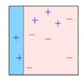

 4. 对分错的3个蓝色点加大权重，其他点减小权重。

 5. 再次训练预测。根据结果修改权重。不断重复。

    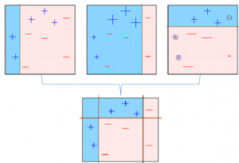

 6.  可以发现最终能够很好的拟合数据！

算法过程中：（权重格式通过最小化训练误差界推导得到）

​	$模型的权重:\alpha_t=\frac{1}{2}ln(\frac{1-\epsilon_t}{\epsilon_t}),其中\epsilon_t为当前误差$

​	$样本权重分布：D_{t+1}=\frac{D_t(i)}{Z_t}\ast\left\{\begin{array}{lr}e^{-\alpha_t},分类正确 \\\\e^{\alpha_t},分类错误 \end{array}\right.$

> **重点：**
>
> 1. 学习器为串行关系。
> 2. Boosting的着重点在于**如何一步步的修正错误，可以理解为每一步训练都只学习数据的一部分特征，最后进行结合。**
> 3. 从偏差-方差分解的角度看，Boosting主要关注**降低偏差**，因此能基于泛化性能相当弱的学习器构建出很强的集成，因此**常用决策树桩最为基学习器。**
> 4. Boosting**一般为同质学习器。**
> 5. 在最后对预测进行结合时，使用**加权投票法**。
> 6. 模型是**指数损失函数**。


**实现：**

#### 3.4.1 AdaBoost

　　**Adaptive boosting** or **AdaBoost** 是一种最简单的Boosting算法实现。其就是将上面讲到的Boosting流程进行了实现。

[sklearn](https://scikit-learn.org/stable/modules/generated/sklearn.ensemble.AdaBoostClassifier.html#sklearn.ensemble.AdaBoostClassifier)

```python
## n_estimators:设置基学习器的个数
## base_estimator：可以选择不同的基学习器，默认为决策树桩。	
>>> from sklearn.model_selection import cross_val_score
>>> from sklearn.datasets import load_iris
>>> from sklearn.ensemble import AdaBoostClassifier

>>> iris = load_iris()
>>> clf = AdaBoostClassifier(n_estimators=100)
>>> scores = cross_val_score(clf, iris.data, iris.target, cv=5)
>>> scores.mean()                             
0.9...
```


#### 3.4.2 ★ Gradient Boosting(GBDT) 

　　**Gradient Boosting ,别称（Gradient Tree Boosting,GBM,GBRT,GBDT,MART）**， 是一种强大而灵活的机器学习算法，可以用于分类，回归，排序等问题。与普通的Boosting不同，GBDT使用梯度上升法来修正之前的错误，实际上**可以将AdaBoost看做一种特定损失函数的GBDT。**

​	让我们先以比较简单的回归问题为例：

1. 比如现在我们有以下这张表，我们的目标是预测年龄。

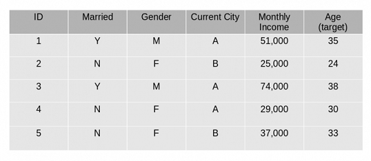

2. 我们进行了第一波的预测(Prediction1)，发现预测值与真实值之间存在差值。

   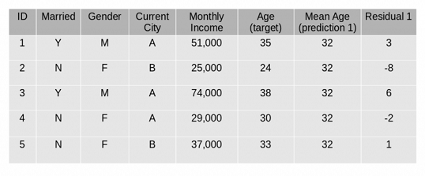

3. 我们的目标变为训练一个模型(Prediction2)去消除这种残差。

   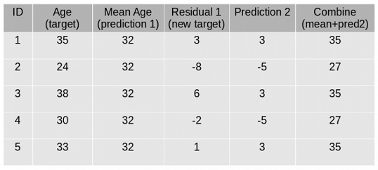

4. 这样一来又可以获得新的残差，继续训练新的模型。

   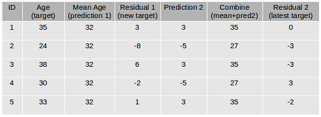

● 在上面这个问题中，我们通过不断的减少残差来拟合数据，但是这和梯度下降又有什么关系呢？

　　实际上上面这个例子使用了**平方损失函数**做为损失函数：

　　　 　$L(y,F(x))=\frac{(y-F(x))^2}{2}$ 

　　根据**梯度下降的思想**，我们需要最小化损失函数：

　　　　 $即最小化：y-F(x)$

　　这就变为减少残差来拟合数据。

● 那么怎么推导到分类问题？

　　对于分类问题，我们可以计算各个类别的概率softmax，然后尽可能使对应类别概率最大。	

　　在这里我们引入**KL-散度**： 

　　　　 $D_{KL}(p||q)=\sum_ip_ilog\frac{p_i}{q_i}$

　　其表示两个概率的不相似程度。p为真实分布，q为预测分布。

　　我们的目标是使两个概率不相似程度最小，这样一来**KL散度也就是这里的损失函数**！

●  GBDT的基学习器是什么？

　　GBDT(Gradient Boosting Decision Tree)，顾名思义，用的是决策树 。需要注意的是**用的是回归树(一般为CART回归树，6层左右)，而不是分类树！**   

　　既然是回归树那么处理回归问题十分方便，使用上面提到的平方损失函数，学习残差即可。

　　对于分类问题，则需要借助**logistic 回归**，将输出值转换为概率值，也就是说**有几种类别就需要训练几个回归树，每个树的输出为对应类别的概率。** 这样就能求取K-L散度。其实是典型的OneVsRest。


> 很明显，GBM的优势在于其通过**梯度下降算法**引入了**损失函数 **，我们可以通过选择不同的损失函数来衍生出不同效果的Boosting算法。
>
> 之所以叫梯度上升树，是因为他是正梯度的，而梯度下降是负梯度的。
>
> 比如Friedman提出可以将AdaBoost看作是用forward stagewise方法来拟合以指数损失为损失函数的Additive Logistic Regression Model。
>
> 比如，我们用KL散度作为损失函数，可以得到分类问题的算法。

[sklearn](https://scikit-learn.org/stable/modules/generated/sklearn.ensemble.GradientBoostingClassifier.html#sklearn.ensemble.GradientBoostingClassifier)
```python
>>> from sklearn.datasets import make_hastie_10_2
>>> from sklearn.ensemble import GradientBoostingClassifier

>>> X, y = make_hastie_10_2(random_state=0)
>>> X_train, X_test = X[:2000], X[2000:]
>>> y_train, y_test = y[:2000], y[2000:]

>>> clf = GradientBoostingClassifier(n_estimators=100, learning_rate=1.0,
...     max_depth=1, random_state=0).fit(X_train, y_train)
>>> clf.score(X_test, y_test)                 
0.913...
```


#### 3.4.3 ★ XGBoost

　　**XGBoost (extreme Gradient Boosting)**是一种高级的gradient boosting算法的实现（二阶泰勒展开）。它的速度几乎可以达到其他GBM算法的**10倍**。 另外XGBoost还包含了正则化用于减少过拟合，所以XGBoost也被称为“regularized boosting”。

　　使用具体调参详见：[AARSHAY JAIN的博客](https://www.analyticsvidhya.com/blog/2016/03/complete-guide-parameter-tuning-xgboost-with-codes-python/)

```python 
# xgboost 需要单独下载包
import xgboost as xgb
model=xgb.XGBClassifier(random_state=1,learning_rate=0.01)
model.fit(x_train, y_train)
```

- **二阶泰勒展开**

  泰勒展开：$f(x+\Delta x)\approx f(x)+f'(x)\Delta x+\frac{1}{2}f''(x)\Delta x$ 

  每棵树的目标函数：损失函数+正则项

  $\begin{align*}  Obj^{\ (t)} &= \sum_{i=1}^N l(y_i,\hat y_i^{(t)}) +\sum_{j=1}^t\Omega(f_j)\\  &=\sum_{i=1}^N l(y_i,\hat y_i^{(t-1)} + f_t({\bf x_i})) + \Omega(f_t)  + constant\\  &=  \sum_{i=1}^N l(y_i,\hat y_i^{(t-1)} + f_t({\bf x_i})) + \Omega(f_t)   \end{align*}$

  进行二阶泰勒展开：

  $\begin{align*}  Obj^{\ (t)} &=\sum_{i=1}^N l(y_i,\hat y_i^{(t-1)} + f_t({\bf x_i})) + \Omega(f_t) \\  &= \sum_{i=1}^N \left(l(y_i,\hat y_i^{(t-1)}) + g_if_t({\bf x_i}) + \frac{1}{2} h_if_t^2({\bf x_i})\right) + \Omega(f_t)  \hspace{5ex} \\  &其中，g_i=\frac{\partial l(y_i,\hat y_i^{(t-1)})}{\partial \hat y_i^{(t-1)}},h_i=\frac{\partial^2l(y_i,\hat y_i^{(t-1)})}{\partial^2 \hat y_i^{(t-1)}}  \end{align*}$
  
  去掉常数项：
  
  $Obj^{\ (t)} = \sum_{i=1}^N \left(g_if_t({\bf x_i}) + \frac{1}{2} h_if_t^2({\bf x_i})\right) + \Omega(f_t)  \hspace{5ex} $
  
  可以看到**目标函数只依赖每个数据点在误差函数上的一阶导数和二阶导数**。

之所以要这么推导，是因为使得工具更一般化，陈天奇的解释原话如下:

> 因为这样做使得我们**可以很清楚地理解整个目标是什么，**并且一步一步推导出如何进行树的学习。
>
> 这一个抽象的形式对于实现机器学习工具也是非常有帮助的。传统的GBDT可能大家可以理解如优化平方残差，但是这样一个形式包含可所有可以求导的目标函数。也就是说有了这个形式，我们写出来的代码可以用来求解包括回归，分类和排序的各种问题，**正式的推导可以使得机器学习的工具更加一般**。


- **正则项**

  $\Omega(f_t) =\gamma T +\frac{1}{2}\lambda\sum_{j=1}^{T} w_j^2$

  一棵树里面**叶子节点的个数T**，以及每棵树**叶子节点上面输出分数w**的平方和。

  这样就能有效约束决策树的复杂度，降低过拟合风险。

  

- **叶节点的分裂**

  $\begin{align*}  Obj^{\ (t)} &=\sum_{i=1}^N \left(g_if_t({\bf x_i}) + \frac{1}{2} h_if_t^2({\bf x_i})\right) +\gamma T +\frac{1}{2}\lambda \sum_{j=1}^{T} w_j^2\\  &=\sum_{i=1}^N \left(g_iw_{q({\bf x_i})} + \frac{1}{2} h_iw_{q({\bf x_i})}^2\right) +\gamma T +\frac{1}{2}\lambda \sum_{j=1}^{T} w_j^2\\  &=\sum_{j=1}^T \left(\sum_{i \in I_j} g_iw_j+ \frac{1}{2} \sum_{i \in I_j} h_i w_j^2\right) +\gamma T +\frac{1}{2}\lambda \sum_{j=1}^{T} w_j^2\\  &=\sum_{j=1}^T \left(G_jw_j + \frac{1}{2} (H_j + \lambda) w_j^2\right) +\gamma T   \end{align*}$

  要使的目标函数最小，求导为0。
  每个叶节点为：$w_j = – \frac{G_j}{H_j+\lambda}$

  带入目标函数，得到决策树的最小结构分数：

  $\begin{align*}  Obj^{\ (t)} &=\sum_{j=1}^T \left(G_jw_j + \frac{1}{2} (H_j + \lambda) w_j^2\right) +\gamma T\\  &=\sum_{j=1}^T \left(- \frac{G_j^2}{H_j+\lambda} + \frac{1}{2} \frac{G_j^2}{H_j+\lambda} \right) +\gamma T\\  &=- \frac{1}{2}\sum_{j=1}^T \left({\color{red}{\frac{G_j^2}{H_j+\lambda}} } \right) +\gamma T \end{align*}$

  那么叶节点分裂后结构分数越小越好：

  $Gain = \frac{1}{2}[\underbrace{\frac{G_L^2}{H_L+\lambda}}_{左子树分数} + \underbrace{\frac{G_R^2}{H_R+\lambda}}_{右子树分数} – \underbrace{\frac{(G_L+G_R)^2}{H_L+H_R+\lambda}}_{分裂前分数}] – \underbrace{\gamma}_{新叶节点复杂度}$

  **Gain值越大，说明分裂后能使目标函数减少越多，就越好**。γ则是阈值，保证分裂带来的收益足够大。

  

- **一些trick**

  - 步长、收缩率：$\hat y_i^t = \hat y_i^{(t-1)} + {\color{red} \eta} f_t(x_i)$ ，强势防止过拟合。

  - 行、列抽样：像随机森林一样，进一步防止过拟合，还能提升训练速度。
  
  - 树节点近似划分算法：当数据量很大时使用精确的贪心法（Exact Greedy Algorithm），即每个值都尝试一下，会非常慢，所以引入了Approximate Algorithm。说白了就是将数据分桶，一个特征只有指定的几个切分点，这样一来速度就能快很多，当然准确率会下降。
  
  - 缺失值处理：模型会尝试将缺失值都分到左子树或右子树，取效果好的一方。
  
  - 分块并行：将排序特征数据装入block中，在寻找最优切分点时，可以不同的block并行运行。
  
  - 缓存优化 ：缓存预取。

- **XGBoost为什么快**
  - 当数据量大时，采用近似算法。
  - Block并行运算，以及一些优化。
  - 缓存的优化。
  - 支持行列抽样。
- **XGBoost 和 GBDT 的区别**
  - XGBoost是GBDT的高级实现版。
  - GBDT使用常规的求导，XGBoost则使用二阶泰勒展开。XGBoost支持自定义损失函数，只要一二阶可导。
  - XGBoost添加了正则项，防止过拟合。
  - XGBoost支持行列抽样，防止过拟合，加快训练速度。
  - XGBoost支持并行。
  - ...XGBoost的许多优化实现。

#### 3.4.4 ★ LightGBM

非常厉害的一个模型，速度远快于XGboost，效果却差不多（稍差）。

其设计理念：

> 1. 单个机器在不牺牲速度的情况下，尽可能多地用上更多的数据；
> 2. 多机并行的时候，通信的代价尽可能地低，并且在计算上可以做到线性加速。

- **直方图算法**

  实际上XGBoost也有实现，只不过没有他来的细致。能够提升非常多的速度。

- **树生长策略**

  - 在XGBoost中，树是按层生长的，称为**Level**-wise tree growth，同一层的所有节点都做分裂，最后剪枝，如下图所示：

  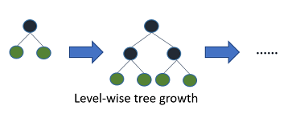

  Level-wise过一次数据可以同时分裂同一层的叶子，容易进行多线程优化，也好控制模型复杂度，不容易过拟合。但实际上Level-wise是一种低效的算法，因为它不加区分的对待同一层的叶子，带来了很多没必要的开销，因为实际上很多叶子的分裂增益较低，没必要进行搜索和分裂。

  - 而LightGBM采用的是**Leaf**-wise tree growth：

    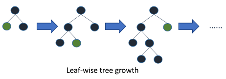

  　　Leaf-wise则是一种更为高效的策略，每次从当前所有叶子中，找到分裂增益最大的一个叶子，然后分裂，如此循环。因此同Level-wise相比，在分裂次数相同的情况下，Leaf-wise可以降低更多的误差，得到更好的精度。Leaf-wise的缺点是可能会长出比较深的决策树，产生过拟合。因此LightGBM在Leaf-wise之上增加了一个最大深度的限制，在保证高效率的同时防止过拟合。

- **并行计算的优化**

  对数据，特征的并行进一步优化。

- **XGBoost 和 LightGBM**

  最最大的改进在于树的生长策略。切发点的寻找，XGBoost实际上也支持近似算法。另外就是一些细节上的优化。

  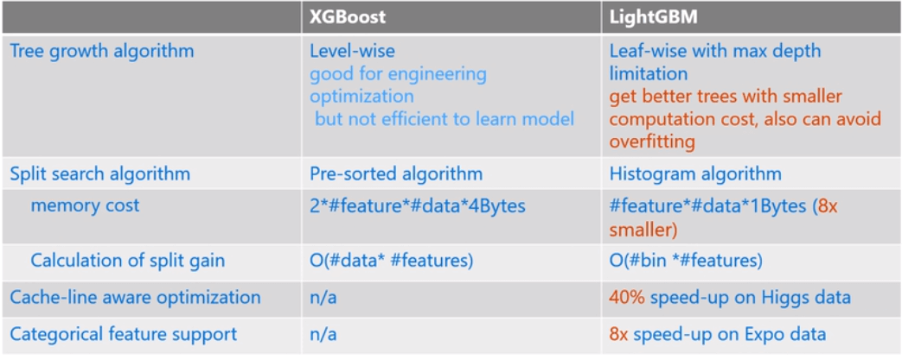


## 4. 总结

　　最后进行简单的总结。

　　　★ Stacking：将各种不同的算法进行整合，取长补短，能够减少偏差与方差。

　　　★ Bagging：利用随机采样(Bootstrap)，减少算法的方差。基学习器为高方差低偏差的算法，如未减枝决策树、神经网络等。

　　　★ Boosting：进行有目的的学习，减少算法的偏差。每一层的基学习器比较弱，每个基学习器各自学习一部分数据的特征，再到最后进行整合。整体看起来比较像神经网络。


