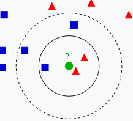

>  本文只对KNN进行一些概念介绍。 

**监督学习**：需要已经标注好的训练集。

**懒惰学习**：没有显示的训练过程，训练时间开销为0，待收到测试样本之后再进行处理。

**复杂度**：由于是懒惰学习，因此对于每个测试值都需要遍历训练样本，需要保存所有的训练样本。时间复杂度和空间复杂度都很高。 

**错误率**：当数据足够大，算法保证错误率不会超过贝叶斯算法错误率的两倍

**机制**：给定测试样本，基于某种距离度量    找出训练集中与其最靠近的K个训练样本，然后基于这K个“邻居”的信息进行预测（对于*分类任务*可以采用投票法，对于*回归任务*可以采用平均法，也可以根据距离远近进行加权）。


**距离度量**：

曼哈顿距离：

*欧氏距离*：用于数值型数据

海明距离：Hamming distance             用于字符串型数据

**参数选择 **：一般情况下，在分类时较大的K值能够减小噪声的影响，但会使类别之间的界限变得模糊。一个较好的K值能通过各种启发式技术来获取。


## scikit-learn Nearest Neighbors 使用

​	[`sklearn.neighbors`](https://scikit-learn.org/stable/modules/classes.html#module-sklearn.neighbors) 类对近邻方法进行了实现，这里简单了解一下几种常用的函数。

​	sklearn实现了**有监督和无监督**的neighbors-based学习方法。无监督的近邻是许多其他学习方法的基础,尤其是流形学习和谱聚类。而有监督的方法则用于直接分类和回归。

​	对于近邻方法，大的来说sklearn有两种实现：
​		● **k-nearest neighbor learning**
​		● **radius-based neighbor learning** 
​	顾名思义，k-nearest基于周围最近的k个样本。radius-based则需要人为设定一个半径，然后基于这个范围内的样本。

> algorithm

​	sklearn用了多种算法来具体实现邻近。(N样本数，D维度数)
​	**'auto' ,  'ball_tree' ,  'kd_tree' ,  'brute'**

​	**brute Force** ：暴力算法，把所有的点都算一遍。复杂度为O[DN^2]，很明显当数据量较大时会很慢。

​	**K-D Tree** ： 认为如果A远离B，B靠近C，那么A就远离C，不需要再计算。复杂度O[DNlog(N)],但是当样本数非常大时退化为O[DN^2]，并由于结构问题甚至比brute还慢！

​	**ball_tree** ：为了解决k-d树当样本数很大时速度变慢的问题，采用球型树来存储数据，使得复杂度维持在O[DNlog(N)]。

​	另外因为存储结构问题，树形结构会随着K值的变大速度变慢，而brute算法没有影响。

​	所以一般当$k\le N/2$时,可以优先使用ball_tree。
​	当$k\ge N/2$ 时，则优先选用brute。
​	当然，自己不确定用什么时可以用‘auto’让系统帮你选~	

> weights

​	表示各个样本的权重，默认为**uniform**,即所有样本重要性一致。

​	另外可以使用**distance**，即距离越近权重越大。

> metric

​	由metric和p决定。
​	当metric=‘minkowski’默认，p=2默认。使用 euclidean_distance
​	当metric=‘minkowski’默认，p=1。使用 manhattan_distance

> 非监督

```python
## 目的在于挑选相近的点
>>> from sklearn.neighbors import NearestNeighbors
>>> import numpy as np
>>> X = np.array([[-1, -1], [-2, -1], [-3, -2], [1, 1], [2, 1], [3, 2]])
>>> nbrs = NearestNeighbors(n_neighbors=2, algorithm='ball_tree').fit(X)
>>> distances, indices = nbrs.kneighbors(X)
>>> indices    #显示每个样本最近的点索引，因为训练集和测试集一致，所以第一个值为自己的坐标             
array([[0, 1],
       [1, 0],
       [2, 1],
       [3, 4],
       [4, 3],
       [5, 4]]...)
>>> distances  # 显示每个样本与最近点的距离，因为训练集和测试集一致，所以第一个值为0
array([[0.        , 1.        ],
       [0.        , 1.        ],
       [0.        , 1.41421356],
       [0.        , 1.        ],
       [0.        , 1.        ],
       [0.        , 1.41421356]])
>>> nbrs.kneighbors_graph(X).toarray() # 还能显示关系矩阵
array([[1., 1., 0., 0., 0., 0.],
       [1., 1., 0., 0., 0., 0.],
       [0., 1., 1., 0., 0., 0.],
       [0., 0., 0., 1., 1., 0.],
       [0., 0., 0., 1., 1., 0.],
       [0., 0., 0., 0., 1., 1.]])
```


> 监督

```python
>>> X = [[0], [1], [2], [3]]
>>> y = [0, 0, 1, 1]
>>> from sklearn.neighbors import KNeighborsClassifier
>>> neigh = KNeighborsClassifier(n_neighbors=3)
>>> neigh.fit(X, y) 
KNeighborsClassifier(...)
>>> print(neigh.predict([[1.1]]))      # 预测
[0]
>>> print(neigh.predict_proba([[0.9]])) # 各个取值概率
[[0.66666667 0.33333333]]
```


