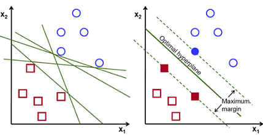
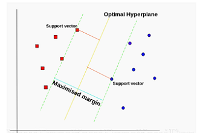
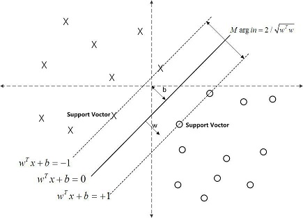
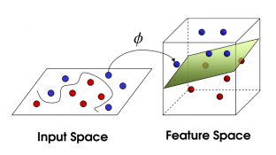
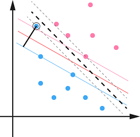
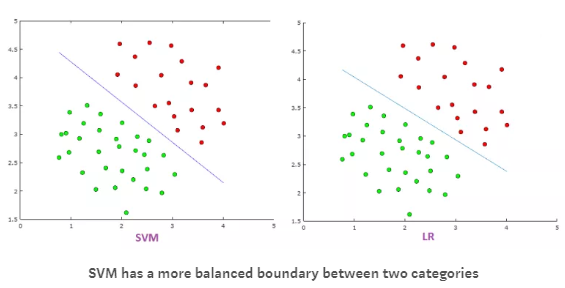
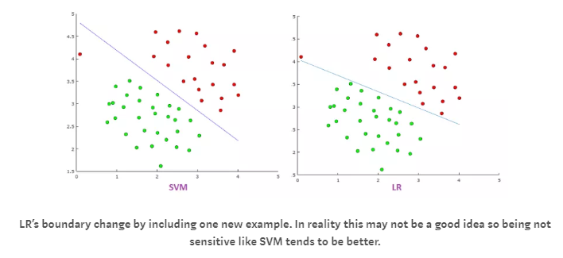
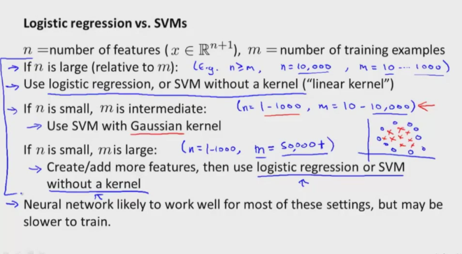

​	**支持向量机(Support Vector Machine,SVM)**，作为一个优秀的分类算法，不管用不用学习一下是必须的。不过说实话，SVM的原理很简单，但证明却很难。如果只是想用一下SVM，调用一下已实现的库，调调参数还是很容易的。所以作为一个数学渣，**这里不会涉及详细的推导，只是尽可能简单的去理一遍整个推导过程（当然重要的公式是少不了的）。**如果要学习一下详细的推导过程可以看一下[刘建平大佬的博客](https://www.cnblogs.com/pinard/p/6097604.html)。

## SVM的直观理解

首先作为一个二分类器，目标很简单：把数据分为两类，也就是找一条分割线、平面、超平面。

> 那么问题是，以什么标准去找这个超平面？

​	现在给你一堆数据，让你去寻找一条分割线去分割两类数据。这个时候往往会有很多种分法（如下图所示），但是很明显我们需要一条泛化能力强的分割线，来适应后续增加的数据。那么，很自然的，我们会把这个分割线尽可能的远离两类数据，尽量使的分割线处于中间（我离你们远一点总不会错吧~）。         

​	SVM就是这么干的，SVM从**几何的角度**出发，力求寻找一个**离两个类一样远的超平面，并且离的还要尽可能的远**！ 而每个类中离超平面最近的点叫做**支持向量（Support Vector）** 。好吧，支持向量机的名字就是这么来的，大概就是通过这些“支持向量”得到了这个分类器（机）吧~

## SVM的直观数学表达

> 首先假设目标超平面

​	$\omega^Tx+b=0$

> 空间任意点到超平面的距离为

​	$r=\frac{|\omega^Tx+b|}{||\omega||}$

> 假设两个与目标超平面平行的超平面,并通过“支持向量”

​	两个超平面为： $$\omega^Tx+b=-1$$ 和 $$\omega^Tx+b=1$$ ，（**这里取1，-1是为了后续计算方便**）

​	因为数据都在这两个超平面之外，于是就有了$\begin{align*}&\omega^Tx+b\le-1,y_i = -1\\&\omega^Tx+b\ge+1,y_i = 1             \end{align*}$   => $y_i(\omega^Tx+b)\ge1,i=1,2...,m$

> 那么可以获得两个类的最远距离

​	$\gamma=\frac{2}{||\omega||}$    ,这个距离被称为**间隔margin** 

> 我们的目标就是寻找**最大间隔**的超平面

​	即 $max_{\omega,b}\frac{2}{||w||}\quad s.t.\ y_i(\omega^Tx+b)\ge1,i=1,2...,m$

> 为了后续求解方便，重写

​	$min_{\omega,b}\frac{1}{2}||\omega||^2\quad s.t.\ y_i(\omega^Tx+b)\ge1,i=1,2...,m$

​	这个就是SVM的**基本型！**

**注：**在推导过程中，进行了一个巧妙的假设，**最近的点（支持向量）到超平面的距离为1**，这个假设使得最大间隔的数学表示变的很简单，但也增加了一个不等式约束。另外注意y只有+1和-1取值。

## SVM的对偶数学表达

我们现在的目标很清晰就是求出满足基本型的w和b

$min_{\omega,b}\frac{1}{2}||\omega||^2\quad s.t.\ y_i(\omega^Tx+b)\ge1,i=1,2...,m$

虽然这是个凸二次规划问题，有现成的包可以求解，但这里有一个更加高效的方法....

> 拉格朗日乘子法 & 对偶问题

​	正好有一个现成的方法可以用来解决这类不等式约束的问题，那就是拉格朗日乘子法。

​	该问题的拉格朗日函数为：$L(\omega,b,\alpha)=\frac{1}{2}||\omega||^2+\sum_{i=1}^m\alpha_i(1-y_i(\omega^Tx_i+b)),\alpha_i\ge0$

​	现在我们的目标变成了两个：
​		① **对于拉格朗日乘子α最大化L（拉格朗日乘子法要求）**
​		② **对于ω、b最小化L（SVM要求）**
​		即：$min_{w,b}max_{a_i\ge0}\ L(\omega,b,\alpha)$	

​	再让我们看一下这个新函数是怎么实现约束条件的：
​		当不满足约束条件时，右面括号里面的值将大于0，这个时候求max是不存在的。
​		当满足约束条件时，先求max，公式右边必将为0，那么求min时就变为了求$\frac{1}{2}||\omega||^2$的原问题。

​	整个约束条件即为**KKT(Karush-Kuhn-Tucker)条件：**

​			$\begin{equation} \begin{cases}\alpha_i\ge0; \\y_if(x_i)-1\ge0;\\ \alpha_i(y_if(x_i)-1)=0. &\end{cases}\end{equation}$      

​		从这个条件我们可以看出一个问题：**只有支持向量的α存在非0值，其他样本的α必将取0！**

​	再看，如果我们先求max，α的个数比较多且是不等式约束不好求，所以在**满足KKT条件下转为对偶问题**：
​		$max_{a_i\ge0}\ min_{w,b}\ L(\omega,b,\alpha)$

> 求解对偶问题

​	首先求解L基于ω和b的极小值，直接求偏导为0：

​		$\omega=\sum_{i=1}^m\alpha_iy_ix_i$

​		$0=\sum_{i=1}^m\alpha_iy_i$

​	带入原式得到只关于α的极大值问题：

​		$max_\alpha\ \sum_{i=1}^m\alpha_i-\frac{1}{2}\sum_{i=1}^m\sum_{j=1}^m\alpha_i\alpha_jy_iy_jx_i^Tx_j\quad s.t.\ \sum_{i=1}^m\alpha_iy_i=0,\alpha_i\ge0$

​	通过**SMO(Sequential Minimal Optimization)**算法获得α值，即可获得**最终模型**：

​		$f(x)=\omega^Tx+b=\sum_{i=1}^m\alpha_iy_ix_i^Tx+b$

> SMO算法

​	SMO算法是一种启发式的方法，其关键在于获得了$0=\sum_{i=1}^m\alpha_iy_i$这个等式。
​	SMO算法每次只优化两个变量，将其他的变量都视为常数，这样就从多变量的优化问题变成了两变量的优化问题。再加上等式的存在，使得这两个变量可以互相表示，这样一来问题近一步简化为了**单变量二次规划问题。**这样一来就能很容易的优化α值。

​	那么怎么选取每次优化的两个α值？
​	已证明[Osuna et al., 1997]，只需选取的α中有一个不满足KKT条件，目标函数就会在迭代后增大。
​	所以我们选取α的策略是：
​		① 先选取一个违背KKT条件程度最大的变量。
​		② 选取的第二个变量与第一个变量对应样本之间的间隔最大。这样有助于加快优化。

> b值求解

​	求导之后我们发现b不见了，好在对于任意的支持向量都有$y_sf(x_s)=1$

​		即：$y_s(\sum_{i\in S}\alpha_iy_ix_i^Tx_s+b)=1,S为所有支持向量的下标$

​	为了结果更鲁棒，b使用所有支持向量的平均值：

​		$b=\frac{1}{|S|}\sum_{s\in S}(1/y_s-\sum_{i\in S}\alpha_iy_ix_i^Tx_s)$

**总结：** 我们通过一系列的优化手段，最终获得了一个**最终模型：**

​		$f(x)=\omega^Tx+b=\sum_{i=1}^m\alpha_iy_ix_i^Tx+b$

​		这个模型有一个特点：**只有支持向量拥有非0的α！**这也造成了SVM的一个重要性质：**训练完成后，大部分的训练样本都不需要保留，最终模型只与支持向量有关！**

## 核函数

​	上面讲了那么多，一直在讲线性可分问题，但是现实任务往往是线性不可分的。但好在，**如果原始空间是有限维，即属性数有限，那么一定存在一个高维特征空间使样本可分！**

> 我们尝试对原数据进行映射Φ(X)

​	$f(x) = \omega^T\phi(x)+b$

​	经过一系列变换之后得到对偶问题：

​	$max_\alpha\ \sum_{i=1}^m\alpha_i-\frac{1}{2}\sum_{i=1}^m\sum_{j=1}^m\alpha_i\alpha_jy_iy_j\phi (x_i)^T\phi (x_j)\quad s.t.\ \sum_{i=1}^m\alpha_iy_i=0,\alpha_i\ge0$

​	如果直接求解因为要计算$\phi (x_i)^T\phi (x_j)$，这是样本映射到特征空间之后的内积，可能维度很高甚至无穷维，通常无法直接运算。

> 设想有这样一个函数：

​		$k(x_i,x_j)=\phi (x_i)^T\phi (x_j)$ 

​	也就是说**在特征空间的内积等于它们在原始样本空间中通过函数k(.,.)计算的结果。** 

​	这个函数K就是**核函数(kernel function)！**

​	有定理证明：只要一个对称函数所对应的核矩阵半正定，它就能作为核函数使用。

> 常用核函数

| 名称       | 表达式                                      | 参数             |
| -------- | ---------------------------------------- | -------------- |
| 线性核      | $k(x_i,x_j)=x_i^Tx_j$                    |                |
| 多项式核     | $k(x_i,x_j)=(x_i^Tx_j)^d$                | d>=1为多项式次数     |
| 高斯核,RBF核 | $k(x_i,x_j)=exp(-\frac{||x_i-x_j||^2}{2\sigma^2})$ | σ>0为高斯核宽度      |
| 拉普拉斯核    | $k(x_i,x_j)=exp(-\frac{||x_i-x_j||}{\sigma})$ | σ>0            |
| Sigmoid核 | $k(x_i,x_j)=tanh(\beta x_i^Tx_j+\theta)$ | 双曲正切函数，β>0,θ<0 |

**注意：核函数的选择是SVM中最大的变数。**

> 带核函数的最终模型

​	$f(x)=\omega^Tx+b=\sum_{i=1}^m\alpha_iy_ik(x,x_i)+b$

​	对比之前的最终模型发现：$k(x,x_i)=x_i^Tx$ ,嗯可以认为原来的模型用了线性核~

## 软间隔

​	                                   

​	前面我们总是找一个超平面将数据完全分开，就如图中的黑色超平面一样。但是现实数据是有噪声的会有异常值。如果有异常值被当做了支持向量来确定超平面，那么这个超平面的泛化能力一定不会好（过拟合），所以我们需要对这种异常值有一定的容忍能力。
​	**硬间隔（hard margin）：** 间隔中不存在样本，即所有样本都划分正确。
​	**软间隔（soft margin）：** 允许间隔中存在一定的样本，即不要求所有样本都划分正确。

> 添加惩罚

​	既允许不满足约束的点存在，又要这些点尽可能的少，那么可以通过添加惩罚的方式来约束这些点。

​	优化目标变为:    $min_{\omega,b}\ \frac{1}{2}||\omega||^2+C\sum_{i=1}^m\ell(y_i(\omega^Tx_i+b)-1)$

​	其中**C为惩罚参数**，C越大，对误分类的惩罚越大，C越小，对误分类的惩罚越小。

​	其中ι为**替代损失（surrogate loss）**，常见的替代损失函数有：

​		● **hinge 损失（合页损失）：** $\ell(z)=max(0,1-z)$

​		● 指数损失（exponential loss）：$\ell(z)=exp(-z)$

​		● 对率损失（logistics loss）：$\ell(z)=log(1+exp(-z))$

​	其中**hinge损失函数是最常用的**（scikit-learn中就使用这种损失函数），一般讨论SVM时就默认这种损失函数。

> 松弛变量

​	为了书写、表达方便，使用**松弛变量（slack variable）**来表示损失值：

​		$min_{\omega,b,\xi_i}\ \frac{1}{2}||\omega||^2+C\sum_{i=1}^m\xi_i\quad s.t.\ y_i(\omega^Tx_i+b)\ge1-\xi_i\quad \xi_i\ge0,i=1,2...m$

​	**每个样本都有一个对应的松弛变量，用来表征样本不满足约束的程度，是样本到超平面距离的一个度量。**
​	可以看到原来的约束是：$y_i(\omega^Tx_i+b)\ge1$ ，即点必须都在间隔之外。
​	现在变成了$y_i(\omega^Tx_i+b)\ge1-\xi_i$ , 可以看成允许到间隔内了。以hinge为例，$z+max(0,1-z)\ge$1 ，z无约束。也就是说**hinge允许样本在任何地方，只是对间隔内的样本进行了惩罚！！这个时候边界上和内的点都是支持向量（当然分错的更是，因为这些点拥有非0的α值）！！**

​	               

> 参数求解

​	求解流程和之前完全一致，当求解对偶问题时：
​	$max_\alpha\ \sum_{i=1}^m\alpha_i-\frac{1}{2}\sum_{i=1}^m\sum_{j=1}^m\alpha_i\alpha_jy_iy_jx_i^Tx_j\quad s.t.\ \sum_{i=1}^m\alpha_iy_i=0,\  0\le a_i\le C$
​	和原来没有太大的差别，只是α的取值范围发生了变化。

​	最终模型样式没有什么变化：
​	$f(x)=\omega^Tx+b=\sum_{i=1}^m\alpha_iy_ix_i^Tx+b$

## 从损失函数角度看SVM

​	SVM的损失函数可以写成：

​	$min\frac{1}{2}||\omega||^2+C\sum_{i=1}^m\ell(f(x_i),y_i)$

​	左边的这项是不是很像**正则化的L2范数**？ 没错，这项称为**结构风险（structural risk）**： 用于描述模型的某些性质。以贝叶斯估计的角度来看，这提供了**模型的先验概率**。比如L2范数倾向于参数尽量均匀，L0和L1范数则倾向参数尽量稀疏。

​	右边一项则像模型训练时计算得到的误差。这项称为**经验风险（empirical risk）**： 用于描述模型与训练数据的契合程度。

​	C则是两者的一个权重比。

​	这个时候，你可能会想，那要是我把L这个损失函数换一换不就可以得到各种不同的模型了？比如把损失函数替换成对率损失函数，你会发现**几乎得到了逻辑回归！**两者的性能也相当！所以这体现了SVM的强大！

## SVM VS LR 

​	在上面我们已经发现，两者的损失函数十分像，当SVM采用对率损失函数时就根本没有差别了。

> 相同点

 	1. 都是二分类算法
 	2. 都是监督学习
 	3. 都是判别式

> 不同点 [参考了Drakos](https://towardsdatascience.com/support-vector-machine-vs-logistic-regression-94cc2975433f)

 1.  一般svm使用hinge损失函数，这样一来，SVM一般会比LR稍微好一点。

	2. svm通过最大化间隔来寻找超平面，而LR通过分类概率来寻找超平面。这使得svm的结果尽可能的远离两个类，而LR的结果没有这个性质。

    

	3. svm对于异常值没有LR敏感，因为逻辑回归的损失函数更敏感。

4. svm的输出是0或1，而LR的输出是一个概率。这使得在某些时候LR的解释性更强。当然也有后续的办法使得svm输出概率。

> 什么时候使用SVM? LR? NN?

