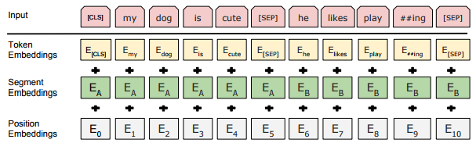
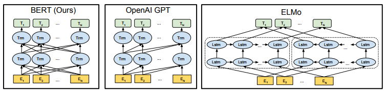
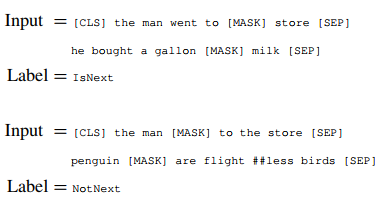
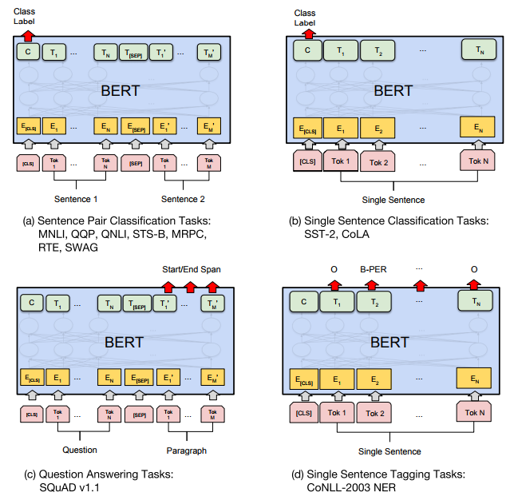
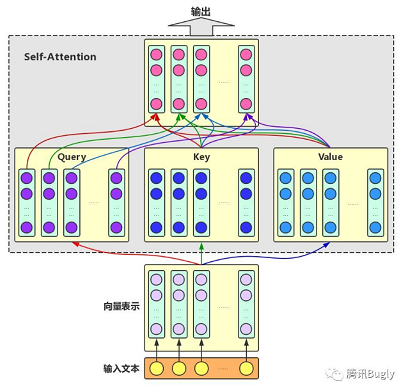
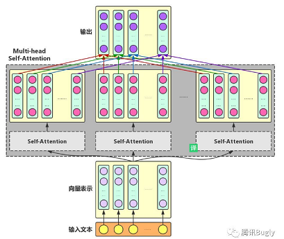
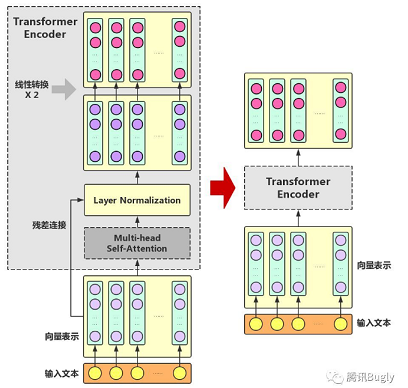
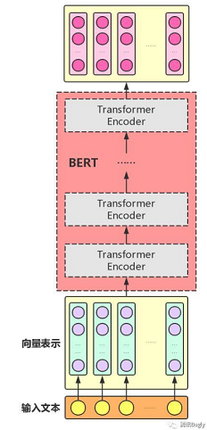
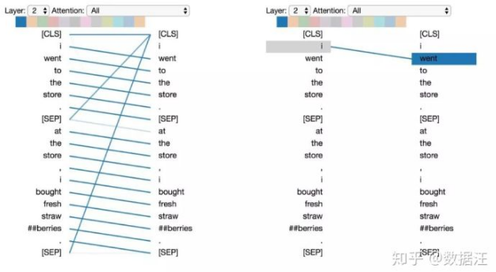
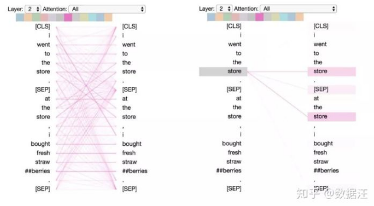

前置知识：[seq2seq-Attention-Transformer](https://cenleiding.github.io/seq2seq-Attention-Transformer.html)

这篇文章只是对bert最基础的了解学习，大致了解其基本特性。

BERT的全称是**Bidirectional Encoder Representation from Transformers**，即双向Transformer的Encoder。

Bert的使用可以分为两部分：**pre-training和fine-tuning**。 

● pre-training为预训练，bert设计了两个基础的任务并利用海量数据进行了训练（BooksCorpus (800M words)和English Wikipedia (2,500M words)）。这就像word2vec一样，为下游的任务提供了支持，当然bert强大很多。

● fine-tuning为微调，在预训练时bert是根据自己的两个基础任务进行训练的与实际情况存在偏差，所以在实际使用时需要使用者定义自己的loss，来微调模型。 

一般使用者不用进行pre-training，根本没那个资源，好在已经有多种语言的预训练模型已经发布,[BERT-Base, Chinese](https://storage.googleapis.com/bert_models/2018_11_03/chinese_L-12_H-768_A-12.zip)。 使用者要干的就是根据自己的任务在 bert上添加网络定义loss，微调出一个合适的模型。

## bert 输入层

●  两个特殊的令牌[CLS]和[SEP]。[CLS]用来表示一个句子的开始，[SEP]则表示两个句子的分隔和句子的结束。

● Token Embeddings：词向量，通过查询向量表将每个词转换为一维向量。

●  Position Embeddings：位置向量，通过学习获得，支持512长度。（毕竟transform无法获得位置信息）

● Segment Embeddings：分割向量，通过学习获得，用于区分两个不同的句子。

## bert 预训练任务

### Masked LM

Masked LM任务就像完形填空：随机抹去一句话中的几个词，用其他词去预测这些词是什么。

bert对随机15%的token进行mask操作，最终的损失函数只计算被mask的那些token。但并不是简单的直接替换为[MASK]，因为微调任务中并不会出现[MASK]标签。而是对于选中的token：80%替换为[MASK]标签，10%替换为随机词，10%保持不变。

这样做的好处是：模型并不知道哪个词需要预测，这样一来迫使模型更多地依赖于上下文信息去预测词汇，并且赋予了模型一定的纠错能力。并且由于随机词替换只有1.5%，所以对模型的语言理解能力损害不大。

相比于GPT，ELMO预训练模型架构，bert直接学习了上下文结构，更符合直观感受，且并行能力更好。
虽然因为每次只有15%的token进行预测导致bert的收敛慢于传统的语言模型，但是训练效果更好慢一些就不是事了。

### Next Sentence Prediction

Next Sentence Prediction任务：给定两句话，判断第二句话是否紧跟在第一句话之后。目的是让模型理解两个句子之间的联系。

**注意：作者特意说了语料的选取很关键，要选用document-level的而不是sentence-level的，这样可以具备抽象连续长序列特征的能力。**

## bert 微调任务

​	微调任务比较简单，句子分类什么的看[CLS]的输出。NER则直接看每个token的输出。另外可以在bert后面接上其他网络结构，比如LSTM+CRF可以使结果更好。

## bert 整体结构

这部分参考[腾讯Bugly](https://cloud.tencent.com/developer/user/1069749)

首先，既然叫transformer。那就是用了self-attention。

**Multi-head Self-Attention:**为了增强Attention的多样性，文章作者进一步利用不同的Self-Attention模块获得文本中每个字在不同语义空间下的增强语义向量，并将每个字的多个增强语义向量进行线性组合，从而获得一个最终的与原始字向量长度相同的增强语义向量。

**Transformer Encoder**： 

只用了Transformer的Encoder部分。

● 残差连接（ResidualConnection）：防止梯度消失。

● Layer Normalization：同样防止梯度消失。

● 线性转换：对每个字的增强语义向量再做两次线性变换，以增强整个模型的表达能力。

**BERT model**：

组装好TransformerEncoder之后，再把多个Transformer Encoder一层一层地堆叠起来。

## 杂谈

优点：

● 由于bert使用了Transformer，相对于rnn更加高效（并行）、能捕捉更长距离的依赖、真正意义上的学习上下文关系，这使得bert的效果非常好。

● 无监督、预训练、迁移学习。

缺点：

● 由于引入了[mask]，但在实际预测中并不会出现，所以过多的[mask]会导致模型的效果不好。

● 模型预训练时mask任务每次只训练15%的token,这导致整体模型的收敛变慢。

### muti-head self-attention 学了什么

BERT 使用了多层次的注意力（12或24层，具体取决于模型），并在每一层中包含多个（12或16）注意力“头”。由于模型权重不在层之间共享，因此一个BERT 模型就能有效地包含多达24 x 16 = 384个不同的注意力机制。

这些注意力机制学到了一些十分有趣的模式：

● 注意下一个词

● 注意相同或相关词

更多模式看[数据汪](https://www.zhihu.com/people/BigDataDigest)的文章。

### 为什么用mask任务

就我个人的感觉，这完全是因为选了transformer的缘故。既然用了transformer那么预测词，最直接的想法当然是用mask方式（当然那3个小trick十分6）。所以，比较mask任务和left-right任务的优缺点，更像是比较transformer和bi-lstm的优缺点。

### bert为什么慢

在讲transformer时，夸其对并行十分友好，能够加快训练速度。但到了bert为什么出奇的慢？个人觉得主要因素有两点：1.self-attention的参数太多了，因为要生成Q,K,V三个向量，且在bert中采用muti-head self-attention而且每层的参数都不共享，这使得bert的参数突破了天际。。。2.预训练任务的MLM每次只预测15%的token这会大大降低收敛速度。

