这篇文章只是对seq2seq和attention机制和Transformer最最最简单的了解，感谢[EulerAndGauss](https://www.zhihu.com/people/EulerAndGauss)、[Yuanche.Sh](https://www.zhihu.com/people/cheshengyuan) 、[刘岩](https://www.zhihu.com/people/yan-liu-43)和[Jay Alammar](https://jalammar.github.io/)的博客文章的讲解。

## 1. seq2seq

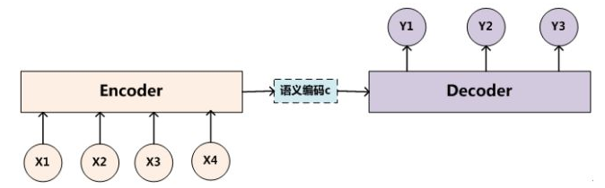

　　**seq2seq**是一种**Encoder-Decoder**结构的网络。简单的来说就是在Encoder端输入一个序列，编码成一个向量C，然后在Decoder端根据这个向量输出一个目标序列，最常见的就是机器翻译和问答系统了。

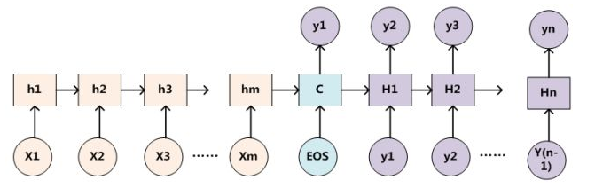

　　在自然语言处理领域，seq2seq最常用RNN实现，比如LSTM，GRU。实际上基础的seq2seq十分简单，其就是在常规的RNN链上增加了一些标志位，比如用\<EOS>表示输入结束，然后靠着网络的记忆能力“惯性”的输出目标序列。但是很明显直接这样做的效果一定不会好，主要有两点原因：

1.虽然像LSTM能够有效的记忆时间序列，但是仍然有长度限制，距离越长细节丢失越多，所以当输入输出是中长序列时效果会严重下降。

2.Encoder部分将输入编码为一个向量C，Decoder部分则依靠这个向量获得输出。所以从输出的角度来看，整个输入是一体的，对每个位置的输出影响力基本是相同的，这明显不合理。比如机器翻译中，某个节点的输出一定对应于输入中的某个单词块。

　　而attention机制恰恰能够有效的弥补这两个缺陷！

- attention vs LSTM
  - LSTM只能记住20个词内的信息。而attention没有距离限制。
  - 即使在较短的句子翻译中，attention仍然优于LSTM，因为其每个词的翻译更有针对性。
  - 对于很短的句子（4,5个词）的翻译，效果都不好。因为太短实际上算不上完整的句子。

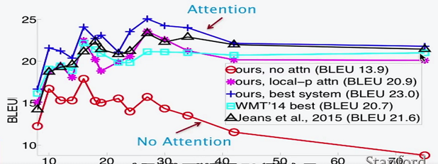

## 2. seq2seq+attention

　　首先需要记住的一点是：**attention实际上就是一个权重分布的计算机制。** 简单却十分的有效。

 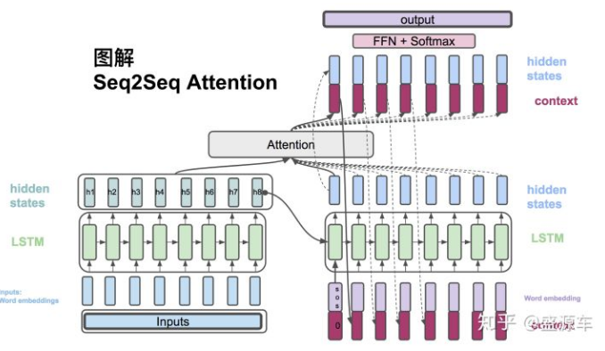

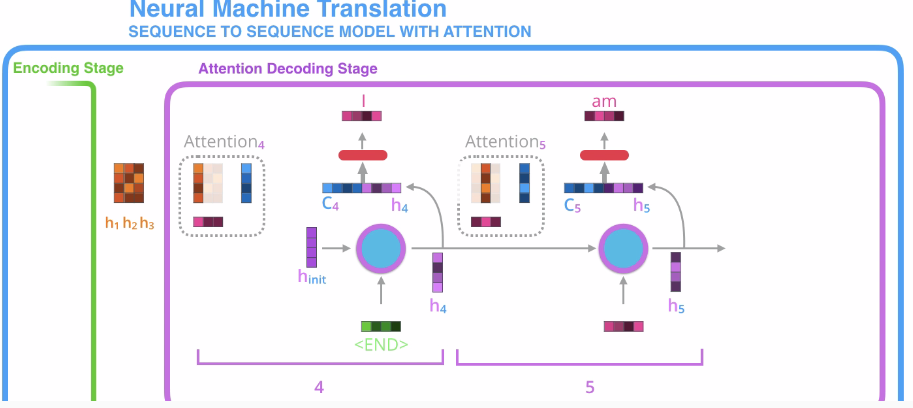

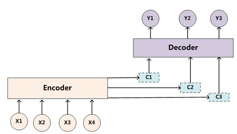

1. 对于Encoder部分没有变化，仍然是根据输入获得hidden states。
2. 对于Decoder部分，每个节点的最终输出不再只靠hidden states。前面提到了这样做会造成丢失长时间信息和信息过于笼统的缺点。因此这里引入了Attention机制，说白了就是通过输出节点的hidden states与输入的hidden states 计算获得输入节点的权重分配概率。然后根据这个概率就能得到一个特殊的输入编码向量。由于是**直接通过权重概率获得输入编码C，因此就不存在距离这一说法了，避免了由于长时间序列造成的信息丢失。** 另外**不同的权重概率，生成不同的C，使得每个输出节点都有自己的着重点、关注点，使得结果更有目的性。**
3. 一个节点的最终输出为hidden states和对应编码C的合并向量。这个向量通过简单的FFN和softMax即可得到预测输出的概率值。

那么，attention具体是怎么获得输入的权重分配的呢？对此，有多种实现方法：

### 2.1 attention实现-dot

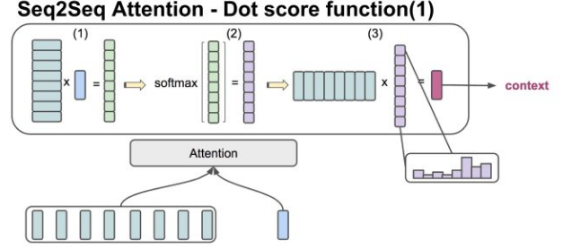

　　该方法，用于Encoder和Decoder的hidden states 的向量维度一致的情况。直接做点乘和softmax，就可以得到每个输入节点的权重概率分布，继而得到带着注意力的编码C。

### 2,2 attention实现-general

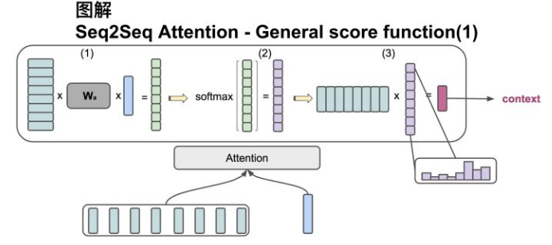

　　该方法，用于Encoder和Decoder的hidden states的向量维度不一致的情况，实际上就是多设置一个转换矩阵，和dot方法没有太大区别。

### 2.3 attention实现-Q,V,K

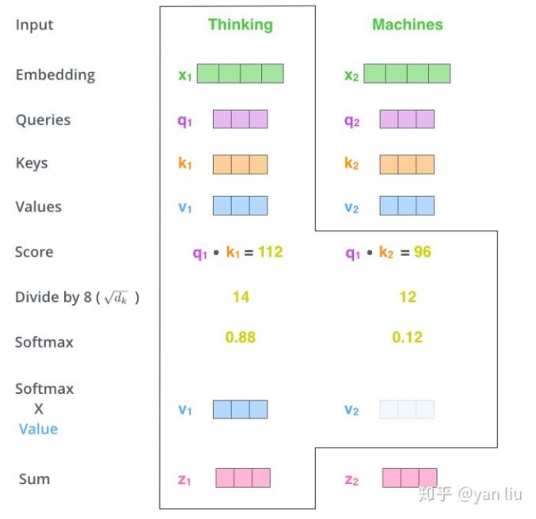

​	该方法，主要用于**self-attention**的计算。

1. 首先将输入单词转化成嵌入向量。
2. 根据嵌入向量得到 Q，K，V（Query，Key，Value）三个向量。**其中Q指用于查询的向量，K指用于和查询向量比较的向量，V指当前节点的本身值。** 
3. 为每个向量计算一个score=Q.K 。也就是用目标节点的Q向量去和所有结点的K向量做点成，这样就会得到一个表示相关性的值，值越大代表相关性越大。 
4. 为了梯度的稳定，使用了score归一化，即除以 $\sqrt{d_k}$ 。
5. 对score施以softmax激活函数，即为各个节点的权重。
6. 权重乘以V向量，再求和，就能得到目标向量。

## 3. Transformer

　　前面提到了，使用Attention机制可以有效的**解决LSTM长时记忆的信息丢失问题**。但是LSTM仍然存在一个非常严重的问题：**模型并行能力非常差！** 因为其每个节点需要前一个节点的输出值作为输入，只能线性运行。但Attention机制给出了另一种解决思路：直接对序列中其他节点计算权重，从而直接得到节点输出向量！这样一来每个节点都能并行的计算自己的输出向量，大大提升了训练速度！这就是**self-attention!** 

　　Transformer中抛弃了传统的CNN和RNN，整个网络结构完全是由Attention机制组成。更准确地讲，**Transformer由且仅由self-Attenion和Feed Forward Neural Network组成**。一个基于Transformer的可训练的神经网络可以通过堆叠Transformer的形式进行搭建。

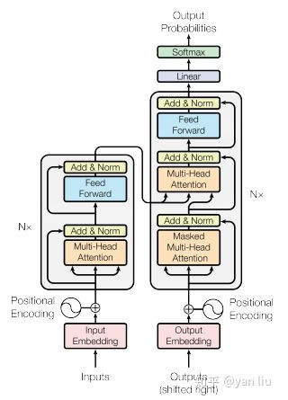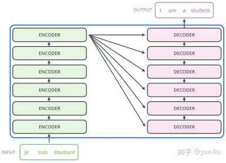

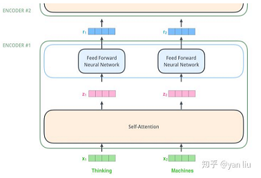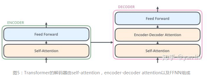

一些注意点：

1. self-attention使用了残差网络中的short-cut结构，用于解决深度学习中的退化问题。
2. 在Decoder时，是一个顺序操作过程，即只能看到当前节点之前的解码结果。因此先用已有的解码结果得到该节点向量，再用这个向量去和输入做attention，最后通过FFN+softmax获得预测值。
3. 用self-attention存在一个问题：**没有捕捉顺序序列的能力** ，也就是说无论句子的结构怎么打乱，Transformer都会得到类似的结果。换句话说，Transformer只是一个功能更强大的词袋模型而已。因此，论文中引入了**位置编码（Position Embedding）**的特征。具体地说，位置编码会在词向量中加入了单词的位置信息，这样Transformer就能区分不同位置的单词了。常见的模式有：a. 根据数据学习；b. 自己设计编码规则。

