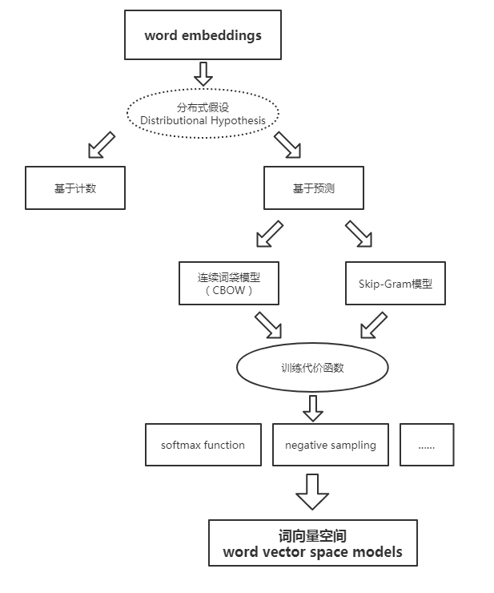
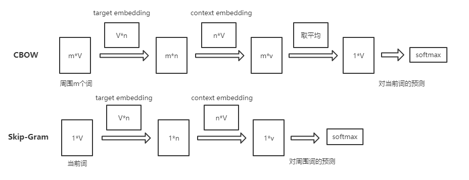
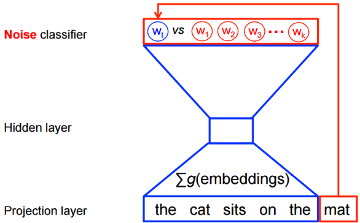
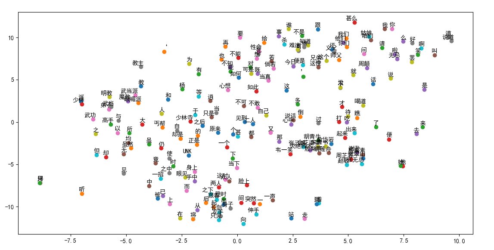

word2vec整体思路还是比较简单的，但十分的有趣，直观，有用。

详细的可以看 TensorFlow 官网给出的教程，可以自己具体实现一下[教程](http://www.tensorfly.cn/tfdoc/tutorials/word2vec.html)

这里只进行简单的介绍，对一些重要概念进行梳理：



## 一.为什么需要word embeddings？

　　我们既然要处理自然语言，那么首先就需要将其转换成电脑能看懂的形式。最简单的就是用**one-hot encode** 的方式，及每个向量只有一位为1其余为0，用一个向量表示一个目标（注意这个目标理解为token，可以是字也可以是词，句子、文章什么的这里不考虑~）。但是这样表示的话，都是稀疏向量（sparse vector），不但占位子而且向量之间都毫无关系，这对于后续的处理无疑是很不利的。我们需要一个能够表示各个词之间关系的稠密向量（dense vector）来表示目标。于是就需要进行word embedding,来得到词向量空间。


## 二.分布式假设

　　**分布式假设 distributional hypothesis**： 指的就是如果两个词所处的上下文环境相似，那么这两个词大概率相似。这为词向量的学习提供了一个可行的方向。　　

　　**基于计数的方法**：计算某词汇与其邻近词汇在一个大型语料库中共同出现的频率及其他统计量。　

　　**基于预测方法**：用当前词汇的邻近词汇对其进行预测，或者用当前词汇对其临近词汇进行预测。


## 三.基于计数

　　基于计数实际上也就是基于统计。基于计数的方法实际上非常简单：**对当前词汇的周围词汇进行统计，用该统计值作为当前词汇的词向量！**

　　这样一来，对大量文本进行统计之后我们就能得到一个[V*V]的矩阵，其中V指的是词总数。每个词都有一条V维的词向量，是对其周围词的统计。很明显，通过计数方法得到的词向量是**稀疏**的。但和one-hot不同的是，其蕴含了词之间的关系。

　　更进一步，直接进行词频统计并不能很好的表示词之间的关系，因为有些词是高频的却没有蕴含足够有意义的信息（比如‘这’，‘的’）。所以我们需要根据一个词的重要性进行统计，最为常用的方法就是**TF-IDF**， 来获得词对于当前文档的重要程度，从而进行加权统计。

　　但不管怎么说，用基于计数的方法得到的词向量是稀疏的，这对后续的训练十分不友好，所以基本上不会使用。


## 四.基于预测

预测方法分为两类：

　　**连续词袋模型（CBOW）**：根据上下文词汇来预测目标词汇。对于很多分布式信息进行了平滑处理（例如将一整段上下文信息视为一个单一观察量）。很多情况下，对于**小型的数据集**，这一处理是有帮助的。

　　**Skip-Gram模型**：通过目标词汇来预测上下文词汇。将每个“上下文-目标词汇”的组合视为一个新观察量，这种做法在**大型数据集**中会更为有效。

　　简单来说就是对于"我爱你"这句，爱作为目标词，cbow模型需要由‘爱’推出‘我’、‘你’，而skip-gram模型则是要由‘我’推出‘爱’，‘你’推出‘爱’。在代码具体实现时，只要稍作修改即可。


> 具体模型

​	

　　整个模型十分简单，能够学得两个映射矩阵**target embedding**和**context embedding**。这两个矩阵都是词与向量的映射。词向量的维度n能够自由设定。最后我们将**target embedding**矩阵作为我们得到的词向量矩阵(没去研究为什么不用context embedding~)。


> 负采样

　　在模型的最后，我们使用softmax来获得对各个词的预测概率，进而使用交叉熵作为损失函数。但是需要注意的是，**由于V往往比较大所以求softmax是很消耗资源的！** 而且我们也没有必要知道对于每个词的预测概率，所以**负采样**将问题简化为：只要目标单词的预测概率较高，同时噪声单词的概率很低，那么就认为这个预测是好的。而噪声词一般选取那些高频词。




## 五.实际使用

> **负采样nce 函数：** 

```python
def nce_loss(weights, biases, inputs, labels, num_sampled, num_classes,
             num_true=1,
             sampled_values=None,
             remove_accidental_hits=False,
             partition_strategy="mod",
             name="nce_loss")
```

weights,biases:逻辑回归的参数

input,labels:预测值，真实值

num_sampled:采样数

num_classes：词总数

这些参数都没什么问题，但是sampled_values为什么默认为None?看源码可以发现，其默认使用log_uniform_candidate_sampler函数采样，这个函数P(k)，k越大，被采样到的概率越小。这里的k就是词的编号。很明显我们需要让高频词被采到的概率更大一点，所以在实现的时候需要将高频词放在前面使其编号小。


> **gensim：**

　　虽然自己也跟着教程实现了一下程序，也能用，但实际使用时当然选择别人提供的工具模块。于是实际用了gensim来进行词嵌入。接口是否简单，没什么好讲。但需要注意的是**gensim里训练出来的词向量空间没有包括低频词！！！！**而TensorFlow的demo里是将低频词统一转换成同一个标志一起处理的。而如果没有低频词的向量，那就没法完整的对所有单词进行转换了，所以用gensim时还要自己对低频词进行处理，可以事先预处理文本也可以最后将低频词赋值为0向量。

　　另外gensim训练出来的是一个model，为了能以后使用方便，最好将其转化为word2id和word2vec两个文件。


最后放张图,什么都没优化，单纯分词+词嵌入：




[程序代码](https://github.com/cenleiding/learning-Machine-Learning/tree/master/gensim_w2v)

