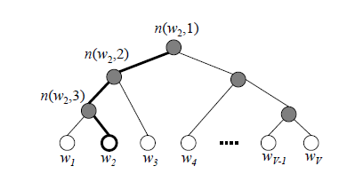
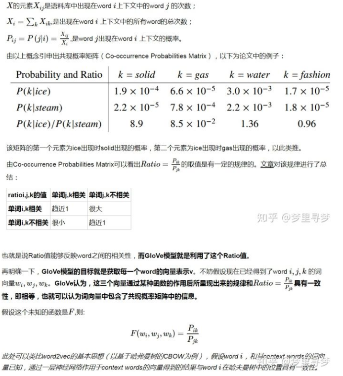
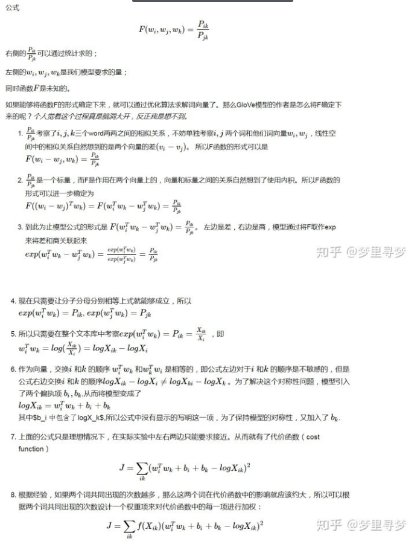
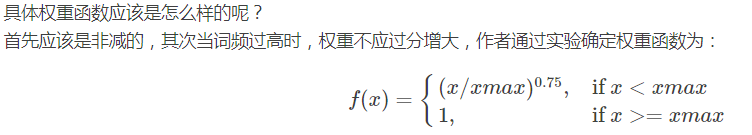

word2vec整体思路还是比较直观的，十分的有趣，有用。

详细的可以看 TensorFlow 官网给出的教程，可以自己具体实现一下[教程](http://www.tensorfly.cn/tfdoc/tutorials/word2vec.html)

这里只进行简单的介绍，对一些重要概念进行梳理：


## 一.为什么需要word embeddings？

　　我们既然要处理自然语言，那么首先就需要将其转换成电脑能看懂的形式。最简单的就是用**one-hot encode** 的方式，及每个向量只有一位为1其余为0，用一个向量表示一个目标（注意这个目标理解为token，可以是字也可以是词，句子、文章什么的这里不考虑~）。但是这样表示的话，都是稀疏向量（sparse vector），不但占位子而且向量之间都毫无关系，这对于后续的处理无疑是很不利的。我们需要一个能够表示各个词之间关系的稠密向量（dense vector）来表示目标。于是就需要进行word embedding,来得到词向量空间。


## 二.分布式假设

　　**分布式假设 distributional hypothesis**： 指的就是如果两个词所处的上下文环境相似，那么这两个词大概率相似。这为词向量的学习提供了一个可行的方向。　　

　　**基于计数的方法**：计算某词汇与其邻近词汇在一个大型语料库中共同出现的频率及其他统计量。　

　　**基于预测方法**：用当前词汇的邻近词汇对其进行预测，或者用当前词汇对其临近词汇进行预测。


## 三.基于计数

　　基于计数实际上也就是基于统计。基于计数的方法实际上非常简单：**对当前词汇的周围词汇进行统计，用该统计值作为当前词汇的词向量！**

　　这样一来，对大量文本进行统计之后我们就能得到一个[V\*V]的矩阵，其中V指的是词总数。每个词都有一条V维的词向量，是对其周围词的统计。很明显，通过计数方法得到的词向量是**稀疏**的。但和one-hot不同的是，其蕴含了词之间的关系。

　　更进一步，直接进行词频统计并不能很好的表示词之间的关系，因为有些词是高频的却没有蕴含足够有意义的信息（比如‘这’，‘的’）。所以我们需要根据一个词的重要性进行统计，最为常用的方法就是**TF-IDF**， 来获得词对于当前文档的重要程度，从而进行加权统计。

　　再进一步，这样得到的词向量维度太大了，不好训练。因此可以使用**SVD奇异值分解**来进行降维，从而得到指定维度的词向量。

　　基于计数的模型利用了**全局统计特征**， 训练速度快，只可惜使用效果没有基于预测的模型好，对词义的捕获能力不够强。


## 四.基于预测

预测方法分为两类：

　　**连续词袋模型（CBOW）**：根据上下文词汇来预测目标词汇。对于很多分布式信息进行了平滑处理（例如将一整段上下文信息视为一个单一观察量）。很多情况下，对于**小型的数据集**，这一处理是有帮助的。

　　**Skip-Gram模型**：通过目标词汇来预测上下文词汇。将每个“上下文-目标词汇”的组合视为一个新观察量，这种做法在**大型数据集**中会更为有效。

　　简单来说就是对于"我爱你"这句，爱作为目标词，cbow模型需要由‘我’、‘你’推出‘爱’，而skip-gram模型则是要由‘爱’推出‘我’，‘你’。在代码具体实现时，只要稍作修改即可。


> 具体模型

​	

　　整个模型十分简单，能够学得两个映射矩阵**target embedding**和**context embedding**。这两个矩阵都是词与向量的映射。词向量的维度n能够自由设定。最后我们将**target embedding**矩阵作为我们得到的词向量矩阵(没去研究为什么不用context embedding~)。

　　注意第二次矩阵相乘时，可以看成词向量之间的相乘，乘值越大说明越相似。


## 五.两个trick

　　在模型的最后，我们使用softmax来获得对各个词的预测概率，进而使用交叉熵作为损失函数。但是需要注意的是，**由于V往往比较大所以求softmax是很耗时的！**为此Word2Vec使用了Hierarchical Softmax和Negative Sampling两种求解策略。普遍认为Hierarchical Softmax对低频词效果较好；Negative Sampling对高频词效果较好，向量维度较低时效果更好。

> 层次softmax



　　Hierarchical Softmax，通过使用哈夫曼树，十分骚气的将softmax的复杂度降低到了$log_2(V)$ 。在这棵哈夫曼树中，叶节点为需要求概率的词，非叶节点则会赋予一个向量（由网络给出）。那么求一个叶子节点的概率，可以表现为从root节点出发随机走，到达目标词的概率。

　　现定义向左和向右走的概率分别为：

$$p(n,left) = \sigma(\theta^T\cdot h)$$

$$p(n,right) =1- \sigma(\theta^T\cdot h)=\sigma(-\theta^T\cdot h)$$  

　　其中，h为隐藏层的输出值，由输入词计算得到。

　　以W2为例：

$$p(w_2) = p(n(w_2,1),left) \cdot p(n(w_2,2),left) \cdot p(n(w_2,3),right) \\ = \sigma({\theta_{n(w_2,1)}}^T \cdot h) \cdot \sigma({\theta_{n(w_2,2)}}^T \cdot h) \cdot \sigma({-\theta_{n(w_2,3)}}^T \cdot h)$$  

　　Hierarchical Softmax的优点有两个：1.将整体计算复杂度降低到了$log2(V)$  2.高频词靠近根节点，能够进一步的减少计算量。


> 负采样

　　 softmax求取了所有的词的概率，而我们实际上没有必要知道每个词的预测概率，所以**负采样**将问题简化为：**只要目标单词的预测概率较高，同时噪声单词的概率很低，那么就认为这个预测是好的。**而噪声词一般选取那些高频词。


## 六.预处理

参考[一灯](http://qiancy.com/2016/08/17/word2vec-hierarchical-softmax/)

> 词典的构造

　　首要任务是构造一个词典。一般使用max_vocab_size来规定词典的最大规模。用min_count来规定一个词最低的出现次数。当达到最大规模时，舍弃低频的词。

> subSampling

　　SubSampling有时候被称作DownSampling，也曾有人译作**亚采样**，实际是对高频词进行随机采样，关于随机采样的选择问题，考虑**高频词往往提供相对较少的信息，因此可以将高于特定词频的词语丢弃掉，以提高训练速度。**Mikolov在论文指出这种亚采样**能够带来2到10倍的性能提升，并能够提升低频词的表示精度。** 

采样参数sample表示采样百分比，默认是1e-3，Google推荐的是1e-3至1e-5。

$$P(w_i) = 1 – \sqrt{t \over f(w_i)}$$

　　其中f(wi)是词wi的词频，t是阈值。而这个是Mikolov论文里的说法，实际Word2Vec的代码，以及后续gensim的实现，都采用了如下公式来表示词wi被丢弃的概率：

$$P(w_i)=1-(\sqrt{sample*N_W \over v_{w_i}} + {sample*N_W \over v_{w_i}})$$

​	其中：NW是参与训练的单词总数，包含重复单词，实质即词频累加；vwi是词wi的词频。

## 七.实际使用

> **负采样nce 函数：** 

```python
def nce_loss(weights, biases, inputs, labels, num_sampled, num_classes,
             num_true=1,
             sampled_values=None,
             remove_accidental_hits=False,
             partition_strategy="mod",
             name="nce_loss")
```

weights,biases:逻辑回归的参数

input,labels:预测值，真实值

num_sampled:采样数

num_classes：词总数

　　这些参数都没什么问题，但是sampled_values为什么默认为None?看源码可以发现，其默认使用log_uniform_candidate_sampler函数采样，这个函数P(k)，k越大，被采样到的概率越小。这里的k就是词的编号。很明显我们需要让高频词被采到的概率更大一点，所以在实现的时候需要将高频词放在前面使其编号小。


> **gensim：**

　　虽然自己也跟着教程实现了一下程序，也能用，但实际使用时当然选择别人提供的工具模块。于是实际用了gensim来进行词嵌入。接口是否简单，没什么好讲。但需要注意的是**gensim里训练出来的词向量空间没有包括低频词！！！！**而TensorFlow的demo里是将低频词统一转换成同一个标志一起处理的。而如果没有低频词的向量，那就没法完整的对所有单词进行转换了，所以用gensim时还要自己对低频词进行处理，可以事先预处理文本也可以最后将低频词赋值为0向量。

　　另外gensim训练出来的是一个model，为了能以后使用方便，最好将其转化为word2id和word2vec两个文件。


最后放张图,什么都没优化，单纯分词+词嵌入：


## 八.GloVe（Global Vectors）

Global Vectors，全局向量。

基于统计的模型利用了**全局统计特征**。基于预测的模型则利用了**局部上下文特征**。 而GloVe则将两者结合了起来，获得了更好的训练效果！

简单来说就是：GloVe利用滑动窗口获得了全局统计，然后设置了个函数去拟合这个统计结果！由于这个统计结果拥有上下文语境又是全局的，所以对词义的捕获能力更强。

以下摘自[知乎](https://zhuanlan.zhihu.com/p/42073620)







整个模型每轮的复杂度为N*N，最终会训练出两个向量矩阵$w_i和w_k$ ，实验表明使用$(w_i+w_k)$矩阵，效果最佳。


**注意：**其实从推导步骤中可以看出Glove和word2vec的本质是一样的。word2vec中最后一步的矩阵相乘可以解读为**如果它是我周围的词，那么我们的词向量相乘一定是大的。** 这在Glove中是一样的$exp(w_i^Tw_k)=P_{i,k}$ 。不同之处在于**word2vec每次训练都是局部特征，而Glove训练的则是全局的统计特征。** 