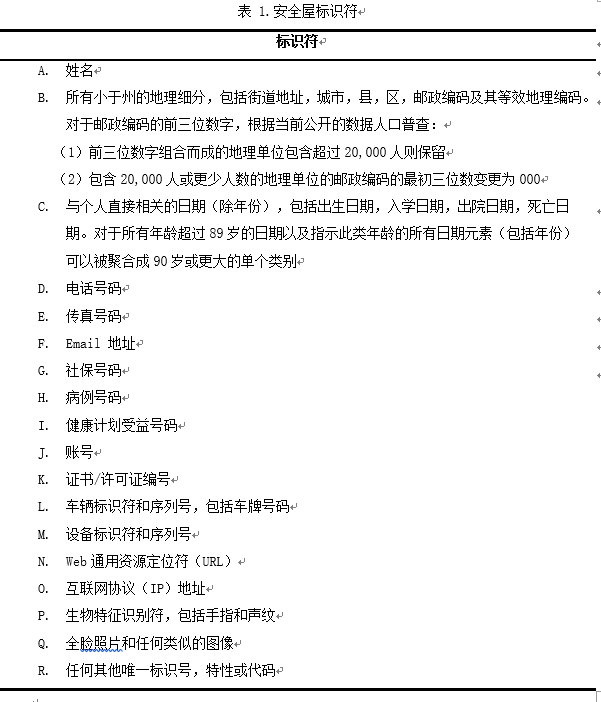

 ​	面对日益严峻的医疗隐私泄露问题，国家的法律保护是必不可少的，在本章中将对国内外的隐私法进行认识与比较。

## 1. 各国隐私法总览

​	自上世纪七十年代起，为有效应对计算机与信息技术迅猛发展带来的个人信息隐私挑战，各发达国家相继将个人信息隐私保护立法工作提上议程。立法保护某些形式的数据最初是1970年由德国黑森州（该法令称为Hessisches Datenschutzgesetz），1973年瑞典（Datalagen），其次是欧洲和其他国家 。Graham Greenleaf 的研究报告显示，截至2015年，世界上至少有109个国家的数据隐私法律生效，且其中超过半数的法案由欧洲国家颁布。*[1]*

> 总体来说，对个人医疗健康信息隐私的立法保护可分为**三种框架**。

​	第一种框架是在基础隐私保护法律框架下**将个人医疗健康信息从个人隐私信息中划归出来单独立法并制定执行标准施以保护**。
​	比如:
​	★美国的《健康保险携带和责任法案》(Health Insurance Portability and Accountability Act，HIPAA)。
​	● 澳大利亚新南威尔士州的《健康记录与信息隐私权法》(Health Records and Information Privacy Act )。		
​	● 法国的《医疗隐私法》(Medical Pricacy Act)和《医疗保险法》(Healthcare Insurance Act)。

​	第二种框架是**将个人医疗健康隐私信息纳入个人信息、敏感信息施以综合保护，这类数据隐私法规常常以人权原则为基础。**
​	比如：
​	★ 欧盟于2018年5月25日起正式施行的《一般数据保护法案》(The general data protection regulation, GDPR)。
​	★ 中国于2018年5月1日起正式实施的《国标-个人信息安全规范》。
​	● 英国的《数据保护法》(The Data Protection Act 1998)。
​	● 加拿大的《个人信息保护与电子文件法》(PIPEDA)。
​	● 韩国与日本也分别于2001年和2003年颁布了各自的《个人信息保护法》 。
​	

​	第三种框架则**不具有法律效力，但在违反规定时可能会造成严重后果，例如专业行为守则或政策准则。**	
​	比如：
​	● 1980年经济合作与发展组织发布的OECD (Organisation for Economic Co-operation andDevelopment) 隐私指南，其阐述了一些原则，但不具约束力和强制性。

## 2. 重要隐私法浏览 

​	这里将简单的提到几种我们会遇到的常见的隐私保护法律，并对其的重点进行简单的介绍。

### 2.1 美国HIPPA法案

​	HIPPA（Health Insurance Portability and Accountability Act）法案于1996年在美国颁布，由于其针对医疗数据且对于去标识化的方法、要求、流程等都进行了十分详细的规定，这是其他法律无法比拟的。这使得HIPPA法案在科学研究领域较于其他法律有着巨大优势。

> 需要遵守该法案的对象:

 1.   “覆盖实体”：医疗服务提供者、健康计划、卫生保健清理公司。

  2.  “商业伙伴”：覆盖实体及其分包商，如云服务。

    ​

> 医疗数据使用前提：

1.  研究参与者提供书面授权。

2.  隐私管理者/董事会放弃授权要求。

3. **健康保护信息已经去标识化。** 

4. **研究人员使用“有限数据集”和“数据使用协议”。**

5. 允许披露PHI的法律许可正在进行，或者在HIPAA生效之前发起（例如在知情同意书或IRB放弃知情同意书的情况下）。

6.  研究人员提供所需的文件，HIPAA过渡规定允许对后代的信息进行研究。

   ​

> 数据去标识化的三种方式

1. 安全屋（Safe Harbor）
  ​	安全屋是由美国HIPAA法提出的一种简单直观的保护健康信息的方法。**安全屋规定：以下有关个人或个人的亲戚，雇佣者，家庭成员的标识符需要移除。覆盖的实体没有足够的知识单独或结合其他信息来识别出信息的个体。**
  ​	**经过安全屋处理的数据将不再被美国隐私规则保护，可以公开使用。**

  

  ​

2. 有限数据集（limited dataset）
    ​	有限数据集是一种类似安全屋方法的处理手段。安全屋方法只保留了时间属性的年份和200万人口以上的地理名称，但精确的时间和地理往往对于科学研究十分重要。**有限数据集在安全屋的基础上对时间属性不进行处理，对地理属性要求放宽，允许城镇，州和邮政编码以外的邮政地址信息。**

    ​	**经过有限数据集处理的数据仍受美国隐私规则保护，不能公开使用。**

    ​

3. 专家裁决（Expert Determination）

    ​	专家裁决是另一种比较复杂灵活的保护健康信息的方法。专家裁决规定：具有被普遍接受的统计学和科学的原则和方法的适当知识和经验的人，提供不能被单独识别的信息；确定信息被预期接收者单独或与其他合理可用的信息结合使用，来识别出作为信息主体的个人的风险非常小；记录分析的方法和结果，证明这种裁决是正确的。

    ​	专家裁决的一般工作流程如图所示。首先，专家将评估预期接受者可以（或不能）识别健康信息的程度。第二，专家通常会向所涵盖的实体或商业伙伴提供指导，以便对健康信息应用统计学或科学的方法，以减轻预期风险。然后专家会执行被覆盖的实体或业务伙伴接受的数据管理方式。最后，专家将评估所得到的健康信息的可识别性，以确认当向预期的接受者披露时，风险不会超过非常小。这个过程可能需要多次的迭代。

    

### 2.2 欧洲GDPR法案

​	欧盟于2018年5月25日起正式施行的《一般数据保护条例》(The general data protection regulation, GDPR)，可以说引起了十分巨大的反响。它将取代1995年颁布的《关于个人资料处理及其自由流通个人保护指令》。其意义在于**现条例直接适用于欧盟各成员国**，而原指令，各成员国有权酌情决定数据保护法的实施。因而，除了严格的数据和隐私保护，条例的实施还将通过在欧盟地区统一数据和隐私法规而简化监管框架。对于跨国企业来说，这将帮助他们在与多个数据和隐私保护机构沟通时消除当地法律之间的不一致性，从而降低行政成本和负担。

> 需要遵守该法案的对象:

1.  数据控制者、数据处理者在欧盟有营业场所的，不论数据处理行为发生在欧盟还是境外。
2.  数据控制者、数据处理者未在欧盟设立营业场所，但向欧盟的数据主体提供商品或者服务，或者被追踪的网络行为发生在欧盟的。
3.  虽然数据控制者、数据处理者未在欧盟设立营业场所，但是根据国际公法应当适用欧盟成员国法律的。第二种情形是典型的域外管辖，主要针对美国的互联网企业。

> 保护对象：

GDPR保护的仅是“个人数据”（personal data），不涉及个人数据以外的其他数据。
根据GDPR第4条的规定，个人数据是指：与一个已被识别（identified）或者可被识别（identifiable）的自然人相关的任何信息；可被识别的自然人是指，其可以被直接或者间接识别，尤其是借助姓名、身份证号码、地理位置、在线标识等身份标识，或者通过与其身体、生理、基因、心理、经济或者社会身份相挂钩的一个或者多个因素。这里所指的个人数据仅限于有生命的自然人的个人数据，不包括死者、胎儿等。
同时，**个人数据的保护不涉及匿名信息，或者经过匿名化处理以致于不再具有可识别性的个人数据。**

> 特点：

1.  GDPR加大了行政处罚的力度，根据案情情况最高可罚款两千万欧元，或公司年营业额的4%。

2.  GDPR规定**匿名化必须是不可逆的！**

3.  GDPR规定欧盟的每个成员国都必须成立一个**数据监督机构(Data Protection Authorities,DPAs)**,与法院一起执行条例。

    ​

### 2.3 中国GB/T 35273-2017

​	近几年国家对个人隐私越来越重视，陆续颁布了一些法案，如《卫生系统电子认证服务管理办法（试行）》（2010年，卫生部）、《卫生系统电子认证服务体系系列规范》（2010年，卫生部）、《人口健康信息管理办法（试行）》（2013年，卫计委）、《中华人民共和国网络安全法》（2016年，全国人大），但总体而言，我国尚未构建起健全完善的个人隐私立法保护体系，有关隐私权的法律规定较少且体系内容庞杂，缺乏层次性、连贯性及统一性。 
​	于2018年5月1日起正式实施的《国标-个人信息安全规范》(GB/T 35273-2017)，虽然是非强制性国标，但让我看到了中国的个人隐私体系越来越完善，而且后续的《国标意见稿-个人信息安全影响评估指南》，《国标意见稿-个人信息去标识化指南》，《国标意见稿-数据安全安全能力成熟度模型》等无疑可以极大的完善中国的个人隐私立法保护体系！

> 保护对象：

​	个人信息(Personal information),以电子或者其他方式记录的能够单独或者与其他信息结合识别特定自然人身份或者特定自然人活动情况的各种信息。
​	**个人信息经过匿名化处理后所得的信息不属于个人信息。**
​	注：匿名化，通过对个人信息的技术处理，使得个人信息主体无法被识别，**且处理后的信息不能被复原的过程。**

> 对于学术研究数据使用要求十分宽松

> 举例个人信息和敏感信息

## 3. 各个组织、平台的保护措施 

● 临床数据仓库（Informatics for Intergrating Biology & the Bedside），简称I2b2。使用有限数据集。并在2006和2014分别进行了去标识的比赛。

● MIMIC是由麻省理工生理学学院实验室开发了一个公开可用的重症监护医疗信息数据集，包含~40000重症患者的去标识健康信息。

				 	

​	在将数据纳入MIMIC-III数据库之前，首先根据健康保险便携性和责任法案（HIPAA）的标准，使用结构化数据清理和日期转移。
​	结构化数据的识别过程需要删除HIPAA中列出的所有18个识别数据元素，包括患者姓名，电话号码，地址和日期等字段。特别地，日期以一致的方式通过每个患者的随机偏移转移到未来，以保持间隔，导致发生在2100和2200年之间的停留。日期移动期间保存时间，星期几和季节性近似值。89岁以上患者的出生日期被转移到掩盖其真实年龄并符合HIPAA规定：这些患者出现在数据库中，年龄超过300岁。
​	受保护的健康信息从自由文本字段中删除，例如诊断报告和医生笔记，使用经过严格评估的去标识系统，基于广泛的字典查找和与正则表达式的模式匹配，MIMIC-III使用了CRF。

● 癌症基因组图谱计划TCGA（The Cancer Genome Atlas Program），数据分为开放数据层和控制数据层（需要组织许可），也就是安全屋数据集和有限数据集。

● 阿里云的《阿里云数据安全白皮书》中：数据传输使用256位https协议。数据存储提供透明数据加密（TDE）的能力，做到写入加密、读出解密的安全机制。身份认证与访问控制，等。。。

● IBM沃森医疗云平台，HIPPA合规，并可按需签署更多相关的业务合作协议（Business Associate Agreement，BAA）。

● ClearData医疗云计算平台（亚马逊旗下）：ClearData保障了HIPPA合规性，并按需签署更多相关的业务合作协议（Business Associate Agreement，BAA）。

● CDC（centers for disease control and prevention）之下的公共资源都以遵循HIPPA法为基础并提出一些各自的要求：
​	HRS（health and retirement study）,1990以来美国老龄化数据的公共资源。其在HIPPA的基础上对数据产品和数据分析的安全进行了要求。如收入等数据要四舍五入，研究人员不能发布会识别任何个人，家庭，雇主或受益提供者的统计信息，等。
​	NIS（national immunization survey ho'mepage） 是儿童预防接种的调查数据，他要求使用数据者都要签署一份保密协议。

● 湘雅医学大数据安全机制

## 4. 开心的使用医疗数据

​	通过对以上几种法案的了解，想要将医疗记录用于研究目的的调查人员或机构有三种选择：
​	● 获得患者许可。
​	● 获得**机构审查委员会(IRB)**或**数据监督机构(DPAs)**或**主管监管部门**的知情同意豁免。
​	● 使用已经进行匿名化操作的数据集。

​	对于以上三种选择我们要注意以下几点：
​	▲ 在卫生研究的背景下，如果数据已去标识化那么许多机构审查委员会将放弃同意的权利。
​	▲ 虽然在可能的情况下应获得个别病人同意，但这样做并不总是可行的，尤其是对已经为不同目的收集的数据进行回顾性分析*[2]*。
​	▲ 未经同意并且没有一个可接受的去标识方法，数据管理者可能会变得越来越不愿意透露在所有的健康数据。即使同意可以得到，同意者和非同意者之间差异显著。这两个群体在人口和社会经济特征上有所不同，导致了有偏见的数据集*[3,4,5]*。

​	**所以使用一个已经进行过匿名化操作的数据集，是研究者最方便的选择！**
​	**注意：数据在匿名化之前是受到法律保护的，所以对数据进行匿名化操作是需要在法律的监管下进行的！**

## 5. 例子

**英国健康医疗大数据平台 care.data为何停摆？**

2013年初，在care.data项目计划发布后，就有一些隐私保护组织发起了“医疗数据保密倡议” （medConfidential），呼吁关注医疗数据使用过程中面临的安全威胁。但NHS并没有表达其与公众进行沟通和咨询的意图，还强调从2013年9月份开始，将正式对集中后的医疗数据进行分析挖掘。

2013年8月，家庭医生收到了NHS的通知，要求其在8周内通知他们的病人care.data项目需要收集、分析其数据。该举动立即引起了家庭医生的集体反对。原因是按英国1998年颁布的“数据保护法案”（Data Protection Act）的规定，家庭医生是病人隐私数据的控制者。如果在将其控制的病人数据用于“直接医疗”之外的目的时，必须及时通知到病人并征求同意，否则可能会承担法律责任。

NHS提出的要求让家庭医生感到非常为难。有媒体在对400位家庭医生调查后发现，41%的病人选择退出care.data项目，16%的病人还未做出决定，而且在没有充分时间和资金的情况下，家庭医生很难通知到数量众多的病人。2013年10月，在家庭医生强烈抗议下，NHS表示将投入200万英镑向公众宣传care.data项目内容。

2014年，care.data依旧麻烦不断。首先，NHS的宣传活动仅是在官网发布视频和向公众派发传单。虽然制作、分发传单的花销高达100万英镑，但后续抽样调查中却发现只有不到三分之一的人表示收到过传单，公开宣传的效果大打折扣。

其次，HSCIC承认其向保险公司出售过病人的数据，面临严厉的数据保护审查。HSCIC的数据披露审计报告显示，医疗数据已经被披露给160个组织，其中包括56家私人企业，虽然HSCIC声明数据已经被匿名化处理，但隐私专家强烈质疑其处理过程的有效性，其披露的数据完全可能被保险公司等组织重新识别为个人数据。

2014年2月，NHS表示，家庭医生可延缓6个月上传病人数据，并首次承认care.data项目面临严重的信任危机。随后，NHS宣布于2014年秋天选取4个地区开展新的试点，收集265名家庭医生掌握的200万病人的数据，事实上，直至2015年6月，第一个试点才进行开展。

# 参考文献

[1] Greenleaf G. Global data privacy laws 2015: 109 countries, with european laws now a minority[J]. 2015.

[2] Canadian Institutes of Health Research (2005) CIHR best practices for protecting privacy in health research. Ottawa: Canadian Institutes of Health Research.

[3] Harris A, Levy AR, Teschke KE (2008) Personal Privacy and Public Health: Potential impacts of privacy legislation on health research in Canada. Canadian Journal of Public Health July–August 2008: 293–296.

[4] El Emam K, Dankar FK, Issa R, Jonker E, Amyot D, et al. (2009) A globally optimal k-anonymity method for the de-identification of health data. J Am Med Inform Assoc 16: 670–682.

[5] Kho ME, Duffett M, Willison DJ, Cook DJ, Brouwers MC (2009) Written informed consent and selection bias in observational studies using medical records: systematic review. BMJ 338.

