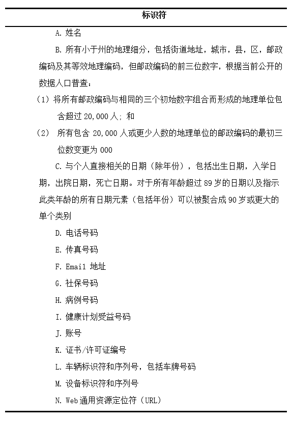

这一章将介绍几种常见的隐私保护算法，具体实现将单独成章。

## 1. 安全屋和有限数据集

​	提到医疗数据保护，最常见的无疑是HIPPA法中的安全屋方式和有限数据集方式。毕竟该法案颁布的早(1996) ，且是专门为医疗数据定制的，其对于去标识化的方法、要求、流程等都进行了十分详细的规定,实现比较容易 *[1]* 。当然也因为美国的数据共享使用环境比较好，有着各种数据仓库，与美国有关的这些仓库必须满足HIPPA法案。比如美国癌症研究组织（The Cancer Genome Atlas）*[2]*，瑞典初级保健心血管数据库等。

​	安全屋方式要求将以下属性进行去除。

​	**有限数据集**方式则是在安全屋的基础上对时间属性不进行处理，对地理属性要求放宽，允许城镇，州和邮政编码以外的邮政地址信息。

​	有研究*[3]*表明：正常无帮助情况下，安全屋的重识别率为**0.01%**而有限数据集的重识别率为**0.25%**；而在有外部帮助下，安全屋的重识别率升为10%，而有限数据集的重识别率升为60%，为此每条识别个体需要花费800$(有限数据集)和17000\$(安全屋)。所以**对于处理完的数据，安全屋方式允许数据公开使用，而有限数据集则只能给签了“数据使用协议”的研究人员使用。**因此有限数据集并不被广泛使用。

​	安全屋本质上就是将一切有可能标识个体的信息全部移除，但在方便的同时也带来了缺陷。其中最为主要的就是**信息的失真**，比如流行病学家需要详细的地理信息，但是安全屋方法只允许透露三位数的邮政编码，这可能会限制模型开发和评估的准确性*[4]*;同样的老年病研究领域需要准确的老年患者年龄信息，但安全屋方法规定大于89岁的年龄统一聚合为90岁或一个更大的单一年龄，这同样会带来很大的问题*[5]*。另外，**安全屋还会受到链式攻击，从而泄露信息。** 

## 2. k-匿名及其衍生算法

​	K-匿名系列算法可以说是最常用，最著名的匿名算法之一了。在实际操作中K-匿名法常会采用泛化，抑制，置换和交换等基础方法*[6]*。另外根据各种攻击情景，在原始的k-匿名法基础上，产生了许多许多衍生算法。另外这部分内容参考了论文*[20]*的总结。

### k-anonymity*[7]*

​	1998年，P.Samarati 和L.Seweney 在PODS国际会议上提出了K-匿名技术。2002年，L.Seweney进一步提出K-匿名隐私保护模型。2004年Meyerson和Williams指出K-匿名问题是NP(Nondeterministic Polynomial)完全问题,因此大部分k-匿名算法都是进行局部最优或采用启发式方法。

​	**定义：**假设$T(A_1,A_2,…,A_n)$是一个表，QI是与T相关联的准标识符，当且仅当在T[QI]中出现的每一个有序的值至少在T[QI]中出现k次，则T满足K-匿名。
​	K-匿名实质就是要求在一个集合（数据集）中只能以不大于1/k（k是一个常数）的概率确定任何一个元素（记录），即要求任何一个元素（记录），在集合中至少存在k-1个相同副本元素。

​	**优点：**

​		K-匿名模型可以很好的**抵挡链式攻击**，且对**数据的破坏也小于安全屋方法**。

​	**缺点：**

​		K-匿名模型**无法抵挡同质攻击和背景知识攻击*[8]*。**因为从本质上讲K-匿名模型只对准标识符进行了处理，未对敏感信息进行处理，攻击者可以从敏感信息入手进行攻击。

### 敏感属性的K-匿名衍生模型

​	上面讲到的原始K-匿名法，由于未对敏感属性进行处理，因此无法抵挡同质性攻击和背景知识攻击。因此出现了大量的K-匿名衍射算法用来**处理敏感信息**。接下来本节将介绍这些对于敏感信息的K-匿名衍生算法。

####★  *l-diversity [9,10]*

​	为了解决k-匿名模型不能抵制同质性攻击和背景知识攻击的问题，Machanavajjhala提出*l-diversity*多样性模型，其主要思想是**要求每个等价类中敏感属性值都必须包含L个不同的元素**，考虑了对敏感属性的约束。

​	**定义**：已知数据表T,如果T中的每个等价类都满足至少包含L个不同的敏感属性，则称数据表T满足l-diversity多样性。

​	**具体实例：** 

​		▲ 基于概率 ($Probabilistic l-diversity$): 在一个等价类中出现频率最高的值的概率不大于1/l。

​		▲ 基于墒 ($Entropy l-diversity$): 在一个等价类中敏感数据分布的熵至少是 log(l)。

​		▲ 递归 ($Recursive (c,l)-Diversity$): 简单来说就是保证最经常出现的值的出现频率不要太高。

​	**优点：**

​		能够**抵挡同质性攻击和背景知识攻击。**

​	**缺点：**

​		 ▲ **很难或是没有必要实现：** 比如对于一个HIV数据集，99%为阴性，1%为阳性。如果对其进行2-	diversity，会发现很难实现，因为阳性实在太少了。就算强行实现了，结果阳性的概率大大提升，反而增加了泄露风险。

​		▲ 仍会受到**倾斜攻击和相似性攻击**。 
​		**倾斜攻击(Skewness Attack)**指的是当原数据属性存在整体分布上的倾斜时，l-diversity无法防止属性泄露。比如对于HIV，阴性属性类型并不在意是否泄露，而阳性属性类型十分害怕泄露。经过处理原来1%的阳性率反而提高了，这是十分不利的。
​		**相似性攻击(Similarity Attack)**指的是经过处理后，虽然一个等价类中有了至少L个属性，但是这L个属性可能都相似，比如下图中第一个等价类中，收入都很低，这就有可能泄露患者收入较低的隐私。

​		无法抵挡这些攻击的原因在于**l-diversity并没有考虑敏感属性的整体分布。**

#### ★ *t-closeness [11]*

​	Li Ninghui 等指出**l-多样性模型不能抵制近似攻击和倾斜攻击**，t-closeness要求等价组内敏感属性值的分布与其整体分布的差异不超过t。

​	**定义：** 已知数据表T,如果T中的每个等价类都满足其敏感属性的分布与整体分布的差异不超过t，则称数据表T满足$t-closeness$ 。

​	上图中每一等价类的收入属性都有着较广的分布，这样就**可以避免相似性攻击**。而且对于99%/1%这样的分布，t-closeness会继续保持这个分布，即使一个等价类中没有阳性也没有什么问题，这样也就**避免了倾斜攻击**。

#### ● *p-sensitive k-anonymity [12]*       

​	*p-sensitive k-anonymity*模型类似于*l-diversity*模型由Truta T M, BinduV等人提出。该模型要求在等价类中至少有*p*个不同的敏感值。

#### ● *(α,k)-anonymity [13]* 

​	(a ,*k*)-anonymity 模型中，任意一个敏感属性值在同一个等价组中出现频率不大于α，α为用户指定的实型参数。论文作者还将该匿名模型扩展到多个敏感信息的情况*[14]*。但(α ,k)-anonymity 模型也存在缺陷:α是对整个数据表的全局性约束，不能满足个性化隐私，只能处理敏感属性分布较均匀的数据，影响模型的适用范围*[15]*。无法对匿名组进行局部优化处理，造成了更多的信息损失，影响了发布数据的质量。当敏感属性分布偏斜时，会产生很高的数据扭曲度，即数据质量很低。

#### ● *(k,e)-anonymity [16]*

​	(k,e)-anonymity 模型中，数值型属性值在等价组内的范围至少为阈值e，也就是要求等价类中敏感属性值的最大值与最小值的差至少是e。但由于它忽略了敏感属性值在每个等价类的子区间上的分布。当某些敏感属性值在子区间上频繁出现时，攻击人员便能够以很高的概率推断该等价类中某些元组的敏感值，从而导致隐私的泄露。

#### *● (ε,m)-anonymity [17]*

​	(ε,m)-anonymity 模型正式提出近似攻击的概念，第一次提出了数值属性的邻近隐私保护问题，即各个等价类$QI_{group}$中的每个敏感值si，最多有1/m个元组的敏感属性取值与si 相似，其中与si相似的敏感值是指[si-ε,si+ε]区间上的所有值，ε 是由用户指定的参数。

#### ● *(k,l)-匿名模型 [18]*

​	Li zude 等提出(k,l)-匿名模型，其中k 和l 都是在每个记录上设置的，并且可以由相应的个体来定义，即每个记录指定一对属于自己的k 和l 值，k 表示一个等价类的匿名程度，l 表示一个记录上一个敏感属性等价类的多样性程度。k和 l 都是整数，$0\le l \le k$。该模型能防范当知道准标识属性的取值域时推理出显示标识属性值的身份泄露和推导出数据中某个个体的敏感属性值的属性泄露。但该模型参数设置需要对每一个记录设置一对参数，当数据量上大时是无法实现的。

#### ● *(alp,dif)-个性匿名模型 [19]*

​	(alp,dif)-个性匿名模型在满足k-匿名的同时，敏感属性值平均泄露概率$\le alp$，等价组中敏感属性值的泄露概率与其的差值$\le dif$，根据保护程度，可设置不同的 alp、dif，从而实现个性化匿名。其中，alp 从整体上体现发布数据的保护程度，dif 表示等价组中敏感属性值泄露概率与alp的相近程度。

### 集值属性的K-匿名衍生模型

​	上面的算法已经对**显示标识符、准标识符和敏感属性**进行了处理，那么问题来了我们要不要试着对**非敏感属性**也进行处理？
​	集值（set-value）属性的K-匿名衍生模型**目的在于对一些看似无害的集值属性进行处理** ，其中最具代表的集值数据如诊断代码，因为在实际中某些攻击可以通过集值属性的组合来获得患者身份或信息。如最著名的例子就是对购物清单的攻击，攻击者通过一些方法知道被攻击者在一次购物中购买了牛奶、啤酒和尿不湿，将这个组合与公布的购买信息比对能够确定被攻击者的其他购买信息，从这些购买信息中（如药物）可以推断出一些更为隐私的信息。**因此对非敏感属性进行处理是合理的。**但真不是很有必要~

#### ● *$K^m$-匿名模型  [21]*

​	$K^m$-匿名模型中定义了两个变量k和m。m指的是对m类属性进行组合，k指的是每种组合结果至少有k组相同。

#### ● *p-uncertainty模型 [22]*

​	p-uncertainty模型,其将个人与任何（单个）诊断代码关联的可能性限制到小于P。该模型假定病人记录中的每个诊断代码都是敏感的，并且记录中的所有剩余代码都可以用于推断。

#### ● *(h,k,p)-coherence模型 [23]*

​	(h,k,p)-coherence模型，该模型定义了三个变量h,k,p。p指的是对p类属性进行组合，k指的是每种组合结果至少有k组相同。h指的是每种组合中敏感属性少于h%。

## 3. 非结构化文本算法

​	大量的医学数据存在于非结构化文本中，如临床笔记，放射学和病理学报告以及出院总结等。因此对非结构化文本的处理十分重要。美国临床数据仓库（Informatics for Intergrating Biology & the Bedside）简称I2b2，在2006和2014年举行了两次医疗数据脱敏比赛，在比赛中参赛者要求对非结构化数据也进行脱敏操作，这大大推动非结构化数据脱敏技术的发展。

​	比赛中的非结构化文本匿名化操作一般只处理有限的几种隐私信息，而不是HIPPA中的18种，其中包括：
​		人名：患者，家属，患者代理人和医护人员的姓名。
​		年龄> 89岁以上89岁以上
​		地理位置：地址，街道名称，邮政编码和城市等位置。
​		医院和保健机构：医疗机构，实验室和养老院。
​		日期：所有小于一年的日期元素。
​		联系方式：电话号码，寻呼机号码，传真号码和电子邮件地址。
​		身份证号码：社会保险号码，病历号码，驾驶执照号码等标识符。
​	且大多数系统仅使用一种或两种特定文件类型，如病理报告和出院总结*[24]*。

对非结构化数据的处理主要基于两种不同的方法：**模式匹配和机器学习。**
且就目前的使用情况和处理结果来看，机器学习已经成为了主导。**机器学习为主，模式匹配为辅已经是一种最实用的匿名化方式。**

### 模式匹配

​	多用规则和字典匹配完成，用正则表达式实现。规则和字典通常是手工制作的，经验丰富的领域专家以数月的工作为代价，但具有有限的可推广性。

​	**优点**：它们需要很少或没有注释的训练数据，并且可以容易且快速地修改，以通过添加规则，字典术语或正则表达式来提高性能。  

​	**缺点**：需要许多复杂的规则，以便解决不同类别的PHI以及特定数据集的特殊定制。因此，模式匹配可能不能推广到不同的数据集（即来自不同机构的数据或不同类型的医疗报告）。 模式匹配去识别方法的另一个缺点是开发人员需要了解可能发生的所有可能的PHI模式，例如使用时间时意外格式（例如12.20.2001）或使用非标准的地理位置缩写（例如，加州缩写为“Cal”）。

​	**例子：**

●  Gupta的De-ID系统*[25]*，**拥有商业和学术许可证。**并获得美国国家癌症研究所（NCI）授权为一些银行和病理工作区应用程序中NCI的癌症生物医学信息去标识。这个系统对文本进行了以下几个操作：

1.  分析患者人口统计信息的报告标题，例如患者姓名，然后将其作为字符串搜索匹配文本正文。

2. 使用模式匹配算法（大概是正则表达式，虽然没有说明）来检测PHI，如电话号码和邮政编码。

3. 使用美国人口普查中的人名列表，并在报告文本中查找与此列表中任何成员的直接匹配。

4. 允许创建包含特定机构特有的本地标识符的用户定义字典。

5. 使用 UMLS词表来帮助识别文档中应保留的有效医疗术语。

6. 将PHI替换为指定删除的PHI类别的特定标签，并且在报告中重复发现的PHI一致地替换为相同的标签，有助于提高未识别报告的可读性。

7. 日期被替换为允许保留两个日期之间的时间间隔的日期标记。

   

●  Neamatullah描述了基于Perl的去标识软件包*[26]*。基于词法查找表，正则表达式和简单规则来识别医疗文本文档中的PHI。它使用了4种字典：

1. 从MIMIC II数据库（美国重症监护室（ICU）心血管信号数据和临床数据的数据库）获得的患者和医院工作人员姓名；

2. 用UMLS词表和spell-checking 词典中的单词来获得PHI名称；

3. 可能作为PHI指示符（“先生”，“博士”，“医院”，“街”等）的关键词和短语字典;

4. 用UMLS词表和spell-checking 词典中的单词来获得非PHI名称。

使用正则表达式来标识数字PHI模式（例如，电话号码）。使用表查找，上下文检测算法和正则表达式的组合来识别非数字PHI（例如，患者姓名）。最后，由上述两个过程识别的所有PHI被替换为标签以指示相应的PHI类别。

● Sweeney的Scrub系统*[27]*。它使用多个PHI检测算法并行竞争，在文本报告中对PHI进行分类和标记。Scrub系统试图用伪PHI来始终代替PHI。例如，如果检测到的PHI是日期，则使用各种算法，基于与原始日期的某个偏移来插入替换日期。如果检测到的PHI是一个名字，系统将使用散列表查找来替换原始名称，并从表中添加一个名称。洗刷系统还采用策略来防止反向洗涤，例如将特定时间段内的所有日期分组到同一日期。

### 机器学习

​	机器学习用于文本匿名化的方法有很多种，支持向量机、条件随机场、决策树、最大熵、神经网络等都有被选择使用。从最近的研究结果来看，CRF、神经网络都能获得很不错的结果，但相比于ANN，CRF的预处理特征提取实在很麻烦，所以使用ANN模型或者ANN+CRF模型能够简单且高准确率的完成匿名化。

​	**优点**：通用性更好。对于新数据集，通常只需要一些额外的注释训练。可以自动学习识别复杂的PHI模式，系统开发人员只需要很少的PHI模式知识。此外，基于机器学习方法的去识别系统往往不会增加复杂性，并且它们的处理速度不会随着时间的推移而减慢。

​	**缺点**：在监督学习的情况下，需要大量注释训练数据。 另一个缺点是有时很难准确地知道应用程序提交错误的原因。 例如，如果应用程序未检测到PHI位置，则添加更多训练数据不一定能纠正错误。

​	**例子**： 

● 来自Nottingham的Yang 和Garibaldi。使用CRF+规则匹配， 他们使用预处理得到特征训练CRF，然后使用字典和正则表达式来识别具有少量样本实例的PHI。最终结果P=0.9645，R=0.9092，F=0.9360。

● 来自哈尔滨工业大学深圳研究生院的Liu等人。使用三个途径来获得PHI：1.基于token级别的CRF。2.基于character级别的CRF。3.基于正则表达式。最终结果P=0.9264，R=0.8988，F=0.9124。

● Franck Dernoncourt,Ji Young Lee,Peter Szolovits等人用比赛用数据进行了研究*[28]*。得到以下结果：

 	

​	Nottingham是2014年i2b2比赛第一名。MIST是唯一免费提供的现成的去识别程序(称为MITER识别洗涤器工具包)。可以看出CRF与ANN的处理结果平分秋色(但是单纯的CRF麻烦啊~)。

## 4. 差分隐私(differential privacy)*[29]*

​	**概念：differential privacy**是密码学中的一种手段，旨在提供一种当从**统计数据库**查询时，最大化数据查询的准确性，同时最大限度减少识别其记录的机会。

​	**动机：**设想一个受信任的机构持有涉及众多人的敏感个人信息（例如医疗记录、观看记录或电子邮件统计）的数据集，并想提供一个全局性的统计数据。这样的系统被称为统计数据库。但是，统计数据往往是会不断更新的这就会造成相同的数据重复发布，如果不进行适当的处理，**当前后两次发布的数据集相差较少时，可能会被推断出一些涉及个人的信息**。差别隐私就是为防护这类统计数据库信息泄露而形成的一个隐私框架。

​	**定义：** $Pr[A(D)\in O]\le e^\epsilon Pr[A(D')\in O],其中||D|-|D'||=1$
​	A是一个随机的算法,O是任意的可能输出,D和D‘只相差一个元组,ε是公开且由数据拥有者指定，越小保护越强。

​	**目标：**  攻击者知道数据集D中除一个元组外的其他所有信息，但输出结果不会给予攻击者太多关于这个元祖的信息。即确保无论数据是否存在一个独立的元祖，输出分布几乎相同。

​	**例子：** 投票结果实时公布。如果每投一个人统计公布一次，那么只要知道一个人是什么时候投的就能知道他的投票情况。差分隐私则会在每次公布时对结果添加一个噪声，比如目前\<70正,29负>可以发布为\<69.5正,30负>然后下一次统计\<70正,31负>则发布为\<71.5正,31.5负>,这样一来就无法直接看出该人投了什么票。

​	**实现机制：**	

​	● Laplace 机制
​	● Geometric 机制（几何）
​	● Exponential机制（指数）
​	● Staircase 机制（梯度）

​	差分隐私一般通过对数据添加噪声使得两个数据集的输出相似，从而无法推断出增加量。
​	以上都是用来增加噪声的机制。其中Laplace 机制是最为常用的机制。

​	**限制：**

​	● ε值是人为指定的。 不能保证一个ε值是否足够小，足够保护数据。

​	● 对于数值数据可能会出现高灵敏度，使得噪声无效。对于无边界的数据，难以计算其灵敏度。

​	**使用：**

​	● 美国人口普查局，发布人口的通勤模式。
​	● Google的RAPPOR，用于遥测，例如了解统计劫持用户设置的恶意软件。
​	● 2016年6月13日，苹果公司宣布其在iOS10中使用差异隐私，以改进其虚拟助理和建议技术。

# 参考文献

[1] Hiatt R. HIPAA: The end of epidemiology, or a new social contract? Epidemiology 2003;14(6):637–9.12.ErlenJ. HIPAA—Implications for research. Orthop Nurs 2005;24(2):139–42.

[2] Nosowsky R, Giordano T. The health insurance portability and accountability Act of 1996 (HIPAA) privacy rule: Implications for clinical research. Am Med Rev 2006;57:575–90.

[3] Benitez K, Malin B (2010) Evaluating re-identification risks with respect to the HIPAA privacy rule. J Am Med Inform Assoc 17: 169–177.

[4] M.Boulos, A.Curtis, and P.AbdelMalik. Musings on privacy issuesin health research involving disaggregate geographic data about individuals.International Journal of Health Geographics, 8:46, 2009.

[5] BenitezK, Loukides G, Malin B. Beyond safe harbor: Automatic discovery of healthinformation de-identification policy alternatives[C\] ACM International HealthInformatics Symposium, IHI 2010, Arlington, VA, USA, November 11 - 12, 2010,Proceedings. 2010:163-172.

[6] GardnerJ, Xiong L. HIDE: An Integrated System for Health InformationDE-identification. Proceedings of the IEEE Symposium on Computer-BasedMedical Systems, 2008:254-259.

[7] Samarati P,Sweeney L.Generalizing data to provide anonymity whendisclosing information (abstract)[A].Proceedings of the 17th ACM-SIGMOD-SIGACT-SIGART Symposium on the Principles of Database Systems[C].Seattle,W A,USA:IEEEpress,1998.188.

[8] A. Machanavajjhala, J. Gehrke, D. Kifer, and M. Venkitasubramaniam. ℓ-diversity: Privacy beyond k-anonymity. In Proc. 22nd Intnl. Conf. Data Engg. (ICDE), page 24, 2006.

[9] Machanavajjhala A, Gehrke J, Kifer D, et al. \ell-Diversity: Privacy Beyond\kappa-Anonymity[C]//null. IEEE, 2006: 24.

[10] Machanavajjhala A, Gehrke J, Kifer D. ℓ-density: Privacy beyond k-anonymity[C]//Proc. of the International Conference on Data Engineering (ICDE’06), Atlanta, Georgia. 2006.

[11] Li N, Li T, Venkatasubramanian S. t-closeness: Privacy beyond k-anonymity and l-diversity[C]//Data Engineering, 2007. ICDE 2007. IEEE 23rd International Conference on. IEEE, 2007: 106-115.

[12] TrutaT M ,Vinay B.Privacy protection:P-sensitive k-anonymity property[A].Proceedingsof the 22nd International Conference on Data Engineering Workshops (ICDEW )[C].Washington,DC, USA :IEEE Computer Society,2006.94.

[13] Wong R C W, Li J, Fu A W C, et al. (α, k)-anonymity: an enhanced k-anonymity model for privacy preserving data publishing[C]//Proceedings of the 12th ACM SIGKDD international conference on Knowledge discovery and data mining. ACM, 2006: 754-759.

[14] Wong R, Li J, Fu A, et al. (α, k)-anonymous data publishing[J]. Journal of intelligent information systems, 2009, 33(2): 209-234.

[15] Li Z, Zhan G, Ye X. Towards an anti-inference (k, ℓ)-anonymity model with value association rules[C]//International Conference on Database and Expert Systems Applications. Springer, Berlin, Heidelberg, 2006: 883-893.

[16] Zhang Q, Koudas N, Srivastava D, et al. Aggregate query answering on anonymized tables[C]//Data Engineering, 2007. ICDE 2007. IEEE 23rd International Conference on. IEEE, 2007: 116-125.

[17] Li J, Tao Y, Xiao X. Preservation of proximity privacy in publishing numerical sensitive data[C] // Proceedings of the 2008 ACM SIGMOD international conference on Management of data. ACM, 2008: 473-486.

[18] Li Zude, Zhan G, Ye X. Towards an anti-inference (k,l)-anonymity model with value association rules. DEXA. Krakow, Poland:SPringer-Verlag, Berlin, Heidelberg,2006:883-893P

[19] 王茜, 屈盛知, 石香灵. 基于敏感属性值泄露个数期望的匿名模型[J]. 计算机应用研究, 2009, 3: 097.

[20] 任向民. 基于 K-匿名的隐私保护方法研究 [D]. 哈尔滨: 哈尔滨工业大学, 2012.

[21] Terrovitis M, Mamoulis N, Kalnis P. Privacy-preserving anonymization of set-valued data[J]. Proceedings of the VLDB Endowment, 2008, 1(1): 115-125.

[22] Cao J, Karras P, Raïssi C, et al. ρ-uncertainty: inference-proof transaction anonymization[J]. Proceedings of the VLDB Endowment, 2010, 3(1-2): 1033-1044.

[23] Xu Y, Wang K, Fu A W C, et al. Anonymizing transaction databases for publication[C]//Proceedings of the 14th ACM SIGKDD international conference on Knowledge discovery and data mining. ACM, 2008: 767-775.

[24] Meystre S M, Friedlin F J, South B R, et al. Automatic de-identification of textual documents in the electronic health record: a review of recent research[J]. BMC medical research methodology, 2010, 10(1): 70.

[25] Gupta D, Saul M, Gilbertson J. Evaluation of a deidentification (De-Id) software engine to share pathology reports and clinical documents for research[J]. American journal of clinical pathology, 2004, 121(2): 176-186.

[26] Neamatullah I, Douglass M M, Li-wei H L, et al. Automated de-identification of free-text medical records[J]. BMC medical informatics and decision making, 2008, 8(1): 32.

[27] Sweeney L. Replacing personally-identifying information in medical records, the Scrub system[C]//Proceedings of the AMIA annual fall symposium. American Medical Informatics Association, 1996: 333.

[28] Dernoncourt F, Lee J Y, Uzuner O, et al. De-identification of patient notes with recurrent neural networks[J]. Journal of the American Medical Informatics Association, 2017, 24(3): 596-606.

[29] Dwork, C.: Differential privacy. In: Automata, Languages and Programming, Pt 2, vol. 4052.
Springer, Berlin (2006)

