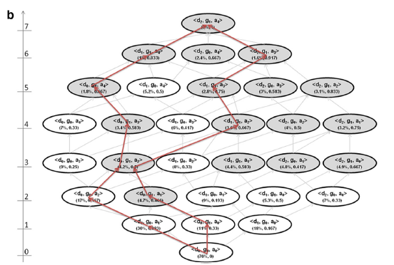
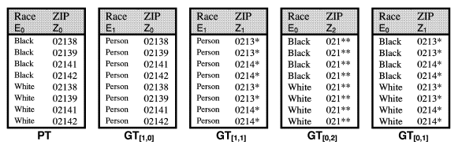
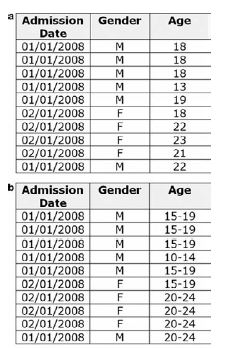

​	隐私保护技术的评估主要考虑三个方面：**隐私保护程度**，**信息损失度**，**算法的性能**。
​	其中隐私保护程度往往和信息损失度呈负相关且隐私保护程度往往是强制要求的是一个算法优先考虑的，算法的性能又比较直观。所以**实际中更多的是在保证隐私保护程度的情况下对信息损失度进行评估。**

## 隐私保护程度

​	● **安全屋模式&有限数据集模式**

​	最简单也是用的最多的保护方法要算HIPPA法案的**安全屋模式**和**有限数据集模式**了。对此HHS委托确定使用HIPAA后的重新识别风险，研究*[1]*表明：正常无帮助情况下，安全屋的重识别率为**0.01%**而有限数据集的重识别率为**0.25%**；而在有外部帮助下，安全屋的重识别率升为10%，而有限数据集的重识别率升为60%，为此每条识别个体需要花费800$(有限数据集)和17000\$(安全屋)！
​	当然这是2010年在美国研究的结果，与现在中国的情况肯定会有差距，但是也能看出**经过安全屋模式处理的数据确实能够很好的保护数据,而有限数据集模式的数据则仍有较大的风险！**

​	● **聚类型算法 **

​	虽然安全屋模式十分安全，但是他对信息的损失有点大了~所以我们就会想着在保证安全性的情况下，减少信息的损失。于是产生了各种匿名算法，其中用的最多的要算聚类型算法了，其代表就是**K-匿名算法**。 简单来说就是将相似的样本聚为一类，且每类样本数不小于K，类内样本的指定属性完全相同无法区别(具体的算法之后会讲到)。**一般实践中，研究*[2~8]*认为K值最小应该取5。**于是算法往往就是在指定K值的情况下，寻找一个信息损失最小的聚类情况。

​	● **敏感信息保护**

​	上面提到保护程度都是面对**身份披露**的，即能准确推断出个体。但我们也知道隐私攻击还能是**属性披露**，即虽无法准确推断出个体，但能够推断出一些共性的敏感属性。现在很多研究都是研究如何保护敏感信息的，因为敏感信息往往难以确定，且研究经常需要用到敏感信息。所以对于敏感信息的处理往往需要保留一定的统计信息。最为著名的敏感信息保护算法应该要算**l-diversity** *[9]* 和**T-closeness** *[10]* 算法了(具体算法之后会介绍)。

## 信息损失度

信息损失度可以分为以下几类： 

 	● 基于构成匿名组的大小的度量

​		Discernibility Metric (DM) *[12~20]*

​		Normalized Average Equivalence Class Size *[27]*

​	● 基于一般值的特征的度量

​		Generalization Cost (GC) *[28]*

​		Normalized Certainty Penalty (NCP) *[29]*

​		Loss Metric (LM)  *[30]*

​	● 信息支持处理预先规定任务的好坏的度量。

​		Classification Metric (CM) *[26]*

​		Average Relative Error (ARE) *[31]*

 	● 信息是否支持一些特殊的数据分析要求。

   	 	Samarati/Xu/Loukides/等人分别提出了一些度量方法。

接下来对其中几种评估方式进行简单介绍。

### 直接按照网格高度评估

​	在数据泛化过程中，可以形成一个如下的泛化栅格。**Samarati 提出具有最低高度的节点应该被选择为最优解。**该解决方案平衡了泛化的程度与抑制的程度。**但网格高度不被认为是良好的信息丢失度量**，因为它不考虑准标识符的泛化层级深度。例如，如果我们将“男性”概括为“人”，并赋予其等于以五年为间隔年龄的权重。在这种情况下，在性别变量中没有留下信息，而五岁年龄段仍然传达相当多的信息，并且在年龄层次中还有其他可能的泛化。

​	图中栅格对< d,g,a >三个属性进行了泛化，属性角标越大表示泛化程度越大。其中灰色的节点表示隐私保护满足要求，即我们需要从灰色节点集中选出一个信息损失最小的。(详细讲解见K-匿名法篇)

### precision metric，Prec

​	Precision或Prec**考虑了泛化层次的结构高度**。Prec由Sweeney *[11]*引入作为适用于分层数据的信息丢失度量。对于每个变量，可能的泛化步骤总数（泛化层次的总高度）与实际泛化步骤数量的比率给出该特定变量的信息损失量。总体Prec信息损失是数据集中所有准标识符的Prec值的平均值。因此，变量越泛化，信息损失越高。此外，具有更多泛化步骤（即，泛化层级有更多级别）的变量比总泛化步骤少的变量信息更不易损失。

$Prec(RT)=1-\frac{\sum_{i=1}^{N_A}\sum_{j=1}^{N}\frac{h}{|DGH_{Aj}|}}{|PT|*|N_A	|} where f_1(...f_k(t_{Pj}[A_i])...)=t_{Rj}[A_i]$

其中$PT$是原表，$RT$是泛化后的表，$DGH_A$是属性A的最大可能泛化高度。
$当PT=RT时，h=0，Prec(RT)=1$。
$当RT达到最大泛化程度时，h=|DGH_A|，Prec(RT)=0$。

例：Race共3种泛化层次，Zip共4种泛化层次。则$Prec(GT_{[1,0]}) = 0.75;Prec(GT_{[1,1]}) = 0.58; Prec(GT_{[0,2]}) = 0.67; Prec(GT_{[0,1]}) = 0.83.$
其中$GT_{[1,0]}和GT_{[0,1]}$ 的总泛化程度相同，但因为Zip的泛化层次较多，所以[0,1]的信息损失较小。

**但是Prec未考虑等价类的大小，不考虑数据本身的结构，因此也不是很准确。** 

### Discernability Metric，DM*[12~20]*

​	**可辨识性度量为每个记录分配一个惩罚，这个惩罚和与它无法区分的记录数成比例。**按照相同的推理，DM为每个被抑制的记录赋予一个等于整个数据集的惩罚（因为被抑制的记录与所有其他记录是不可区分的）。

$DM=\sum_{f_i\ge k}(f_i)^2+\sum_{f_i\le k}(n*f_i)$
其中，$f_i$是等价类i的大小。i=1……Z，Z是等价类的数量。n是记录的总数。

**但DM有一个很大的问题：非单调。** 这会给策略选择带来很大的影响。如上图所示，图b是图a的直接泛化。我们假设我们想要达到3-匿名。对于图a有7个记录不符合，因此DM值为79，而对于图b，DM值为55。图b的信息损失反而小于图a，这是违反直觉的！

###  DM*

​	**为了解决DM的非单调性问题，DM放弃了对抑制记录的惩罚 *[21]*。** 

​	$DM* = \sum_{i=1}^zf_i^2$

### 非均匀熵(non-uniform entropy)*[22~25]*

​	**DM和DM*都有一个问题：未考虑原数据的分布情况。**例如，假设我们有一个单一的准标识符'性别'和两个不同的数据集，有1,000条记录。第一个有50个男性记录和950个女性，第二个有500个男性和500个女性。如果性别都泛化为“人”那么直观上第一个数据集中的950位女性的信息损失应该是相当低的，因为女性记录为主要数据集。但DM和DM*的值并不能区分这两个数据集。

**非均匀熵就是用来解决这类数据分布不均匀的情况。**

​	$Pr(a_r|b_{r'})=\frac{\sum_{i=1}^nI(R_{i,j}=a_r)}{\sum_{i=1}^nI(R_{i,j}'=b_r)}$

​	$-\sum_{i=1}^n\sum_{j=1}^Jlog_2(Pr(R_{i,j}|R_{i,j}'))$

$R_{ij}和R'_{ij}$分别用来表示泛化前和泛化后的单元格数据。I(.)是集合论中的指示函数，相同则为1不同为0。

公式一：计算单元格熵
单元格数据未泛化前该列中相同数据项个数 (除以) 该单元格数据泛化后该列中相同数据项个数。
公式二：遍历所有的单元格进行熵累加

​	回到刚才的例子中，50/950的男性/女性分布式数据集的熵为286，而500/500的男性/女性分布式数据集的熵为1,000。 因此，前一个数据集中的信息损失要低得多，这就更加直观了。

### classification metric，CM*[26]*

​	CM由Iyengar提出。**其在DM的基础上，考虑了原数据的分布。** CM更多的用于标签型泛化。

​	$CM=\sum_{f_i\ge k}(|minority(f_i)|)+\sum_{f_i\le k}(f_i)$

​	minority函数返回一个等价类中的少数类。即CM认为一个等价类中的多数类没有造成信息损失，其他记录则都分配一个为1的信息损失惩罚。如50/950的男性/女性分布式数据集，泛化为“人”，CM认为原女性并未信息损失，所以CM=50。而500/500的数据集，CM=500。

​	**但CM也有一个问题：非单调。**

###  $C_{AVG}$*[27]*

​	normalized average equivalence class size metric($C_{AVG}$)和DM*相似，用于简单的表示信息损失度。

​	$C_{AVG}=(\frac{total\_records}{total\_equiv\_classes})/(k)$

## 小结

​	综上所述，匿名化算法就是在**保证安全性的情况下寻找一个信息损失最小的策略。**
​	实际上，**安全性交由K值来保证，即每条记录的相同记录必须大于等于K。**
​	信息损失的度量公式的选取并不是十分重要，**重要的是公式的单调性。**这个单调性使得节点在网格中移动时，向上泛化一定会使信息损失变大，这样能够给策略选择带来极大的简化。毕竟这个问题是NP难问题，无法通过穷举获得全局最优解，需要启发式的寻找最有点。

# 参考文献

[1] Benitez K, Malin B (2010) Evaluating re-identification risks with respect to the HIPAA privacy rule. J Am Med Inform Assoc 17: 169–177.

[2] Cancer Care Ontario data use and disclosure policy. Toronto (ON): Cancer Care Ontario; 2005.

[3] Security and confidentiality policies and procedures. Saskatoon (SK): Health Quality Council; 2004.

[4] Privacy code. Saskatoon (SK): Health Quality Council; 2004.

[5] Privacy code. Winnipeg (MB): Manitoba Centre for Health Policy; 2002.

[6] Federal Committee on Statistical Methodology, Subcommittee on Disclosure Limitation Methodology. Report on statistical disclosure control. Working Paper 22. Washington (DC): Office of Management and Budget; 1994.

[7] Therapeutic abortion survey. Ottawa (ON): Statistics Canada; 2007 [cited 2009 Jun 26]. Available from: http://www.statcan.gc.ca/cgibin/imdb/p2SV.pl?Function=getSurvey&SDDS=3209&lang=en&db=imdb&adm=8&dis=2

[8] El Emam K. Heuristics for de-identifying health data. IEEE Secur Priv 2008 Jul-Aug;:72-75.

[9] A. Machanavajjhala, J. Gehrke, D. Kifer, and M. Venkitasubramaniam.l-diversity: Privacy beyond k-anonymity. In Proc. 22nd Intnl. Conf. Data Engg. (ICDE), page 24, 2006.

[10] Li N, Li T, Venkatasubramanian S. t-closeness: Privacy beyond k-anonymity and l-diversity[C]//Data Engineering, 2007. ICDE 2007. IEEE 23rd International Conference on. IEEE, 2007: 106-115.

[11] Sweeney L. Achieving k-anonymity privacy protection using generalization and suppression[J]. International Journal of Uncertainty, Fuzziness and Knowledge-Based Systems, 2002, 10(05): 571-588.

[12] Bayardo R, Agrawal R. Data privacy through optimal k-anonymization.Proceedings of the 21st International Conference on Data Engineering, 2005.

[13] El Emam K, Dankar F. Protecting privacy using k-anonymity.J Am Med Inform Assoc 2008;15:627–37.

[14] LeFevre K, DeWitt D, Ramakrishnan R. Mondrian multidimensional k-anonymity. Proceedings of the 22nd International Conference on Data Engineering, 2006.

[15] Hore B, Jammalamadaka R, Mehrotra S. Flexible anonymization for privacy preserving data publishing: A systematic search based approach. Proceedings of the SIAM International Conference on Data Mining, 2007.

[16] Xu J, Wang W, Pei J, et al. Utility-based anonymization for privacy preservation with less information loss. ACM SIGKDD Explor Newsl 2006;8(2):21–30.

[17] Nergiz M, Clifton C. Thoughts on k-anonymization. Second international workshop on privacy. Data Manag. 2006.

[18] Polettini S. A Note on the Individual Risk of Disclosure, Istituto Nazionale di Statistica, 2003 [Italy].

[19] Machanavajjhala A, Gehrke J, Kifer D, Venkitasubramaniam M. L-diversity: Privacy beyond k-anonymity. Proceedings of the International Conference on Data Engineering, 2006.

[20] Bayardo R, Agrawal R. Data privacy through optimal k-Anonymization. Proceedings of the 21st International Conference on Data Engineering, 2005.

[21] El Emam K, Dankar F K, Issa R, et al. A globally optimal k-anonymity method for the de-identification of health data[J]. Journal of the American Medical Informatics Association, 2009, 16(5): 670-682.

[22] de Waal T, Willenborg L. Information loss through global recoding and local suppression. Neth Off Statistics 1999;14:17–20.

[23] Willenborg L, de Waal T. Elements of Statistical Disclosure Control, Springer-Verlag, 2001.

[24] Gionis A, Tassa. T. k-Anonymization with minimal loss of information. IEEE Trans Knowl Data Eng 2009;21(2):206 –19.

[25] Domingo-Ferrer J, Vicenc T. Disclosure control methods and information loss for microdata. In: Doyle P et al, eds. Confidentiality, Disclosure, and Data Access: Theory and Practical Applications for Statistical Agencies, Elsevier, 2001.

[26] V. Iyengar. Transforming data to satisfy privacy constraints. In Proc. of the Eigth ACM SIGKDD Int’l Conf. on Knowledge Discovery and Data Mining, 279-288,2002.

[27] LeFevre K, DeWitt D J, Ramakrishnan R. Mondrian multidimensional k-anonymity[C]//Data Engineering, 2006. ICDE'06. Proceedings of the 22nd International Conference on. IEEE, 2006: 25-25.

[28] Aggarwal G, Feder T, Kenthapadi K, et al. Approximation algorithms for k-anonymity[J]. Journal of Privacy Technology (JOPT), 2005.

[29] Xu J, Wang W, Pei J, et al. Utility-based anonymization using local recoding[C]//Proceedings of the 12th ACM SIGKDD international conference on Knowledge discovery and data mining. ACM, 2006: 785-790.

[30] Iyengar V S. Transforming data to satisfy privacy constraints[C]//Proceedings of the eighth ACM SIGKDD international conference on Knowledge discovery and data mining. ACM, 2002: 279-288.

[31] LeFevre K, DeWitt D J, Ramakrishnan R. Mondrian multidimensional k-anonymity[C]//Data Engineering, 2006. ICDE'06. Proceedings of the 22nd International Conference on. IEEE, 2006: 25-25.