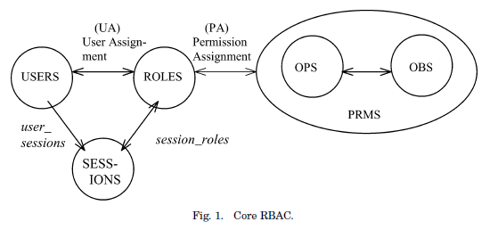
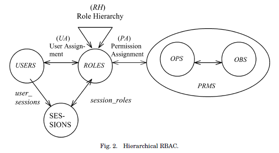
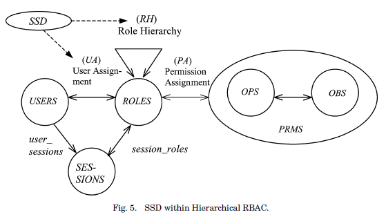
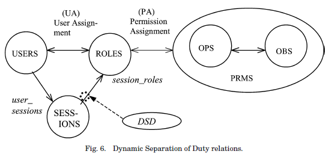

​	有些医疗大数据平台往往直接收集了病人的信息，提供给多方使用，不同的用户能够使用的数据也不同。对于这类平台访问控制是必不可少的。

## 访问控制三要素

​	访问控制涉及3个基本概念：主体，客体和授权访问。

​	● 主体：是一个主动的实体，包括用户、用户组、终端、主机或一个应用。主体可以访问客体。

​	● 客体：是一个被动的实体，对客体的访问要受控。它可以是一个字节、字段、记录、程序、文件，或者一个处理器、存储器、网络接点等。

​	● 授权访问：指主体访问客体的允许。

## 访问控制策略

​	在业界有三种访问控制方式影响较大，它们是：

​	● **DAC(Discretionary Access Control)自主访问控制**

​	● **MAC(Mandatory Access Control)强制访问控制**

​	● **RBAC(Role-based Access Control)基于角色的访问控制**。

### ▲ 自主访问控制-DAC

​	DAC是指**用户可以自主地将访问权限或者访问权限的某个子集授予其他用户**。主要是某些用户(特定客体的用户或具有指定特权的用户)规定别的用户能以怎样的方式访问客体。DAC这种控制方式具有很强的灵活性，但是，它的缺点也是非常明显的。因为用户可以自主的将权限授予其他用户，这样很可能会因为权限的传递而出现失控，而导致信息的泄漏。另外DAC无法抵御特洛伊木马的攻击。所以**DAC的安全性相对较低**。
​	比如：结构化查询语言(Structured Query Language) SQL的标准访问控制机制就通常被认为是DAC的代表。因为它的授权操作(Grant)是可以被用户传递的。即使我们假定所有合法用户都不会故意地将权限授权给不该拥有此权限的用户，但是，DAC的这种弱点也非常容易被一些非法用户或者木马程序所利用，成为权限失控的根源。所以，关系数据库管理系统的各种商业产品中(Oracle，DB2等)，都加入了一些特殊的访问控制措施，来避免访问控制问题的产生，增加安全性。

### ▲ 强制访问控制-MAC

​	MAC是基于系统用户的安全许可和系统对象的安全等级来实现的。也就是说用户的安全许可和系统对象的安全等级组成了一个访问控制矩阵，来实现访问控制的策略。
​	用一个简单的例子来说明。用户分为两种：G-般用户和A-高级用户。数据分为两种：U-未分级数据和S-密级数据。一般用户对未分级数据有读写权限，对密级数据没有任何权限；而高级用户对未分级数据有读权限，对密级数据有读写权限。这样就严格控制了用户的访问控制策略。
​	MAC虽然严格控制了用户的权限，但是，它的授权过程却十分的复杂，需要在两个维度上进行管理。所以，他多用于军事领域，其他方面很少使用。

### ▲ 基于角色的访问控制-RBAC

​	基于角色的访问控制方法是目前最为流行的访问控制策略。它通过引入“角色”的概念，使得授权管理变得简单。安全管理人员根据需要定义各种角色，并对每个设置不同的权限；再根据用户责任和资历再被指派为不同的角色。这样，整个访问控制过程就分成两个部分，即**访问权限与角色相关联，角色再与用户关联**。这样用户通过角色获得其对应的权限，实现了用户与访问权限的逻辑分离，从而简化了授权的过程。

## 基于角色的访问控制-RBAC *[1]*

基于角色的访问控制方法作为目前最为流行的访问控制策略，将在本节中详细介绍。

**▲基本概念：** 角色分配给用户，权限分配给角色，用户通过角色成员获得权限。

**▲核心**：用户（USERS），角色（ROLES），对象（OBS），操作（OPS）和权限（PRMS）五个基本数据元素。

​	**用户：** 访问系统中的资源的主体，一般为人，也可以扩展到包括机器，网络或智能代理等。

​	**角色：** 应用领域内一种权力和责任的语义综合体，可以是一个抽象概念也可以是对应于实际系统中的特定语义体，比如组织内部的职务等。针对角色属性的不同，某些模型中将角色进一步细分为普通角色和管理员角色（可理解为全局角色）。

​	**对象：** 包含或接收信息的实体。RBAC覆盖的对象集包括分配给角色的权限中列出的所有对象。

​	**操作：** 一个程序的可执行映像，它在调用时为用户执行一些功能。

​	**权限：** 对一个或多个受RBAC保护的对象执行操作的批准。

​	**会话（SESSIONS）：** 另外RBAC还有会话概念，每个会话都是一个用户到可能多个角色的映射，也就是说，一个用户建立一个会话，在这个会话期间，用户激活他或她所分配的一些角色子集。每个会话都与单个用户相关联，每个用户都与一个或多个会话相关联。

**▲角色分层：** 角色可以具有重叠的能力，属于不同角色的用户可能被分配了共同的权限。此外，在许多组织中，有大量用户执行的许多一般权限。因此，如果反复指定一般的权限分配，将会效率低下，管理麻烦。为了提高效率和支持组织结构，RBAC模型以及商业实现包括角色层次的概念。
​	RBAC引入了角色间的继承关系，角色间的继承关系可分为一般继承关系和受限继承关系。一般继承关系允许角色间的多继承。而受限继承关系则进一步要求角色间的单继承，这样角色继承关系是一个树结构。

**▲ RBAC职责分离：**用于避免控制冲突

​	**● 静态职责分离SSD(Static separation of duty)：** 指定角色的互斥关系，用于用户指派阶段。避免同一用户拥有互斥的角色。实现简单，角色互斥语义关系清楚，便于管理，不够灵活，不能处理某些实际情况。例如，如果一个角色请求支出而另一个角色批准这些支出，则组织可以禁止将同一用户分配到两个角色。

​	**● 动态职责分离DSD(Dynamic separation of duty)：**指定角色的互斥关系，用于角色激活阶段。允许同一用户拥有某些互斥的角色，但是不允许该用户同时激活互斥的角色。更灵活，直接与会话挂钩，适应实际管理需要，实现复杂，不易管理。DSD属性为最小权限原则提供了扩展支持，因为每个用户在不同的时间都有不同的权限级别，具体取决于正在执行的任务。这确保了权限不会超出履行职责所需的时间。

**▲ 参考模型：**

​	四个模型组件，核心RBAC，角色分层，静态职责分离和动态职责分离。核心RBAC在任何RBAC系统中都是必需的，但是其他组件是相互独立的，可以分开实施。

​	**核心RBAC：**由5个基本元素和会话组成。

​	**分层RBAC：** 在核心RBAC的基础上，能过角色分层。

​	**静态职权分离RBAC：** 增加了SSD，避免控制冲突。

​	**动态职权分离RBAC：**增加了DSD，避免控制冲突。

## 大数据平台访问控制的一些问题*[2]*

1. **数据量大**，增加了访问控制策略制定以及授权管理的难度，过度授权和授权不足现象越来越严重。
   ​	例如，在医疗大数据系统中，医学研究者是能够访问病人的部分临床数据的. 由于“ 病人的哪部分临床数据能够被医学研究者查看”需要非常专业的医学知识才能把握，所以为了不影响研究工作，这些系统往往采用了过度授权.     
   ​	其次，由于大数据及其应用系统的复杂性，往往会造成一些访问需求没有被管理员预先考虑到，或者出现一些新的访问需求.因此，大数据应用中用户的授权不足现象也将越来越频繁.
2. **数据结构多样化(结构化、半结构化、非结构化数据)**，增加了访问控制客体描述的困难，为细粒度访问控制的实施提出了挑战。
   ​        传统访问控制方案中往往采用数据类型来描述访问控制策略中的客体. 例如，医疗系统中针对“ 病人ID ”这种数据类型的策略为 “ 医学研究人员不能访问病人ID“。 然而，相比于结构化数据，非结构化数据自身能够体现更丰富的信息. 譬如，在医疗系统中，同样是“ 病例”这种类型的非结构化数据，患有不同病症的病人的病例在内容和表达方式上往往都是截然不同的. 人们也期望这些信息能够体现在访问控制中，以实现更细粒度的访问控制。例如，“医学研究人员能够访问与其研究方向相关的病例在传统的访问控制方案中，虽然可以利用基于属性的访问控制（Attribute-Based Access Control, ABAC ) 来表达该策略中“与研究方向相关” 的概念，但是在大数据应用中，由于数据规模大且增长速度快的缘故，管理员较难实施这种劳动密集型的标记操作，因此较难针对非结构化数据进行细粒度的访问控制策略描述。
3. 大数据应用往往具有更加**复杂的数据用户类型**，并且在这些数据用户之间分享数据时，出现了诸如朋友关系、病人与医生相关性、业务流程等安全约束需求；使得访问数据的主体集合构成复杂化，同时也增加了分享数据时安全需求的描述难度。
   ​        以典型的大数据应用— 区域医疗及基层医疗信息系统为例，它所涉及的公共卫生、医疗服务、医疗保险、药品管理、运营管理等多方面的应用都将使用医疗大数据系统收集和存储的大数据集。 在这种情况下，“ 医疗缴费通知单” 这个客体，将可能被收费员工、药房护士、社保员工等多种用户访问，以支持各类不同业务. 而这种粗粒度的授权是不满足最小权限原则的，例如“ 医疗缴费通知单”在报销时还能被收费员工、药房护士访问是非常不合理的，会造成不必要的患者隐私泄漏。
4. **个人用户成为了数据的重要来源**，增加了访问控制对数据客体中个人隐私的保护难度。
   ​        例如，医疗大数据系统中，好奇的医生可能会对治疗过程无关的病人数据进行访问。而传统的访问控制技术重点关注的是数据的安全管理— “医生能够访问自己病人的数据”，却对大数据应用中日益突出的个人隐私泄漏问题— “好奇医生对治疗无关的病人隐私的窥探” 缺乏有效应对手段。

# 参考文献

[1] Ferraiolo D F, Sandhu R, Gavrila S, et al. Proposed NIST standard for role-based access control[J]. ACM Transactions on Information and System Security (TISSEC), 2001, 4(3): 224-274.

[2] 李昊, 张敏, 冯登国, 等. 大数据访问控制研究[J]. 计算机学报, 2017, 1(2): 72-91.