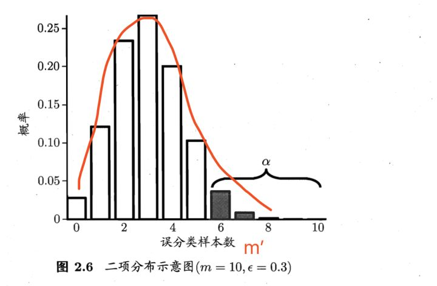

通过算法学习，我们可以得到数据的模型，但我们应该怎么评估这个模型好坏，怎么与其他模型比较？

## 1.误差与拟合

`错误率 error rate`：分类错误的样本数占总样本的比例。

`精度 accuracy`： 1-错误率。

`误差 error`：更一般的、实际预测输出与真实输出之间的差异 。

`训练误差 training error` 、`经验误差 empirical error`：在训练集上的误差。

`泛化误差 generalization`：在新样本上的误差。

> 毫无疑问，我们的目标当然是使*泛化误差*尽可能小。但我们并不知道新样本会是什么~~(如果知道就用来训练了)~~,因此实际中我们只能尽可能的使训练误差减小。

`过拟合 overfitting`： 在训练集上表现很好，但在实际使用中泛化性能不佳。

`欠拟合 underfitting` : 连训练集上都未学习好。

> 欠拟合是比较容易克服的，多训练几轮就可以了。
>
> 但过拟合却十分麻烦！机器学习的问题往往是NP难问题，简单的说就是无法在多项式时间内获得最优解，只能获得一个近似、局部最优解。这个解会尽量使训练误差最小，这就会导致模型过度的学习训练样本，将样本的一些自身特点当做了一般特性，这就导致了过拟合。因为无法获得全局最优解，因此过拟合是无法避免的！


## 2.评估方法

从上面对过拟合的分析我们知道光看训练误差是没有什么意义的，我们需要知道泛化误差,来帮助我们进行**模型选择(model selection)**和**调参(parameter tuning)**。为了能够评估泛化误差，我们需要一个**测试集(training set)**来模拟新样本。那么这个测试集从哪里来？

😄 为了与实际遇到的真实测试数据进行区别，测试集常被称为**验证集（validation set）** 。


### 留出法 hold-out

简单暴力，直接将数据集划分为两个互斥的集合，一个作为训练集，一个作为测试集。

> 注意一：划分时要尽可能保持数据分布的一致性，可以使用*分层采样（stratified sampling）*的方式。
>
> 注意二：由于存在多种划分方式，因此一般进行多次随机划分然后对每次结果取平均值。
>
> 注意三：测试集小，会导致评估结果方差较大（过拟合）；训练集小，会导致评估结果偏差较大（欠拟合）。一般将2/3~4/5的数据作为训练集，而测试集一般至少应含30个样例。


### 交叉验证 cross validation

将数据集划分为K个大小相似的互斥子集。每个子集尽量保持数据发布的一致性（分层抽样）。然后每次用K-1个子集作为训练集，剩下那个子集作为测试集，这样就可以进行K次训练和测试，最后返回均值。

> 因为分为 K个，因此又称为“K折交叉验证”、“K倍交叉验证”。K一般取10左右。
>
> 当K取样本大小时，则称为:留一法（Leave-One-Out,LOO）,这种评估结果往往认为比较准确，但是计算开销实在太大。

又由于存在多种划分方式，因此通常要随机使用不同的划分方式重复P次，最终结果为这p次K折交叉验证结果的均值。


### 自助法（可重复采样、有放回采样） bootstrapping

> 上面的两种方法，都会导致训练集小于数据集，这会产生评估偏差，而自助法能够解决这个问题。

自助法以*自助采样法*为基础。给定包含m个样本的数据集D，采用生成数据集D‘：每次从D中随机取一个样本放入D’，并放回D，使D始终不变。重复m次后，就会获得包含m个样本的数据集D‘。我们可以估计一下D中未被采样到的样本数：（1-1/m）^m取极限约为0.368。这意味着有36.8%的数据未被采样到。于是我们将D’作为训练样本，D\D'作为测试样本，这样我们的训练集大小任为m，在这方面不会引入评估偏差。

> **注意！**自助法在数据集较小，难以有效划分训练\测试集时很有用。
>
> 但当数据集足够大时，留出法和交叉验证法更常用。因为自助法会改变数据集发布，也会引入偏差。


## 3.性能度量

在上面评估方法中对于数据集的度量使用的是泛化误差。但在实际使用中只使用泛化误差往往是不够的，我们需要更为全面的性能度量标准。


### 3.1混淆矩阵(confusion matrix)


True、False:预测的结果是否正确               Positive、Negative：预测的结果

> 混淆矩阵通过不同的组合可以形成这种参数指标

**1.正确率 precision**

$Precision=\frac{TP}{TP+FP}$

**2.真阳性率(True Positive Rate TPR),灵敏度(Sensitivity),召回率(Recall)**

$Sensitivity=Recall=TPR=\frac{TP}{TP+FN}$

**3.真阴性率(True Negative Rate TNR),特异度(Specificity)**

$Specificity=TNR=\frac{TN}{FP+TN}$

**4.假阴性(False Negative Rate FNR),漏诊率**

$FNR=\frac{FN}{TP+FN}$

**5.假阳性(False Positive Rate FPR),误诊率**

$FPR=\frac{FP}{FP+TN}$

**6.阳性似然比(Positive Likelihood Ratio LR+)**

$LR+ =\frac{TPR}{FPR}=\frac{Sensitivity}{1-Specificity}$

**7.阴性似然比(Negative Likelihood Ratio LR-)**

$LR- =\frac{FNR}{TNR}=\frac{1-Sensitivity}{Specificity}$

**8.Youden 指数 **

$Youden index=Sensitivity+Specificity-1=TPR-FPR$

------

### 3.2查准率(Precision),召回率(Recall),F值

> P值，R值，F值可以说是最为常用的指标了

$P=\frac{TP}{TP+FP}$       

$ R=\frac{TP}{TP+FN}$       

$F_\beta=\frac{(1+\beta^2)\times P\times R}{(\beta^2\times P)+R} (\beta>0)$

**P值：**预测为真的结果中，预测正确的概率。

**R值：**正真为真的数据，成功预测的概率。

> 我们的目标当然是P值和R值越高越好，但是这两者却是矛盾的。
>
> 高R低P：宁可错杀不可放过，~~只要它是那我一定说是~~ 。比如对于癌症的预测宁可误差也不能漏诊。
>
> 高P低R：宁可放过不可错杀，~~我说他是那他就是~~。比如人道主义的判断坏人，只要判断是坏人那就一定是。

但是到底应该怎么取P,R值的大小，实在麻烦，于是就有了F值。

**F值：** 参数=1   F1为P和R的调和平均数，两者一样重要。

​           参数<1   侧重于R值

​           参数>1   侧重于P值

> 但是有时候我们会有多个混淆矩阵，比如进行了多次训练/测试。这时候我们只要对P,R,F值稍加修改就行了。

**宏 macro:** 先求出各个P,R值。然后求平均P,R值。最后求F值。

$macro-P=\frac{1}{n}\sum\limits_{i=1}^{n} P_i$		

$macro-R=\frac{1}{n}\sum\limits_{i=1}^{n} R_i$	

$macro-F_1=\frac{2\times macro-P\times MACRO-R}{macro-P+macro-R}$

**微 micro：**先求平均再求P,R,F

$micro-P=\frac{\overline{TP}}{\overline{TP}+\overline{FP}}$			

$micro-R=\frac{\overline{TP}}{\overline{TP}+\overline{FN}}$			

$micro-F_1=\frac{2\times micro-P\times micro-R}{micro-P+micro-R}$

------

### 3.3ROC与AUC

> **多用于度量分类算法。**
>
> **优势：**当测试集中的正负样本的分布变化的时候，ROC曲线能够保持不变(P-R曲线会变化明显)。
>
> 在实际的数据集中经常会出现类不平衡(class imbalance)现象，即负样本比正样本多很多(或者相反)，而且测试数据中的正负样本的分布也可能随着时间变化。 


**ROC**(Receiver Operating Characteristic)反映敏感性和特异性连续变量的综合指标，曲线上每个点反映着对同一信号刺激的感受性。


**横轴：** 假阳性 $FPR=\frac{FP}{FP+TN}$   预测为正但实际为负的样本占所有负例样本的比例

**纵轴：** 真阳性  $TPR=\frac{TP}{TP+FN}$   预测为正且实际为正的样本占所有正例样本 的比例

对于分类器，改变最后的分类阈值，就可以获得不同大小的FPR和TPR，用于画出ROC图。

> **理想目标：**TPR=1，FPR=0，即图中(0,1)点，故ROC曲线越靠拢(0,1)点越好。
>
> 但是往往并不能很好的判断出，两个ROC图，哪个更好，更接近(0,1)点。
>
> 于是便有了AUC。


**AUC** (Area under the curve)为ROC曲线下的面积，显然这个面积的数值不会大于1。又由于ROC曲线一般都处于y=x这条直线的上方，所以AUC的取值范围一般在0.5和1之间(小于0.5那么这个分类器还不如投硬币......)。**AUC值越大的分类器，正确率越高**。

对于AUC的计算有多种方法([参考](https://blog.csdn.net/qq_22238533/article/details/78666436))：

1.直接计算,知道坐标{(x1,y1),(x2,y2)......(xm,ym)}

$AUC=\frac{1}{2}\sum\limits_{i=1}^{m-1}(x_i+1-x_i)*(y_i+y_{i+1})$

2.在有M个正样本,N个负样本的数据集里。一共有M*N对样本（一对样本即，一个正样本与一个负样本）。统计这M*N对样本里，正样本的预测概率大于负样本的预测概率的个数。**注意：这个“预测概率”不一定是真的概率，只要能比大小即可**


比如现在有2个正例和两个反例：

| ID   | label | pro  |
| ---- | ----- | ---- |
| A    | 0     | 0.1  |
| B    | 0     | 0.4  |
| C    | 1     | 0.4  |
| D    | 1     | 0.8  |

共4种组合：{C,A},{C,B},{D,A},{D,B}.            

结果为：$AUC=\frac{1+1+1+0.5}{4}=0.875$


3.用rank法,M个正样本,N个负样本.按照概率排个序，然后将正例的序号相加(重叠取平均)，减去常数项，除以常数项即可。

$AUC=\frac{\sum_{ins_i\in{positiveclass}}rank_ins_i-\frac{M\times(M+1)}{2}}{M\times N}$

如：

| ID   | label | pro  | rank |
| ---- | ----- | ---- | ---- |
| A    | 0     | 0.1  | 1    |
| B    | 0     | 0.4  | 2    |
| C    | 1     | 0.4  | 3    |
| D    | 1     | 0.8  | 4    |

结果：$AUC=\frac{4+(2+3)/2-2\times (2+1)/2}{2\times 2}=0.875$


4.实际使用时直接用别人的实现~

```python
import numpy as np
from sklearn.metrics import roc_auc_score
y_true = np.array([0,0,1,1])
y_scores = np.array([0.1,0.4,0.4,0.8])
print "y_true is ",y_true
print "y_scores is ",y_scores
print "AUC is",roc_auc_score(y_true, y_scores)
```


### 3.4 代价敏感错误率与代价曲线

该方法对FN和FP分配了一个代价，~~😢具体就不做了解了~~


## 4 比较检验

照理来说，我们已经学会了评估方法和性能度量，我们应该能够愉快的进行对学习器的优劣比较了。但现实并不像这样简单。对此西瓜书给出了三个因素：

> 1.我们得到的只是测试集上的性能度量并不能等同于正真的泛化性能。

> 2.测试集的选择会对结果带来很大的影响。

> 3.算法本身就有一定的随机性，即使参数相同也会得出不同的结果。

那么我们应该怎么办？（接下来为了方便以错误率ε为例）


**首先，我的求得的这个测试样本错误率ε还有没有用？**

当然有用，**统计假设检验（hypothesis test）**为我们提供了重要依据。

``假设检验的定义是：在总体的分布函数完全未知或已知其形式，但不知其参数的情况，为了推断总体的某些未知特性，提出某些关于总体的假设。我们要根据样本对所提出的假设作出是接受还是拒绝的决策。``

也就是说，我们已经得到了假设，我们需要做的是知道对于这个假设，我们接受的概率是多少，拒绝的概率是多少。很明显当然是接受的概率越高越好，这样才能用我们的这个假设去近似正真情况啊。


**那么问题又来了，这个接受概率怎么求？**

为此，我们又要推出两个概念：**置信度（confidence）=1-α**  和  **置信区间**

> 比如，在置信度0.95上的置信区间X。意味着真实值落在X上的概率为95%

我们一般都是确定置信度，然后求出相应的置信区间，也就是说我们得将错误率ε变换为一个范围表示。


**那么我们的任务变成了怎么将一个数值变成一个范围，并且还要考虑其发生概率？**

为此这里将讲述几种西瓜书里提到的检验方法。

### 4.1 二项检验 binomial test

> **使用场景：只有一个单独的错误率ε**




在测试样本m独立采样的条件下，我们可以求出，泛化错误率为ε的学习器被测出测试错误率为ε‘的概率是多少。

$P(\epsilon';\epsilon)=\epsilon^{\epsilon'\times m}(1-\epsilon)^{m-\epsilon'\times m}$

很明显的，当ε=ε‘时，概率是最大的，而且还符合二项发布。

这时我们假设ε<=ε0,并设置置信度1-α。我们可以求出在这个条件下，测试错误率ε‘。

$\epsilon'=(max \epsilon) s.t (\sum\limits_{i=\epsilon0\times m+1}^{m}\epsilon^i(1-\epsilon)^{m-i})<\alpha (s.t 是 subject to 的缩写，使左边式子在右边条件满足时成立)$

他直接理解就是：在ε0确定的情况下，寻找一个最大的满足右边式子的ε即为ε’。

通俗一点理解就是：因为ε是小于ε0的，因此当误分样本数大于(ε0+m)是不可能的。而我们测出的ε‘满足二项发布，是可能出现误分样本大于(ε0+m)的情况的，于是我们要限制这个情况出现的概率小于某个值α。

实际使用时：我们已经知道了ε’，可以反过来求出当等于α时，相应的ε0为多少。

这样就实现了从一个单独的测试错误率ε‘，转换为一个范围的泛化错误率ε。


### 4.2 t检验 t-tets

> **使用场景：有多个错误率的值**


> **先了解一下什么是t发布：**

**学生t-分布**（Student's *t*-distribution）可简称为**t分布**：$T=\frac{\overline{X_n}-\mu}{S_n/\sqrt{n}}=\frac{样本均值-整体期望}{样本标准差/\sqrt{样本数}}=n-1自由度的t分布$

> T分布，是一种正太分布的近似分布，当自由度趋于无穷时，即为标准正太分布。那为什么不用正太分布呢？因为我们往往得不到正真数据样本的期望和方差，用不了正太，只能用样本的标准差和期望来构建T分布。
>
> 所以，**T分布用于根据小样本来估计呈正态分布且方差未知的总体的均值。如果总体方差已知（例如在样本数量足够多时），则应该用正态分布来估计总体均值。**


