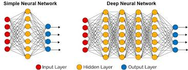
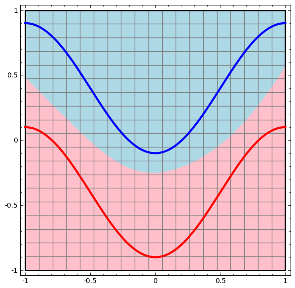

## 神经网络是什么？

这里我也不想搞哪些麻烦的概念，只想简单的从直觉上去理解什么是神经网络。

首先来看一下神经网络的流程：数据从输入层输入，然后经过中间的隐藏层的激励函数，最后在输出层输出相应大小的结果。

### 方向一：从过程看

该部分内容参考[colah的博客。](http://colah.github.io/posts/2014-03-NN-Manifolds-Topology/)

每一层的隐藏层都可以看成一个变换函数，输入数据经过一层隐藏层就相当于进行了一次变换。于是我们可以通过变换将不同平面的输入数据拉伸变换到一个平面并进行分离，这样对于输出结果我们只要进行简单的线性分割就能分类数据了。

比如我们现在要对以下的两个曲线进行分类：



我们发现无法使用线性分割的方式分类曲线，而获得一个“扭曲”的边界函数并不容易。于是通过神经网络我们将曲线变换为如下样子：


这样我们就可以对神经网络的输出结果进行线性的分割，问题就变的很简单。当然这只是最简单情况，实际上对于较复杂的情况也一样：


我们只要增加网络的隐藏层数量和每层的激励单元数量，就可以将一些更为复杂的函数分离开来。

但是这只是理想状态，往往我们并不能做到随便增加网络节点和层数因为计算量实在太复杂，而实际问题的数据又往往有着复杂的结构，如下图：


现实数据往往是缠绕在一起的，要完全分离这样的数据需要十分复杂的神经网络。好在我们在实际应用时并不要求一定要得到完美的结果，于是我们可以通过神经网络将数据变换为以下样式：


我们尽可能的让数据重叠的部分变少，然后分离数据，这样会产生误差，但是能较快的得到可用结果。


### 方向二：从结果看

上面讲的从过程看虽然十分形象，但是并不能帮助我们实现得到神经网络~毕竟我们并不知道应该怎么变化~~至少现在不能~~。但是从结果出发我们可以通过数学训练得到想要的神经网络！

对数据进行变形的过程，可以理解为对输入数据矩阵进行变换，每一个网络节点都是一次变换，我们的目标是强行将输入矩阵变的和目标结果矩阵相似。

而每一次变换都是一次矩阵的相乘，于是可以看成【输入矩阵*网络矩阵】=>【输出矩阵】，关键是确定网络矩阵中茫茫多的参数。

而输出矩阵和目标矩阵的相似度则可以用代价函数（cost -function）来表示，具体怎么设计代价函数看情况来定。这时我们可以将整体看成【输入矩阵 *输出矩阵 *代价函数】=>【代价值】。

毫无疑问这个代价值越小越好。而这个带价值是一个多元多次方程，如下图所示：


我们的目标就是从中找到最低的那个点。

要求一个方程的最低点，就需要对每个参数求偏导，然后沿着梯度下降的方向变换参数，这就是**梯度下降算法 （Gradient Descent algorithm）GD。**而具体如何确定每个节点参数的变化，这就需要用到**反向传播算法 （Back Propagation algorithm）BP。** 

> 所以从结果来看：**神经网络的搭建就是假设一个高次的变化方程；训练就是凑变换函数参数。** 这样看来神经网络原理也就没什么，就是靠计算机的算力强行凑函数。。。 


## 梯度下降和反向传播是什么？

这部分内容还是主要参考[colah的博客。](http://colah.github.io/posts/2014-03-NN-Manifolds-Topology/) 和 [AGH](http://galaxy.agh.edu.pl/~vlsi/AI/backp_t_en/backprop.html)


>  **梯度下降**:

上面也讲到了，梯度下降算法的目的就是获得目标方程的最低点。而最低点的“斜率”是为0的，那么只要对方程求偏导，就能知道当前点的“斜率”，然后只要沿着这个斜率的反方向移动就能理论上到达最低点了。

过程如下图所示：


**局部最低点问题：** 从上图我们可以看出，沿着梯度下降的方向移动并不一定能获得全局的最低点。因为神经网络创建的方程往往是很复杂的，有着大量的“谷底”，不同的起点最后掉落的“谷底”不一定相同。而这个起点取决于我们对参数的初始值设定。因此在实际训练网络时，有时对初始值设定进行一些“小操作”会有助于提高最后结果的准确度。。。嗯，所以神经网络很玄学！


**学习速率问题：** 前面讲了要沿着梯度下降的方向移动，但是具体移动多少呢？首先很明显跟预测值与目标值的差距有关，两者差距越大那就要移动的越多，这就是**梯度误差（error gradient）**。但是如果直接根据这个误差来调整参数，发现参数变化幅度太大了，会导致结果一直在震荡（如右图所示），甚至直接就飞出这个“山谷”。。。因此需要一个值来缩小这个变化幅度，这就是**学习速率（learning rate）** ，学习速率往往是一个比较小的值如0.01，这样就能使得方程慢慢的向谷底移动。学习速率的选取是个需要注意的点，太小会导致下降的十分缓慢，训练网络需要很长时间，而太大又会引起“震荡”，学不到好的结果。


> **反向传播：**

知道了要进行梯度下降，但怎么具体操作是个问题，毕竟参数这么多，一个个求过来这个计算量不敢想~

于是就有了**反向传播算法**

这个部分一开始看公式一直很疑惑为什么要这么做？不就是个链式法则？这和直接求每个参数的偏导（正向传播）到底快在哪里？直到看了colah的讲解才恍然大悟，什么链式法则都不是重点，**避免重复计算才是反向传播算法的精髓！**

接下来膜拜colah大佬==>

首先看一下正常的求偏导是怎么求的：


比如要求b对e的影响能力，我们用链式法则就能很简单的算出e对b的偏导值。

然后抽象一点，比如现在有如下网络，分别正向和反向的求一次偏导：


正向（Forward-Mode）:以x为主，及表示了x**参数对每个节点的影响能力** 。

反向（Reverse-Mode）:以Z为主，及表示了Z**结果对每个节点的影响能力**。

嗯。。。。。看起来很有道理的样子，但是这有什么用呢？

那么就需要用例子体验一下两者的不同了！


首先，两者都是要将各个路径的偏微分值计算出来的 ，毕竟这是基础，在网络中就是**路径权重值** 。。。

*向前传播*：是一个**路径遍历求和**的过程，要求b的影响要遍历一次，要求a的影响又要遍历一次，**同一路径会被多次计算**。而神经网络的参数和路径如此之多，要是每进行一次梯度下降就要对每个参数进行一次路径遍历，这个计算了就爆炸了！！！

*反向传播：*是一个**一次性扩散**的过程，可以看到向后传播直接确定了结果对每个节点的影响能力，**一条路径只会被计算一次**，这个几乎没有什么计算量。


看完不经感叹，反向传播原来这么简单，又这么有用。。。

最后跟着[AGH](http://galaxy.agh.edu.pl/~vlsi/AI/backp_t_en/backprop.html)上的反向传播图理一遍整个过程。

首先我们有一个简单的神经网络，如下图：


然后输入x1,x2获得输出y，并计算得出误差δ：


有了整体误差，那么就要开始反向传播了，进而获得每个节点的输出误差：


最后就是对权重的调整，η就是学习速率：


这里要注意一下，传递误差δ只是代表节点输出值的偏导，而我们的目标是路径权重w的偏导，中间还需要过度一下。


## 激活函数的作用

> 首先，感谢一下[Daniel Godoy](https://towardsdatascience.com/@dvgodoy?source=post_header_lockup)大佬的独特的可视化解释，以及[机器之家](https://www.jqr.com/article/000161)的翻译（╮(╯▽╰)╭还是中文看的舒服）

激活函数是神经网络中必不可少的部分，每个神经节点都会调用激活函数，那么激活函数的作用是什么呢？

**引入非线性！**  当然，这是大家都知道的事，但它具体是怎么影响神经网络的呢？效果又是怎么样的呢？借助Godoy的可视化训练，可以让我们更为直接的感受激活函数的作用。


### sigmoid

最传统的激活函数。尽管今时今日，它的使用场景主要限制在**分类任务的输出层**。 


如上图所示，sigmoid激活函数将输入值“压入”**区间(0, 1)**（和概率值的区间一致，这正是它在输出层中用于分类任务的原因）。由于sigmoid的区间在(0, 1)，**激活值以0.5为中心**，而不是以零为中心（正态分布输入通常以零为中心）。其**梯度**（gradient）峰值为0.25（当z = 0时），而当|z|达到5时，它的值已经很接近零了。


<iframe width="700" height="393" src="https://www.youtube.com/embed/4RoTHKKRXgE" allow="autoplay; encrypted-media" allowfullscreen></iframe>

可以从视频中看出sigmoid激活函数成功分开了两条曲线，不过损失下降得比较缓慢，训练时间有显著部分停留在高原（plateaus）上。


### tanh

**双曲正切函数**tanh激活函数从sigmoid演进而来，和其前辈不同，其输出值的均值为零。


如上图所示，tanh激活函数“挤压”输入至**区间(-1, 1)** 。因此，**中心为零**，（某种程度上）激活值已经是下一层的正态分布输入了。至于梯度，它有一个大得多的峰值1.0（同样位于z = 0处），但它下降得更快，当|z|的值到达3时就已经接近零了。这是所谓**梯度消失（vanishing gradients）**问题背后的原因，这导致网络的训练进展变慢。

<iframe width="700" height="393" src="https://www.youtube.com/embed/PFNp8_V_Apg" allow="autoplay; encrypted-media" allowfullscreen></iframe>

tanh激活函数以更快的速度达到了所有情形正确分类的点，而损失函数同样下降得更快（损失函数下降的时候），但它同样在高原上花了很多时间。


### ReLu

修正线性单元（Rectified Linear Units），简称**ReLU**，是寻常使用的激活函数**。**ReLU处理了两个前辈常见的**梯度消失**问题，同时也是计算梯度**最快**的激活函数。


如上图所示，**ReLU**是一头完全不同的野兽：它并不“挤压”值至某一区间——它只是**保留正值**，并将所有**负值转化为零**。

使用**ReLU**的积极方面是它的**梯度**要么是1（正值），要么是0（负值）——**再也没有梯度消失了！**这一模式使网络**更快收敛**。

另一方面，这一表现导致所谓的**“死亡神经元”**问题，也就是输入持续为负的神经元激活值总是为零。

<iframe width="700" height="393" src="https://www.youtube.com/embed/Ji_05nOFLE0" allow="autoplay; encrypted-media" allowfullscreen></iframe>

**损失**从开始就保持**稳定下降**，直到**接近零**后才**进入平原**，花了**大约75%**的**tanh**训练时间就达成所有情形**正确分类!!**


### ↑上三种激活函数比较


嗯。难怪ReLU激活函数现在这么常用。。。


### ELU

**指数线性单元ELU**融合了sigmoid和ReLU，具有左侧软饱性。其正式定义为：


右侧线性部分使得ELU能够缓解梯度消失，而左侧软饱和能够让ELU对输入变化或噪声更鲁棒。ELU的输出均值接近于零，所以**收敛速度更快**。实验中，ELU的收敛性质的确优于ReLU和PReLU。


### LReLu

**Leaky ReLU** 是给所有负值**赋予一个非零斜率(固定)**。Leaky ReLU激活函数是在声学模型（2013）中首次提出的。以数学的方式我们可以表示为：


### PReLU

**参数化修正线性单元PReLU**是ReLU和LReLU的**改进版本** ，具有非饱和性：


与LReLU相比，PReLU中的负半轴**斜率a可学习而非固定**。原文献建议初始化a为0.25。与ReLU相比，PReLU收敛速度更快。因为PReLU的输出更接近0均值，使得SGD更接近natural gradient。证明过程参见[原文](https://www.cv-foundation.org/openaccess/content_iccv_2015/papers/He_Delving_Deep_into_ICCV_2015_paper.pdf?spm=5176.100239.blogcont55892.28.pm8zm1&file=He_Delving_Deep_into_ICCV_2015_paper.pdf)


### RReLU

**随机纠正线性单元RReLu**数学形式与PReLU类似，但RReLU是一种非确定性激活函数，其**参数是随机的** 。这种随机性类似于一种噪声，能够在一定程度上起到正则效果。


### Maxout

Maxout是ReLU的推广，其发生饱和是一个零测集事件（measure zero event）。正式定义为：


Maxout网络能够近似任意连续函数，且当w2,b2,…,wn,bn为0时，退化为ReLU。 其实，Maxout的思想在视觉领域存在已久。例如，在HOG特征里有这么一个过程：计算三个通道的梯度强度，然后在每一个像素位置上，仅取三个通道中梯度强度最大的数值，最终形成一个通道。这其实就是Maxout的一种特例。

Maxout能够缓解梯度消失，同时又规避了ReLU神经元死亡的缺点，但增加了参数和计算量。


### ↑以上Relu亲戚的比较


其实ReLu的亲戚还有很多，左边什么形状都看得到~但**最常用的还是ReLU和ELU**。


##  权重初始化

提前感谢[Daniel Godoy](https://towardsdatascience.com/@dvgodoy?source=post_header_lockup)和[夏飞](https://www.leiphone.com/news/201703/3qMp45aQtbxTdzmK.html)文章的帮助。

首先为什么要进行权重初始化？直接赋0让机器自己去学习不行吗？
这当然不行，毕竟如果权重全为0，那反向传播时weight updata 也都为0了，也就是说根本无法学习！

那么我们应该怎么初始化权重？
常用的初始化方法有：

╋ **Random initialization**

╋ **Xavier / Glorot  initialization**

╋ **He initialization**

╋ **Batch Normalization Layer**


### Random initialization

```python
W = tf.Variable(np.random.randn(d1,d2))
```

> 最为**常用**的初始化方法。
>
> 参数呈**正太分布**。
>
> 适用于比较小的神经网络。 

但是这种初始化在面对**层次比较多的网络**时尝尝会出现问题，主要是因为**梯度消失**和**梯度爆炸**。

首先拿已经被抛弃的**sigmoid激活函数为例**，权重初始化为σ=0.01运行结果如下图所示。可以看到出现了梯度消失的现象，这是因为在反向传播的过程中，是需要不断的乘以权重和f'(e)的，而权重初始化小于1且sigmoid的导数最大也只有0.25，那么误差在传递过程中越来越小，从而导致了梯度消失。


那么我们加大初始化时的标准差呢？可以看到情况变好了一点，但仍然不够。


那么我们再次加大正态分布的标准差。结果发现梯度消失倒是没了，但是激活函数的输出值几乎呈二值状态（因为权值太大导致Z值太大，而当|z|达到5时sigmoid函数基本上就是0或1了），这样一来激活函数就没什么用了。。


嗯，难道是因为sigmoid函数求导实在太小了(难怪被抛弃~)？
那么我们换成比较常见的**tanh激活函数**呢？

从下面3幅图可以看到，标准差为0.01时还是会出现梯度消失，标准差为1时不但激活函数输出值呈二值状态甚至出现了**梯度爆炸**的情况！但是当标准差为0.1时，终于找到了一个平衡点！看起来是那么的完美！


可是0.1只是这里例子的特殊情况，平时初始化时我们又不可能自己去凑这个值，那么就有了**Xavier / Glorot  初始化**和 **He 初始化** 。


###  Xavier / Glorot  initialization

Glorot和Bengio设计的一种初始化方案，该方案试图保持前面列出的**获胜特性**，即**梯度**、**Z值**、**激活**在**所有层上相似**。换句话说，保持**所有层的方差相似**。具体证明见[Daniel Godoy](https://towardsdatascience.com/hyper-parameters-in-action-part-ii-weight-initializers-35aee1a28404)


> 适用于tanh激活函数
>
> 方差为sqrt(2/(fan_in+fan_out))的正太分布
>
> 或上下限为sqrt(6/(fan_in+fan_out))的均匀分布 

fan_in，fan_out指的是当前权重输入层和输出层的节点数。**一般每一层的节点数都是一样的，及fan_in=fan_out**

``` 
W = tf.Variable(np.random.randn(node_in, node_out)) * np.sqrt(1/node_in)
```


### He initialization

那么对于Relu激活函数也类似，**保证所有层上相似即可。**具体证明见[Daniel Godoy](https://towardsdatascience.com/hyper-parameters-in-action-part-ii-weight-initializers-35aee1a28404)

> 适用于ReLU激活函数
>
> 方差为sqrt(2/fan_in)的正太分布
>
> 或上下限为sqrt(6/fan_in)的均匀分布 

```python
W = tf.Variable(np.random.randn(node_in,node_out)) * np.sqrt(2/node_in)
```


###  Batch Normalization Layer

前面两种方法都是通过计算巧妙的来保持每一层的相似。
而Batch Normalization是一种直接暴力的方法，既然目标是保持每一层的相似，也就是说我们想要的是在非线性激活函数之前，输出值应该有比较好的分布（例如高斯分布）。于是Batch Normalization将输出值强行做一次Gaussian Normalization和线性变换：


Batch Normalization中所有的操作都是平滑可导，这使得back propagation可以有效运行并学到相应的参数，。需要注意的一点是Batch Normalization在training和testing时行为有所差别。Training时和由当前batch计算得出；在Testing时和应使用Training时保存的均值或类似的经过处理的值，而不是由当前batch计算。

```python
for i in range(0,num_layers -1)
	W = tf.Variable(np.random.randn(node_in,node_out)) * np.sqrt(2/node_in)
	fc = tf.matmul(X,W)
	fc = tf.contrib.layers.batch_norm(fc, center=True, scale=True,is_training=True)
	fc = tf.nn.relu(fc)
```

