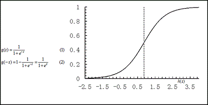
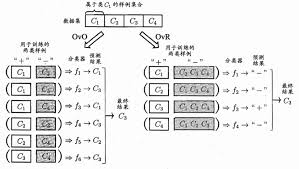

## 基础

1. 回归分析：确定两种或两种以上变量间相互依赖的定量关系的一种统计分析方法。
2. 回归与分类在本质上是一样的，都是在拟合数据集的函数基础上对新样本进行预测。
3. 回归与分类的最大不同仅在于预测值范围不同，分类问题预测离散值，回归预测连续值。

## 线性回归

​	线性回归(linear regression)试图学得一个线性模型以尽可能准确地预测实值输出标记。

​	$f(x) = w_1x_1+w_2x_2+...+w_dx_d+b=w^Tx+b$ 

> 如何确定w和b	

​	在回归任务中常用**均方误差**来作为衡量预测值与真实值之间差距的**代价函数**。
​	$L(f)=\sum_{i=1}^D(wx_i+b-y_i)^2$

​	均方误差又被称为**欧氏距离**。 基于均方误差最下化来进行模型求解的方法称为**最小二乘法**。

​	于是参数为：
​	$(w*,b*)=argmin_{w,b}(\sum_{i=1}^D(wx_i+b-y_i)^2)$

> 如何求解w和b

​	求解均方误差最小化的过程，称为**参数估计**。
​	因为L(f)函数为凸函数，所以求最小值的就是求导数为0时的值。
​	为了表示方便这里把w和b统一表示为$\widehat{w}={w;b}$

​	● 当$X^TX$为满秩矩阵或正定矩阵时：
​		$\widehat{w}^*=(X^TX)_{-1}X^Ty$

​	● 当不为满秩矩阵时（样本数小于属性数）则需要加入正则化项，这里以L2为例:
​		$\widehat{w}^*=argmin_{w}[(y-X\widehat{w})^T(y-X\widehat{w})+\lambda||\widehat{w}^2_2||]$

> 实际模型获得w和b

​	虽然在上面我们已经获得了w和b的精确解析解，但在实际训练中我们还是老老实实的使用**梯度下降**等算法来逼近w和b。因为：

​	● 虽然获得了解析解，但是需要进行矩阵求逆运算，求逆运算的复杂度是十分大的，所以还不如SGD来的快。

​	● 梯度下降算法是线上算法，当有新的数据时可以继续训练，而解析解则需要重新计算。

## 广义线性模型

​	只能拟合线性数据很显然是不够的，所以有了广义线性模型，其实际上已经是**非线性模型**了。
​	广义线性模型添加了一个**单调可微函数h(.)**，来拟合非线性数据。

### 逻辑回归

​	又叫**对数几率回归、对率回归**。

​	其在线性回归的基础上增加了一个**logistic function，又被称为Sigmoid函数、对数几率函数、对率函数**。
​		logistic function:   

​	实际上，逻辑回归虽然叫“回归”，但却是一种**分类方法**。

> 如何进行w和b参数估计

​	对于分类问题，常用**极大似然法(maximum likelihood method)**来估计参数。
​	极大似然法是概率论中的方法，其思想比较简单：选取一组参数使得由样本预测真实标记的概率最大。由于一般有多组样本，所以需要进行概率连乘，为了防止下溢和后续处理方便，经常使用**对数似然(log likelihood)**，将乘法装换为加法。

> 实际模型获得w和b

​	因为似然函数为高阶可导连续凸函数，所以可用梯度下降法或者拟牛顿法求解。

### 线性判别分析

​	线性判别分析(Linear Discriminant Analysis ,LDA)：给定训练样例集，设法将样例投影到一条直线上，使得同类样例的投影点尽可能接近，异类样例的投影点尽可能远离。

​	LDA算法既可以用来降维，又可以用来分类，但是目前来说，主要还是用于降维。

## 多分类学习

​	上面提到的情况都是2分类问题，但实际中常遇到多分类的学习任务，我们可以基于一些基本策略利用二分类学习器来解决多分类问题。

​	● 一对一(One vs One , OvO)
​		将N个类别两两配对，从而产生N(N-1)/2个二分类问题，最后将预测得最多的类别作为最终分类结果。

​	● 一对其余(One vs Rest , OvR)
​		将一个类的样例作为正例、所有其他类的样例作为反例来训练N个分类器。

​	● 多对多(Many vs Many , MvM)
​		将若干个类作为正类，若干个其他类作为反类。

## 线性模型 & 神经网络

​	由于我先看的是神经网络，所以看到线性模型时第一个反应就是：这丫的不就是单层的神经网络吗？
​	好吧，神经网络就是从线性模型进化过来的，因为人们不再满足于拟合简单的线性平面，而且有了计算机算力的支持，于是产生了能拟合更复杂数据的神经网络。

​	

